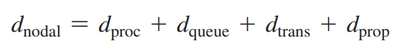
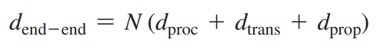

# 1.4 Delay, Loss, Throughput in Packet-Switched Networks

#### 1.4.1 Overview of Delay in Packet-switched network

**Nodal processing delay**

The time required to examine the packet’s header and determine where to direct the packet is part of the processing delay. The processing delay can also include other factors, such as the time needed to check for bit-level errors in the packet that occurred in transmitting the packet’s bits from the upstream node to router A.

**Queueing delay**

At the queue, the packet experiences a queuing delay as it waits to be transmitted onto the link. The length of the queuing delay of a specific packet will depend on the number of earlier-arriving packets that are queued and waiting for transmission onto the link. If the queue is empty and no other packet is currently being transmitted, then our packet’s queuing delay will be zero. On the other hand, if the traffic is heavy and many other packets are also waiting to be transmitted, the queuing delay will be long.

**Transmission delay**

Assuming that packets are transmitted in a first-come-first-served manner, as is common in packet switched networks, our packet can be transmitted only after all the packets that have arrived before it have been transmitted. This is the amount of time required to push (that is, transmit) all of the packet’s bits into the link.

**Propagation delay**

Once a bit is pushed into the link, it needs to propagate to router B. The time required to propagate from the beginning of the link to router B is the propagation delay. The bit propagates at the propagation speed of the link. The propagation speed depends on the physical medium of the link.

All these 4 accumulate to give **total nodal** delay.

<figure><figcaption></figcaption></figure>

#### 1.4.2 Queueing delay and Packet loss

**Queueing delay** is the delay that occurs when packets of data are waiting in a queue to be transmitted over a network link. It is caused by the limited capacity of network devices, such as routers, switches, and servers, to process and forward packets at a given rate. When packets arrive at a device faster than they can be transmitted, they are placed in a queue and must wait for their turn to be transmitted. The length of the queue and the rate at which packets are transmitted determine the amount of time a packet must wait in the queue before it can be transmitted, resulting in queueing delay. Excessive queueing delay can lead to network congestion, dropped packets, and decreased network performance.

Packet can arrive to find a full queue. With no place to store such a packet, a router will drop that packet; that is, the packet will be lost. The fraction of lost packets increases as the traffic intensity increases. Therefore, performance at a node is often measured not only in terms of delay, but also in terms of the probability of packet loss.

#### 1.4.3 End to end delay

Suppose there are N - 1 routers between the source host and the destination host. Let’s also suppose for the moment that the network is uncongested (so that queuing delays are negligible), the processing delay at each router and at the source host is $d\_{proc}$, the transmission rate out of each router and out of the source host is R bits/sec, and the propagation on each link is $d\_{prop}$. The nodal delays accumulate and give an end-to-end delay.

<figure><figcaption></figcaption></figure>

$d\_{trans}$ = L/R, where L is the packet size.

In addition to processing, transmission, and propagation delays, there can be additional significant delays in the end systems.

#### 1.4.4 Throughput in Computer Networks

In addition to delay and packet loss, another critical performance measure in computer networks is **end-to-end throughput**. To define throughput, consider transferring a large file from Host A to Host B across a computer network. This transfer might be, for example, a large video clip from one computer to another. The instantaneous throughput at any instant of time is the rate (in bits/sec) at which Host B is receiving the file.
