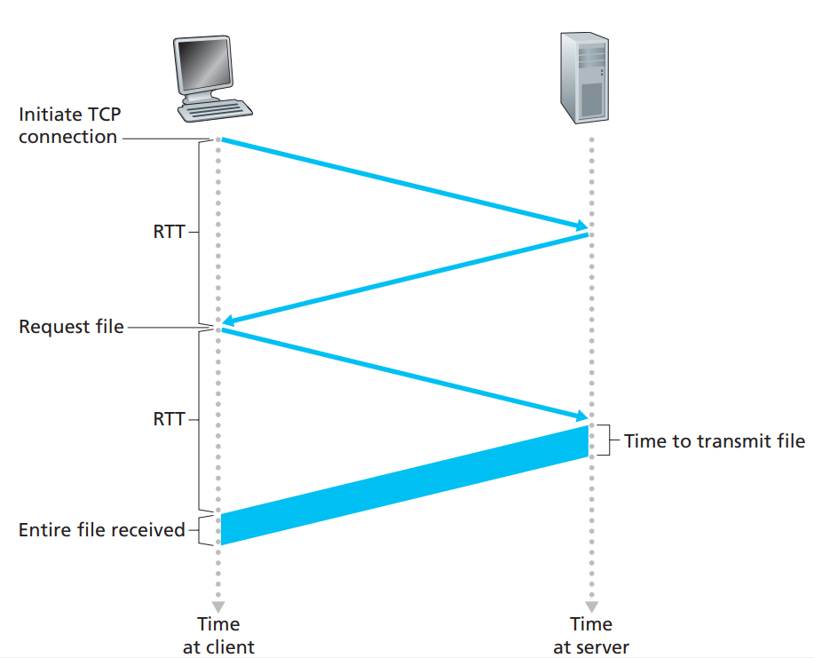
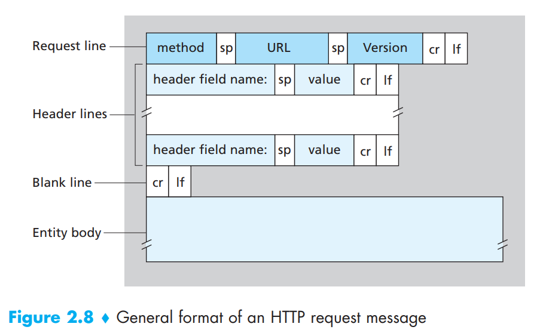
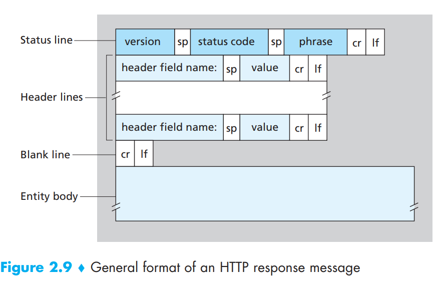
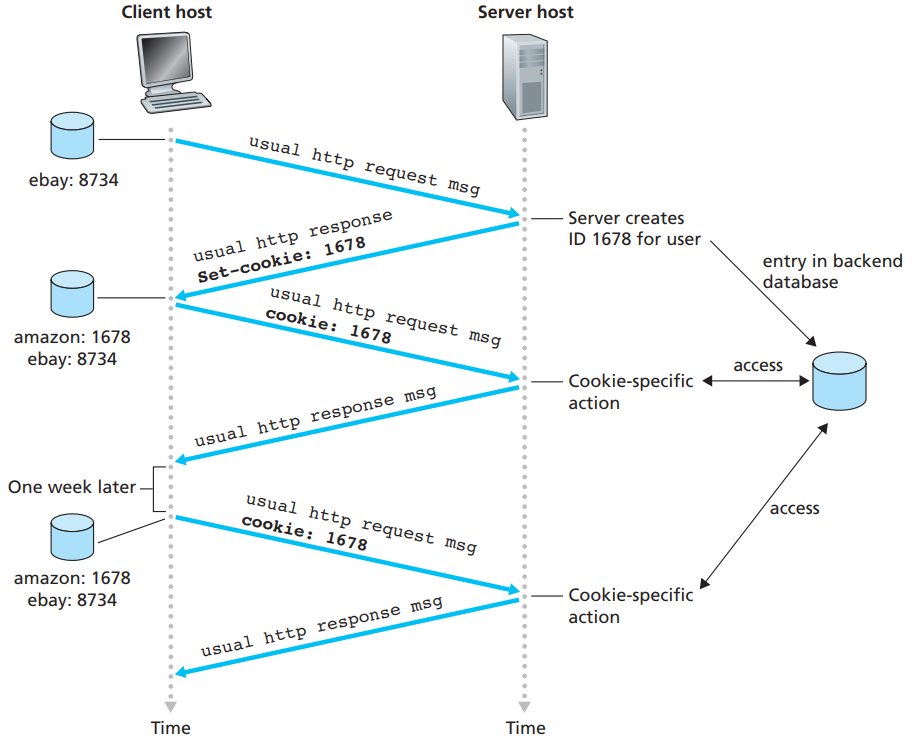
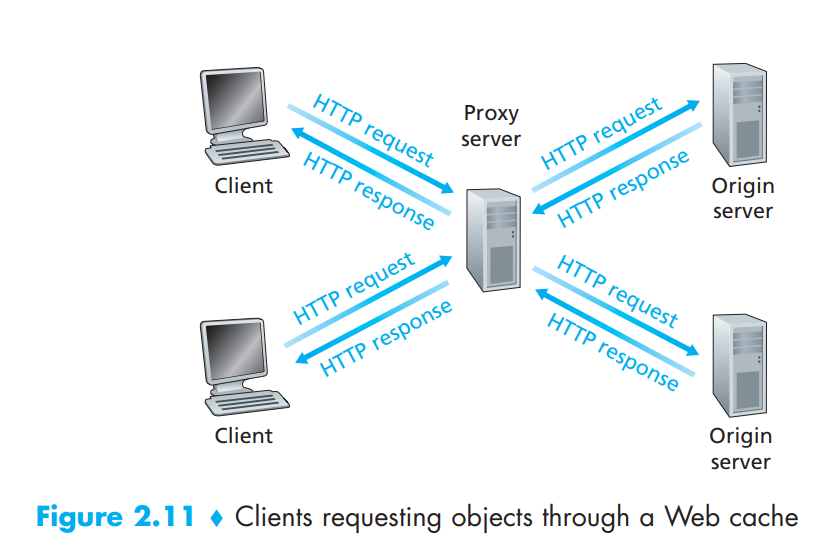

# 2.2 The Web and HTTP

## 2.2.1 Overview of HTTP

The **HyperText Transfer Protocol (HTTP),** the Web’s application-layer protocol, is at the heart of the Web.

HTTP is implemented in two programs: a client program and a server program. The client program and server program, executing on different end systems, talk to each other by exchanging HTTP messages. HTTP defines the structure of these messages and how the client and server exchange the messages.

A **Web page** (also called a document) consists of objects. An **object** is simply a file—such as an HTML file, a JPEG image, a Java applet, or a video clip—that is addressable by a single URL. Most Web pages consist of a **base HTML file** and several referenced objects.

Because **Web browsers** (such as Internet Explorer and Firefox) implement the client side of HTTP, in the context of the Web, we will use the words browser and client interchangeably. **Web servers**, which implement the server side of HTTP, house Web objects, each addressable by a URL.

HTTP defines how Web clients request Web pages from Web servers and how servers transfer Web pages to clients. When a user requests a Web page (for example, clicks on a hyperlink), the browser sends HTTP request messages for the objects in the page to the server. The server receives the requests and responds with HTTP response messages that contain the objects.

HTTP uses TCP as its underlying transport protocol (rather than running on top of UDP). The HTTP client first initiates a TCP connection with the server. Once the connection is established, the browser and the server processes access TCP through their socket interfaces. The client sends HTTP request messages into its socket interface and receives HTTP response messages from its socket interface. Similarly, the HTTP server receives request messages from its socket interface and sends response messages into its socket interface. Once the client sends a message into its socket interface, the message is out of the client’s hands and is “in the hands” of TCP. Recall from Section 2.1 that TCP provides a reliable data transfer service to HTTP. This implies that each HTTP request message sent by a client process eventually arrives intact at the server; similarly, each HTTP response message sent by the server process eventually arrives intact at the client.

It is important to note that the server sends requested files to clients without storing any state information about the client. If a particular client asks for the same object twice in a period of a few seconds, the server does not respond by saying that it just served the object to the client; instead, the server resends the object, as it has completely forgotten what it did earlier. Because an HTTP server maintains no information about the clients, HTTP is said to be a **stateless protocol.**

## 2.2.2 Non-Persistent and Persistent Connections

In many Internet applications, the client and server communicate for an extended period of time, with the client making a series of requests and the server responding to each of the requests. Depending on the application and on how the application is being used, the series of requests may be made back-to-back, periodically at regular intervals, or intermittently. When this client-server interaction is taking place over TCP, the application developer needs to make an important decision––should each request/response pair be sent over a separate TCP connection, or should all of the requests and their corresponding responses be sent over the same TCP connection? In the former approach, the application is said to use **non-persistent connections**; and in the latter approach, **persistent connections**.

#### HTTP with Non-Persistent Connections

Let’s walk through the steps of transferring a Web page from server to client for the case of non-persistent connections. Let’s suppose the page consists of a base HTML file and 10 JPEG images, and that all 11 of these objects reside on the same server. Further suppose the URL for the base HTML file is `http://www.someSchool.edu/someDepartment/home.index`

1. The HTTP client process initiates a TCP connection to the server [www.someSchool.edu](http://www.someschool.edu) on port number 80, which is the default port number for HTTP. Associated with the TCP connection, there will be a socket at the client and a socket at the server.
2. The HTTP client sends an HTTP request message to the server via its socket. The request message includes the path name /someDepartment/home.index.
3. The HTTP server process receives the request message via its socket, retrieves the object /someDepartment/home.index from its storage (RAM or disk), encapsulates the object in an HTTP response message, and sends the response message to the client via its socket.
4. The HTTP server process tells TCP to close the TCP connection.
5. The HTTP client receives the response message. The TCP connection terminates. The message indicates that the encapsulated object is an HTML file. The client extracts the file from the response message, examines the HTML file, and finds references to the 10 JPEG objects.
6. The first four steps are then repeated for each of the referenced JPEG objects.

As the browser receives the Web page, it displays the page to the user. The steps above illustrate the use of non-persistent connections, where each TCP connection is closed after the server sends the object—the connection does not persist for other objects. Note that each TCP connection transports exactly one request message and one response message. Thus, in this example, when a user requests the Web page, 11 TCP connections are generated.

In the steps described above, we were intentionally vague about whether the client obtains the 10 JPEGs over 10 serial TCP connections, or whether some of the JPEGs are obtained over parallel TCP connections. Indeed, users can configure modern browsers to control the degree of parallelism. In their default modes, most browsers open 5 to 10 parallel TCP connections, and each of these connections handles one request-response transaction.

Before continuing, let’s do a back-of-the-envelope calculation to estimate the amount of time that elapses from when a client requests the base HTML file until the entire file is received by the client. To this end, we define the **round-trip time (RTT)**, which is the time it takes for a small packet to travel from client to server and then back to the client. The RTT includes packet-propagation delays, packet queuing delays in intermediate routers and switches, and packet-processing delays.

<figure><figcaption></figcaption></figure>

Now consider what happens when a user clicks on a hyperlink. As shown in Figure 2.7, this causes the browser to initiate a TCP connection between the browser and the Web server; this involves a “three-way handshake”—the client sends a small TCP segment to the server, the server acknowledges and responds with a small TCP segment, and, finally, the client acknowledges back to the server. The first two parts of the threeway handshake take one RTT. After completing the first two parts of the handshake, the client sends the HTTP request message combined with the third part of the three-way handshake (the acknowledgment) into the TCP connection. Once the request message arrives at the server, the server sends the HTML file into the TCP connection. This HTTP request/response eats up another RTT. Thus, roughly, the total response time is two RTTs plus the transmission time at the server of the HTML file.

#### HTTP with Persistent Connections

Non-persistent connections have some shortcomings. First, a brand-new connection must be established and maintained for each requested object. Second, as we just described, each object suffers a delivery delay of two RTTs—one RTT to establish the TCP connection and one RTT to request and receive an object.

With persistent connections, the server leaves the TCP connection open after sending a response. Subsequent requests and responses between the same client and server can be sent over the same connection. In particular, an entire Web page (in the example above, the base HTML file and the 10 images) can be sent over a single persistent TCP connection. Moreover, multiple Web pages residing on the same server can be sent from the server to the same client over a single persistent TCP connection. These requests for objects can be made back-to-back, without waiting for replies to pending requests (pipelining). Typically, the HTTP server closes a connection when it isn’t used for a certain time (a configurable timeout interval). When the server receives the back-to-back requests, it sends the objects back-to-back. The default mode of HTTP uses persistent connections with pipelining.

## 2.2.3 HTTP Message Format

There are two types of HTTP messages, request messages and response messages.

#### HTTP Request Message

Below we provide a typical HTTP request message:

```jsx
GET /somedir/page.html HTTP/1.1
Host: www.someschool.edu
Connection: close
User-agent: Mozilla/5.0
Accept-language: fr

```

First of all, we see that the message is written in ordinary ASCII text, so that your ordinary computer-literate human being can read it. Second, we see that the message consists of five lines, each followed by a carriage return and a line feed. The last line is followed by an additional carriage return and line feed. Although this particular request message has five lines, a request message can have many more lines or as few as one line.

The first line of an HTTP request message is called the **request line**; the subsequent lines are called the **header lines**. The request line has three fields: the method field, the URL field, and the HTTP version field. The method field can take on several different values, including GET, POST, HEAD, PUT, and DELETE. The great majority of HTTP request messages use the GET method. The GET method is used when the browser requests an object, with the requested object identified in the URL field. In this example, the browser is requesting the object /somedir/page.html. The version is self-explanatory; in this example, the browser implements version HTTP/1.1.

Now let’s look at the header lines in the example. The header line Host: [www.someschool.edu](http://www.someschool.edu) specifies the host on which the object resides. By including the Connection: close header line, the browser is telling the server that it doesn’t want to bother with persistent connections; it wants the server to close the connection after sending the requested object. The User-agent: header line specifies the user agent, that is, the browser type that is making the request to the server. Here the user agent is Mozilla/5.0, a Firefox browser. This header line is useful because the server can actually send different versions of the same object to different types of user agents. (Each of the versions is addressed by the same URL.) Finally, the Accept language: header indicates that the user prefers to receive a French version of the object, if such an object exists on the server; otherwise, the server should send its default version.

<figure><figcaption></figcaption></figure>

Having looked at an example, let’s now look at the general format of a request message, as shown in Figure 2.8. We see that the general format closely follows our earlier example. You may have noticed, however, that after the header lines (and the additional carriage return and line feed) there is an “entity body.” The entity body is empty with the GET method, but is used with the POST method.

An HTTP client often uses the POST method when the user fills out a form—for example, when a user provides search words to a search engine. With a POST message, the user is still requesting a Web page from the server, but the specific contents of the Web page depend on what the user entered into the form fields. If the value of the method field is POST, then the entity body contains what the user entered into the form fields.

We would be remiss if we didn’t mention that a request generated with a form does not necessarily use the POST method. Instead, HTML forms often use the GET method and include the inputted data (in the form fields) in the requested URL.

The HEAD method is similar to the GET method. When a server receives a request with the HEAD method, it responds with an HTTP message but it leaves out the requested object. Application developers often use the HEAD method for debugging. The PUT method is often used in conjunction with Web publishing tools. It allows a user to upload an object to a specific path (directory) on a specific Web server. The PUT method is also used by applications that need to upload objects to Web servers. The DELETE method allows a user, or an application, to delete an object on a Web server.

#### HTTP Response Message

Below we provide a typical HTTP response message. This response message could be the response to the example request message just discussed.

```jsx
HTTP/1.1 200 OK
Connection: close
Date: Tue, 09 Aug 2011 15:44:04 GMT
Server: Apache/2.2.3 (CentOS)
Last-Modified: Tue, 09 Aug 2011 15:11:03 GMT
Content-Length: 6821
Content-Type: text/html

(data data data data data ...)
```

Let’s take a careful look at this response message. It has three sections: an initial status line, six header lines, and then the entity body. The entity body is the meat of the message—it contains the requested object itself (represented by data data data data data ...). The status line has three fields: the protocol version field, a status code, and a corresponding status message. In this example, the status line indicates that the server is using HTTP/1.1 and that everything is OK (that is, the server has found, and is sending, the requested object).

Now let’s look at the header lines. The server uses the Connection: close header line to tell the client that it is going to close the TCP connection after sending the message. The Date: header line indicates the time and date when the HTTP response was created and sent by the server. The Server: header line indicates that the message was generated by an Apache Web server; it is analogous to the User-agent: header line in the HTTP request message. The Last-Modified: header line indicates the time and date when the object was created or last modified. The Last-Modified: header, which we will soon cover in more detail, is critical for object caching, both in the local client and in network cache servers (also known as proxy servers). The Content-Length: header line indicates the number of bytes in the object being sent. The Content-Type: header line indicates that the object in the entity body is HTML text. (The object type is officially indicated by the Content-Type: header and not by the file extension.)

<figure><figcaption></figcaption></figure>

Having looked at an example, let’s now examine the general format of a response message, which is shown in Figure 2.9. The status code and associated phrase indicate the result of the request. Some common status codes and associated phrases include:

* 200 OK: Request succeeded and the information is returned in the response
* 301 Moved Permanently: Requested object has been permanently moved; the new URL is specified in Location: header of the response message. The client software will automatically retrieve the new URL
* 400 Bad Request: This is a generic error code indicating that the request could not be understood by the server
* 404 Not Found: The requested document does not exist on this server
* 505 HTTP Version Not Supported: The requested HTTP protocol version is not supported by the server

## 2.2.4 User-Server Interaction: Cookies

We mentioned above that an HTTP server is stateless. This simplifies server design and has permitted engineers to develop high-performance Web servers that can handle thousands of simultaneous TCP connections. However, it is often desirable for a Web site to identify users, either because the server wishes to restrict user access or because it wants to serve content as a function of the user identity. For these purposes, HTTP uses cookies. Cookies allow sites to keep track of users.

<figure><figcaption></figcaption></figure>

As shown in Figure 2.10, cookie technology has four components: (1) a cookie header line in the HTTP response message; (2) a cookie header line in the HTTP request message; (3) a cookie file kept on the user’s end system and managed by the user’s browser; and (4) a back-end database at the Web site.

Using Figure 2.10, let’s walk through an example of how cookies work. Suppose Susan, who always accesses the Web using Internet Explorer from her home PC, contacts [Amazon.com](http://amazon.com) for the first time. Let us suppose that in the past she has already visited the eBay site. When the request comes into the Amazon Web server, the server creates a unique identification number and creates an entry in its back-end database that is indexed by the identification number. The Amazon Web server then responds to Susan’s browser, including in the HTTP response a Set-cookie: header, which contains the identification number. For example, the header line might be:

```jsx
Set-cookie: 1678
```

When Susan’s browser receives the HTTP response message, it sees the Setcookie: header. The browser then appends a line to the special cookie file that it manages. This line includes the hostname of the server and the identification number in the Set-cookie: header. Note that the cookie file already has an entry for eBay, since Susan has visited that site in the past. As Susan continues to browse the Amazon site, each time she requests a Web page, her browser consults her cookie file, extracts her identification number for this site, and puts a cookie header line that includes the identification number in the HTTP request. Specifically, each of her HTTP requests to the Amazon server includes the header line:

```jsx
Cookie: 1678
```

In this manner, the Amazon server is able to track Susan’s activity at the Amazon site. Although the Amazon Web site does not necessarily know Susan’s name, it knows exactly which pages user 1678 visited, in which order, and at what times! Amazon uses cookies to provide its shopping cart service—Amazon can maintain a list of all of Susan’s intended purchases, so that she can pay for them collectively at the end of the session.

From this discussion we see that cookies can be used to identify a user. The first time a user visits a site, the user can provide a user identification (possibly his or her name). During the subsequent sessions, the browser passes a cookie header to the server, thereby identifying the user to the server. Cookies can thus be used to create a user session layer on top of stateless HTTP.

Although cookies often simplify the Internet shopping experience for the user, they are controversial because they can also be considered as an invasion of privacy. As we just saw, using a combination of cookies and user-supplied account information, a Web site can learn a lot about a user and potentially sell this information to a third party.

## 2.2.5 Web Caching

A **Web cache**—also called a **proxy server**—is a network entity that satisfies HTTP requests on the behalf of an origin Web server. The Web cache has its own disk storage and keeps copies of recently requested objects in this storage.

A user’s browser can be configured so that all of the user’s HTTP requests are first directed to the Web cache. Once a browser is configured, each browser request for an object is first directed to the Web cache.

<figure><figcaption></figcaption></figure>

As an example, suppose a browser is requesting the object [http://www.someschool.edu/campus.gif](http://www.someschool.edu/campus.gif). Here is what happens:

* The browser establishes a TCP connection to the Web cache and sends an HTTP request for the object to the Web cache.
* The Web cache checks to see if it has a copy of the object stored locally. If it does, the Web cache returns the object within an HTTP response message to the client browser.
* If the Web cache does not have the object, the Web cache opens a TCP connection to the origin server, that is, to [www.someschool.edu](http://www.someschool.edu). The Web cache then sends an HTTP request for the object into the cache-to-server TCP connection. After receiving this request, the origin server sends the object within an HTTP response to the Web cache
* When the Web cache receives the object, it stores a copy in its local storage and sends a copy, within an HTTP response message, to the client browser (over the existing TCP connection between the client browser and the Web cache)

Note that a cache is both a server and a client at the same time. Typically a Web cache is purchased and installed by an ISP.

Web caching has seen deployment in the Internet for two reasons. First, a Web cache can substantially reduce the response time for a client request, particularly if the bottleneck bandwidth between the client and the origin server is much less than the bottleneck bandwidth between the client and the cache. If there is a high-speed connection between the client and the cache, as there often is, and if the cache has the requested object, then the cache will be able to deliver the object rapidly to the client. Second, as we will soon illustrate with an example, Web caches can substantially reduce traffic on an institution’s access link to the Internet. By reducing traffic, the institution (for example, a company or a university) does not have to upgrade bandwidth as quickly, thereby reducing costs. Furthermore, Web caches can substantially reduce Web traffic in the Internet as a whole, thereby improving performance for all applications

Through the use of **Content Distribution Networks (CDNs)**, Web caches are increasingly playing an important role in the Internet. A CDN company installs many geographically distributed caches throughout the Internet, thereby localizing much of the traffic. There are shared CDNs (such as Akamai and Limelight) and dedicated CDNs (such as Google and Microsoft).

## 2.2.6 The Conditional GET

Although caching can reduce user-perceived response times, it introduces a new problem—the copy of an object residing in the cache may be stale. In other words, the object housed in the Web server may have been modified since the copy was cached at the client. Fortunately, HTTP has a mechanism that allows a cache to verify that its objects are up to date. This mechanism is called the **conditional GET**. An HTTP request message is a so-called conditional GET message if (1) the request message uses the GET method and (2) the request message includes an If-Modified-Since: header line.

Since this object may have been modified at the Web server in the past week, the cache performs an up-to-date check by issuing a conditional GET. Specifically, the cache sends:

```jsx
GET /fruit/kiwi.gif HTTP/1.1
Host: www.exotiquecuisine.com
If-modified-since: Wed, 7 Sep 2011 09:23:24
```

Note that the value of the If-modified-since: header line is exactly equal to the value of the Last-Modified: header line that was sent by the server one week ago. This conditional GET is telling the server to send the object only if the object has been modified since the specified date. Suppose the object has not been modified since 7 Sep 2011 09:23:24. Then, fourth, the Web server sends a response message to the cache:

```jsx
HTTP/1.1 304 Not Modified
Date: Sat, 15 Oct 2011 15:39:29
Server: Apache/1.3.0 (Unix)

(empty entity body)
```

We see that in response to the conditional GET, the Web server still sends a response message but does not include the requested object in the response message. Including the requested object would only waste bandwidth and increase user-perceived response time, particularly if the object is large. Note that this last response message has 304 Not Modified in the status line, which tells the cache that it can go ahead and forward its (the proxy cache’s) cached copy of the object to the requesting browser.
