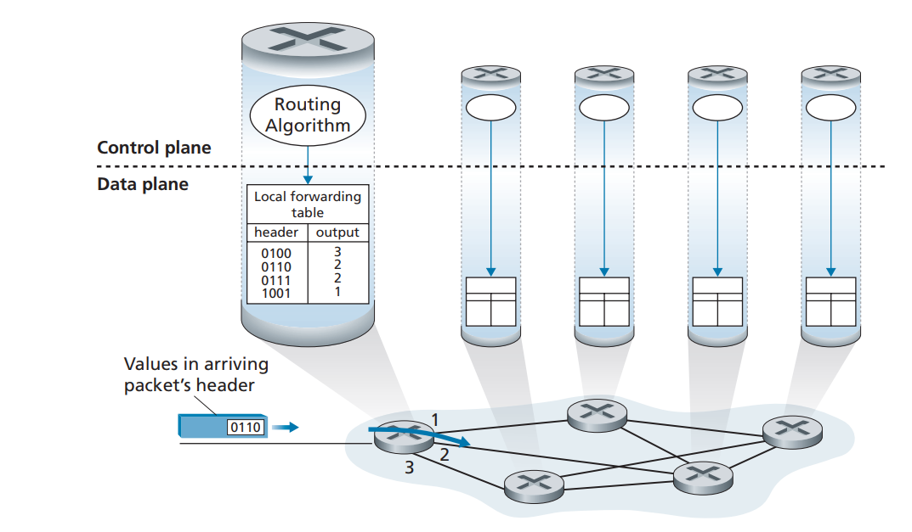
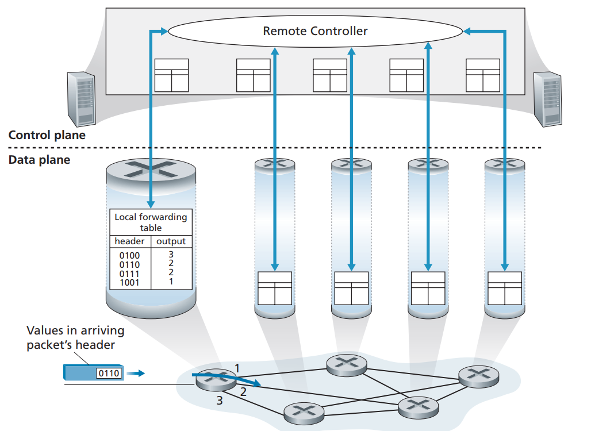

# 4.1 Overview of Network Layer

## 4.1.1 Forwarding and Routing: The Data and Control Planes

* **Forwarding.** When a packet arrives at a router’s input link, the router must move the packet to the appropriate output link.
* **Routing**. The network layer must determine the route or path taken by packets as they flow from a sender to a receiver. The algorithms that calculate these paths are referred to as **routing algorithms**.

**Forwarding** refers to the router-local action of transferring a packet from an input link interface to the appropriate output link interface. Forwarding takes place at very short timescales (typically a few nanoseconds), and thus is typically implemented in hardware. **Routing** refers to the network-wide process that determines the end-to-end paths that packets take from source to destination. Routing takes place on much longer timescales (typically seconds), and as we will see is often implemented in software.

A key element in every network router is its **forwarding table**. A router forwards a packet by examining the value of one or more fields in the arriving packet’s header, and then using these header values to index into its forwarding table. The value stored in the forwarding table entry for those values indicates the outgoing link interface at that router to which that packet is to be forwarded.

#### Control Plane: The Traditional Approach

A routing algorithm runs in each and every router and both forwarding and routing functions are contained within a router.

The routing algorithm function in one router communicates with the routing algorithm function in other routers to compute the values for its forwarding table By exchanging routing messages containing routing information according to a routing protocol

<figure><figcaption></figcaption></figure>

#### Control Plane: The SDN Approach

A physically separate, remote controller computes and distributes the forwarding tables to be used by each and every router.

 

<figure><figcaption></figcaption></figure>

Control-plane routing functionality is separated from the physical router—the routing device performs forwarding only, while the remote controller computes and distributes forwarding tables.

The remote controller might be implemented in a remote data center with high reliability and redundancy, and might be managed by the ISP or some third party.

The routers and the remote controller communicate by exchanging messages containing forwarding tables and other pieces of routing information.

## 4.1.2 Network Service Model

Let’s now consider some possible services that the network layer could provide. These services could include:

* **Guaranteed delivery.** This service guarantees that a packet sent by a source host will eventually arrive at the destination host.
* G**uaranteed delivery with bounded delay.** This service not only guarantees delivery of the packet, but delivery within a specified host-to-host delay bound (for example, within 100 msec).
* **In-order packet delivery.** This service guarantees that packets arrive at the destination in the order that they were sent.
* **Guaranteed minimal bandwidth.** This network-layer service emulates the behavior of a transmission link of a specified bit rate (for example, 1 Mbps) between sending and receiving hosts. As long as the sending host transmits bits (as part of packets) at a rate below the specified bit rate, then all packets are eventually delivered to the destination host.
* **Security.** The network layer could encrypt all datagrams at the source and decrypt them at the destination, thereby providing confidentiality to all transport-layer segments.

The Internet’s network layer provides a single service, known as **best-effort service**.

It might appear that best-effort service is a euphemism for **no service at all**—a network that delivered no packets to the destination would satisfy the definition of best-effort delivery service!

We’ll reserve the term packet switch to mean a general packet-switching device that transfers a packet from input link interface to output link interface, according to values in a packet’s header fields. Some packet switches, called **link-layer switches** (examined in Chapter 6), base their forwarding decision on values in the fields of the link-layer frame; switches are thus referred to as link-layer (layer 2) devices. Other packet switches, called **routers**, base their forwarding decision on header field values in the network-layer datagram. Routers are thus network-layer (layer 3) devices.
