# 4.2 What’s Inside a Router?

 

<figure>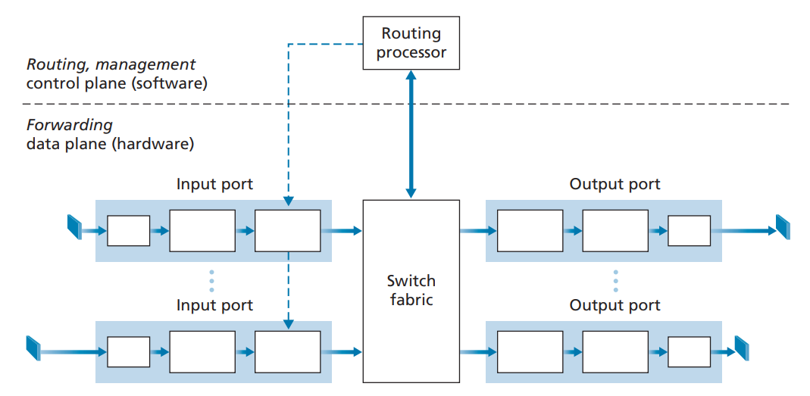<figcaption></figcaption></figure>

* **Input ports**. An input port performs several key functions. It performs the physical layer function of terminating an incoming physical link at a router. An input port also performs link-layer functions needed to interoperate with the link layer at the other side of the incoming link; this is represented by the middle boxes in the input and output ports. Perhaps most crucially, a lookup function is also performed at the input port; this will occur in the rightmost box of the input port. It is here that the forwarding table is consulted to determine the router output port to which an arriving packet will be forwarded via the switching fabric. Control packets (for example, packets carrying routing protocol information) are forwarded from an input port to the routing processor.
* **Switching fabric.** The switching fabric connects the router’s input ports to its output ports. This switching fabric is completely contained within the router—a network inside of a network router!
* **Output ports.** An output port stores packets received from the switching fabric and transmits these packets on the outgoing link by performing the necessary link-layer and physical-layer functions. When a link is bidirectional (that is, carries traffic in both directions), an output port will typically be paired with the input port for that link on the same line card.
* **Routing processor**. The routing processor performs control-plane functions. In traditional routers, it executes the routing protocols, maintains routing tables and attached link state information, and computes the forwarding table for the router. In SDN routers, the routing processor is responsible for communicating with the remote controller in order to (among other activities) receive forwarding table entries computed by the remote controller, and install these entries in the router’s input ports.

A router’s input ports, output ports, and switching fabric are almost always implemented in hardware.

* Destination-based forwarding. Suppose the car stops at an entry station and indicates its final destination (not at the local roundabout, but the ultimate destination of its journey). An attendant at the entry station looks up the final destination, determines the roundabout exit that leads to that final destination, and tells the driver which roundabout exit to take.
* Generalized forwarding. The attendant could also determine the car’s exit ramp on the basis of many other factors besides the destination. For example, the selected exit ramp might depend on the car’s origin, for example the state that issued the car’s license plate. Cars from a certain set of states might be directed to use one exit ramp (that leads to the destination via a slow road), while cars from other states might be directed to use a different exit ramp (that leads to the destination via superhighway). The same decision might be made based on the model, make and year of the car. Or a car not deemed roadworthy might be blocked and not be allowed to pass through the roundabout. In the case of generalized forwarding, any number of factors may contribute to the attendant’s choice of the exit ramp for a given car.

We can easily recognize the principal router components in Figure 4.4 in this analogy—the entry road and entry station correspond to the input port (with a lookup function to determine to local outgoing port); the roundabout corresponds to the switch fabric; and the roundabout exit road corresponds to the output port.

## 4.2.1 Input Port Processing and Destination-Based Forwarding

 

<figure>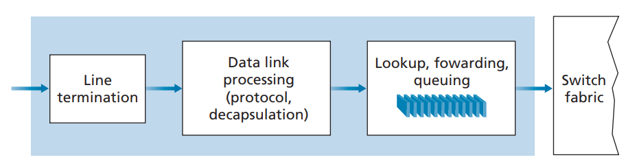<figcaption></figcaption></figure>

Let’s now consider the “simplest” case that the output port to which an incoming packet is to be switched is based on the packet’s destination address. In the case of 32-bit IP addresses, a brute-force implementation of the forwarding table would have one entry for every possible destination address. Since there are more than 4 billion possible addresses, this option is totally out of the question.

As an example of how this issue of scale can be handled, let’s suppose that our router has four links, numbered 0 through 3, and that packets are to be forwarded to the link interfaces as follows:

 

<figure>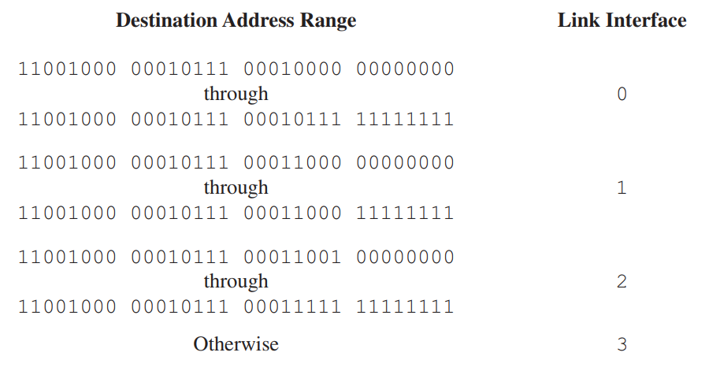<figcaption></figcaption></figure>

We could, for example, have the following forwarding table with just four entries:

 

<figure>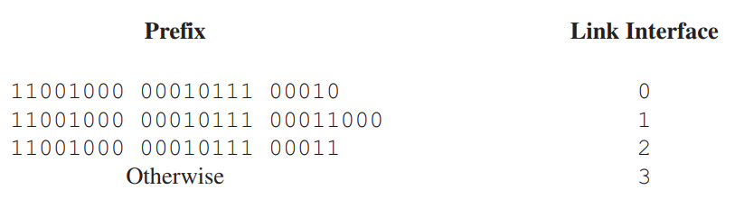<figcaption></figcaption></figure>

With this style of forwarding table, the router matches a prefix of the packet’s destination address with the entries in the table; if there’s a match, the router forwards the packet to a link associated with the match.

When there are multiple matches, the router uses the **longest prefix matching rule**; that is, it finds the longest matching entry in the table and forwards the packet to the link interface associated with the longest prefix match.

Once a packet’s output port has been determined via the lookup, the packet can be sent into the switching fabric. In some designs, a packet may be temporarily blocked from entering the switching fabric if packets from other input ports are currently using the fabric. A blocked packet will be queued at the input port and then scheduled to cross the fabric at a later point in time.

Although “lookup” is arguably the most important action in input port processing, many other actions must be taken: **(1)** physical- and link-layer processing must occur, as discussed previously; **(2)** the packet’s version number, checksum and time-to-live field must be checked and the latter two fields rewritten; and **(3)** counters used for network management (such as the number of IP datagrams received) must be updated.

## 4.2.2 Switching

The switching fabric is at the very heart of a router, as it is through this fabric that the packets are actually switched (that is, forwarded) from an input port to an output port. Switching can be accomplished in a number of ways:

* **Switching via memory**. The simplest, earliest routers were traditional computers, with switching between input and output ports being done under direct control of the CPU (routing processor). Input and output ports functioned as traditional I/O devices in a traditional operating system. An input port with an arriving packet first signaled the routing processor via an interrupt. The packet was then copied from the input port into processor memory. The routing processor then extracted the destination address from the header, looked up the appropriate output port in the forwarding table, and copied the packet to the output port’s buffers. In this scenario, if the memory bandwidth is such that a maximum of B packets per second can be written into, or read from, memory, then the overall forwarding throughput (the total rate at which packets are transferred from input ports to output ports) must be less than B/2. Note also that two packets cannot be forwarded at the same time, even if they have different destination ports, since only one memory read/write can be done at a time over the shared system bus.
* **Switching via a bus**. In this approach, an input port transfers a packet directly to the output port over a shared bus, without intervention by the routing processor. This is typically done by having the input port pre-pend a switch-internal label (header) to the packet indicating the local output port to which this packet is being transferred and transmitting the packet onto the bus. All output ports receive the packet, but only the port that matches the label will keep the packet. The label is then removed at the output port, as this label is only used within the switch to cross the bus. If multiple packets arrive to the router at the same time, each at a different input port, all but one must wait since only one packet can cross the bus at a time. Because every packet must cross the single bus, the switching speed of the router is limited to the bus speed; in our roundabout analogy, this is as if the roundabout could only contain one car at a time.
* **Switching via an interconnection network.** One way to overcome the bandwidth limitation of a single, shared bus is to use a more sophisticated interconnection network, such as those that have been used in the past to interconnect processors in a multiprocessor computer architecture. A crossbar switch is an interconnection network consisting of 2N buses that connect N input ports to N output ports, as shown in Figure 4.6. Each vertical bus intersects each horizontal bus at a crosspoint, which can be opened or closed at any time by the switch fabric controller (whose logic is part of the switching fabric itself). When a packet arrives from port A and needs to be forwarded to port Y, the switch controller closes the crosspoint at the intersection of busses A and Y, and port A then sends the packet onto its bus, which is picked up (only) by bus Y. Note that a packet from port B can be forwarded to port X at the same time, since the A-to-Y and B-to-X packets use different input and output busses. Thus, unlike the previous two switching approaches, crossbar switches are capable of forwarding multiple packets in parallel. A crossbar switch is **non-blocking**—a packet being forwarded to an output port will not be blocked from reaching that output port as long as no other packet is currently being forwarded to that output port. However, if two packets from two different input ports are destined to that same output port, then one will have to wait at the input, since only one packet can be sent over any given bus at a time.

 

<figure>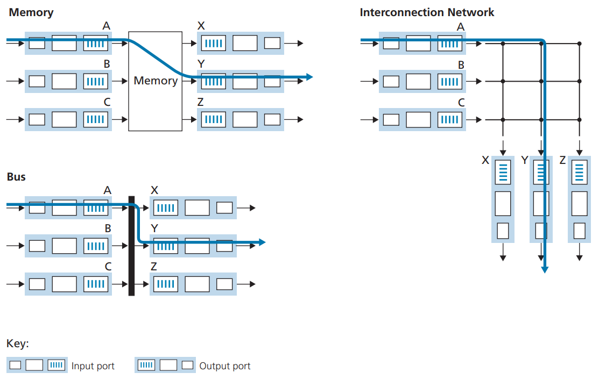<figcaption></figcaption></figure>

## 4.2.3 Output Port Processing

Output port processing takes packets that have been stored in the output port’s memory and transmits them over the output link. This includes selecting (i.e., scheduling) and de-queueing packets for transmission, and performing the needed link-layer and physical-layer transmission functions.

## 4.2.4 Where Does Queueing Occur?

It’s clear that packet queues may form at both the input ports and the output ports, just as we identified cases where cars may wait at the inputs and outputs of the traffic intersection in our roundabout analogy.

 

<figure>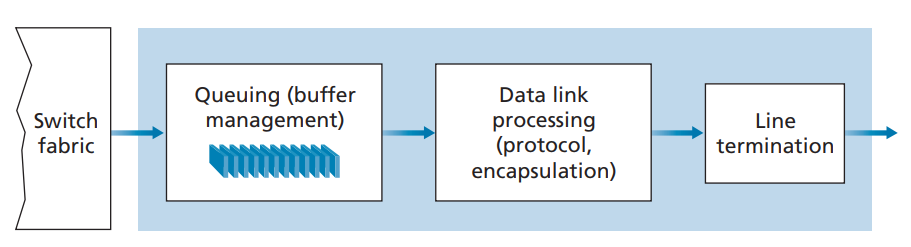<figcaption></figcaption></figure>

#### Input queueing

If the switch fabric is not fast enough (relative to the input line speeds) to transfer all arriving packets through the fabric without delay, packet queuing can also occur at the input ports, as packets must join input port queues to wait their turn to be transferred through the switching fabric to the output port.

**Head-of-the-line (HOL) blocking** in an input-queued switch—a queued packet in an input queue must wait for transfer through the fabric (even though its output port is free) because it is blocked by another packet at the head of the line.

 

<figure>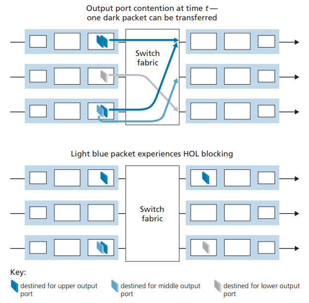<figcaption></figcaption></figure>

#### Output Queueing

 

<figure>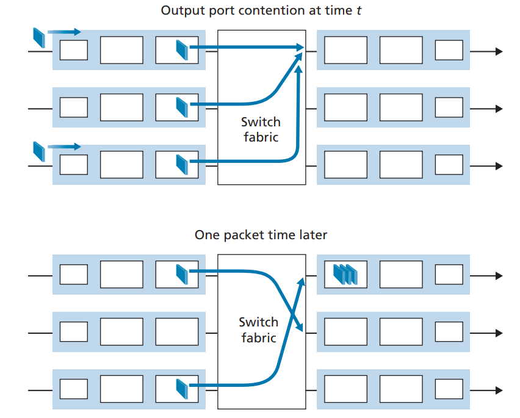<figcaption></figcaption></figure>

When there is not enough memory to buffer an incoming packet, a decision must be made to either drop the arriving packet (a policy known as drop-tail) or remove one or more already-queued packets to make room for the newly arrived packet. In some cases, it may be advantageous to drop (or mark the header of) a packet before the buffer is full in order to provide a congestion signal to the sender. A number of proactive packet-dropping and -marking policies (which collectively have become known as **active queue management (AQM)** algorithms) have been proposed and analyzed

#### How Much Buffering Is Enough?

For many years, the rule of thumb \[RFC 3439] for buffer sizing was that the amount of buffering (**B**) should be equal to an average round-trip time (**RTT**, say 250 msec) times the link capacity (**C**). Thus, a 10-Gbps link with an RTT of 250 msec would need an amount of buffering equal to **B** = **RTT** \* **C** = 2.5 Gbits of buffers.

More recent theoretical and experimental efforts \[Appenzeller 2004], however, suggest that when a large number of independent TCP flows (N) pass through a link, the amount of buffering needed is **B** = **RTT \* C / sqrt(N).**

It’s temping to think that more buffering must be better—larger buffers would allow a router to absorb larger fluctuations in the packet arrival rate, thereby decreasing the router’s packet loss rate. But larger buffers also mean potentially longer queueing delays.

## 4.2.5 Packet Scheduling

#### FIFO

Packets arriving at the link output queue wait for transmission if the link is currently busy transmitting another packet. When a packet is completely transmitted over the outgoing link (that is, receives service) it is removed from the queue. The FIFO (also known as first-come-first-served, or FCFS) scheduling discipline selects packets for link transmission in the same order in which they arrived at the output link queue.

 

<figure>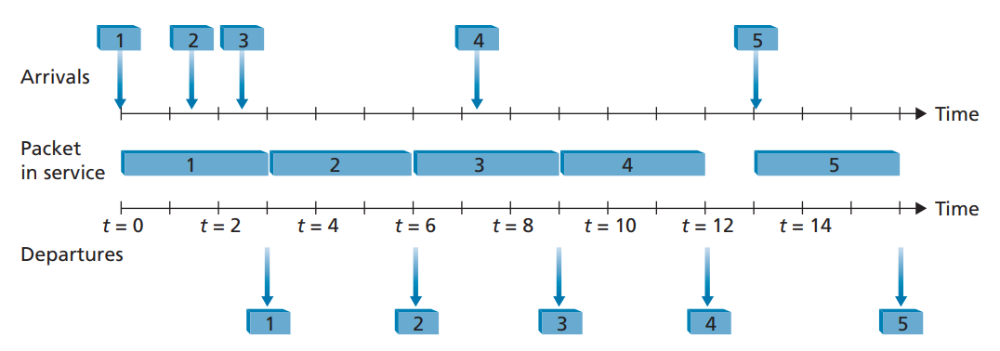<figcaption></figcaption></figure>

Assume that each packet takes three units of time to be transmitted. Under the FIFO discipline, packets leave in the same order in which they arrived. Note that after the departure of packet 4, the link remains idle (since packets 1 through 4 have been transmitted and removed from the queue) until the arrival of packet 5.

#### Priority Queuing

Under priority queuing, packets arriving at the output link are classified into priority classes upon arrival at the queue, as shown in Figure 4.13. In practice, a network operator may configure a queue so that packets carrying network management information (for example, as indicated by the source or destination TCP/UDP port number) receive priority over user traffic; additionally, real-time voice-over-IP packets might receive priority over non-real-time traffic such e-mail packets. Each priority class typically has its own queue. When choosing a packet to transmit, the priority queuing discipline will transmit a packet from the highest priority class that has a nonempty queue (that is, has packets waiting for transmission). The choice among packets in the same priority class is typically done in a FIFO manner.

 

<figure>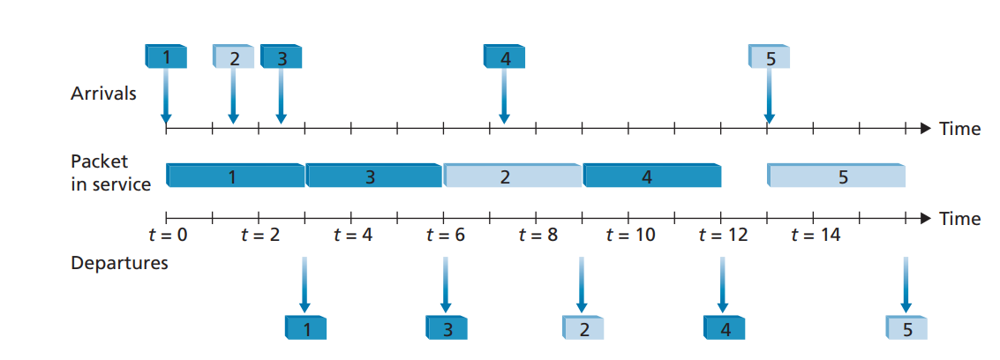<figcaption></figcaption></figure>

Packets 1, 3, and 4 belong to the high-priority class, and packets 2 and 5 belong to the low-priority class. Packet 1 arrives and, finding the link idle, begins transmission. During the transmission of packet 1, packets 2 and 3 arrive and are queued in the low and high-priority queues, respectively. After the transmission of packet 1, packet 3 (a high-priority packet) is selected for transmission over packet 2 (which, even though it arrived earlier, is a low-priority packet). At the end of the transmission of packet 3, packet 2 then begins transmission. Packet 4 (a high-priority packet) arrives during the transmission of packet 2 (a low-priority packet).

Under a non-preemptive priority queuing discipline, the transmission of a packet is not interrupted once it has begun. In this case, packet 4 queues for transmission and begins being transmitted after the transmission of packet 2 is completed.

#### Round Robin and Weighted Fair Queuing (WFQ)

Under the round robin queuing discipline, packets are sorted into classes as with priority queuing. However, rather than there being a strict service priority among classes, a round robin scheduler alternates service among the classes. In the simplest form of round robin scheduling, a class 1 packet is transmitted, followed by a class 2 packet, followed by a class 1 packet, followed by a class 2 packet, and so on. A so-called work-conserving queuing discipline will never allow the link to remain idle whenever there are packets (of any class) queued for transmission. A work conserving round robin discipline that looks for a packet of a given class but finds none will immediately check the next class in the round robin sequence.

 

<figure>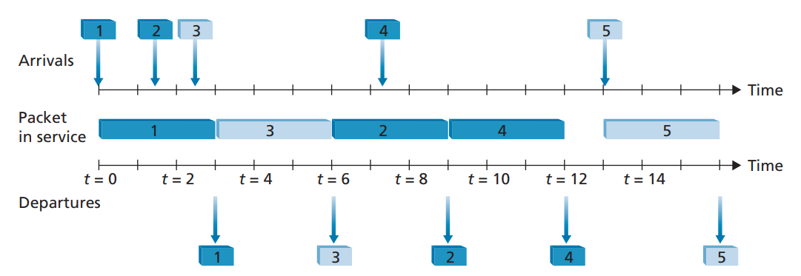<figcaption></figcaption></figure>

In this example, packets 1, 2, and 4 belong to class 1, and packets 3 and 5 belong to the second class. Packet 1 begins transmission immediately upon arrival at the output queue. Packets 2 and 3 arrive during the transmission of packet 1 and thus queue for transmission. After the transmission of packet 1, the link scheduler looks for a class 2 packet and thus transmits packet 3. After the transmission of packet 3, the scheduler looks for a class 1 packet and thus transmits packet 2. After the transmission of packet 2, packet 4 is the only queued packet; it is thus transmitted immediately after packet 2.

A generalized form of round robin queuing that has been widely implemented in routers is the so-called **weighted fair queueing (WFQ)** discipline.

WFQ differs from round robin in that each class may receive a differential amount of service in any interval of time. Specifically, each class, $i$, is assigned a weight, $w\_i$. Under WFQ, during any interval of time during which there are class $i$ packets to send, class $i$ will then be guaranteed to receive a fraction of service equal to $w\_i/\sum w\_j$), where the sum in the denominator is taken over all classes that also have packets queued for transmission. In the worst case, even if all classes have queued packets, class $i$ will still be guaranteed to receive a fraction $w\_i/\sum w\_j$ of the bandwidth, where in this worst case the sum in the denominator is over all classes. Thus, for a link with transmission rate $R$, class i will always achieve a throughput of at least $R.w\_i/\sum w\_j$.
