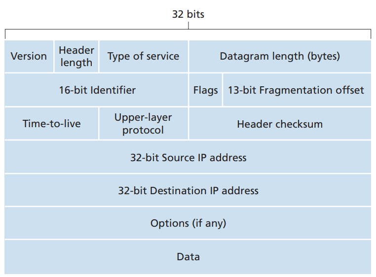
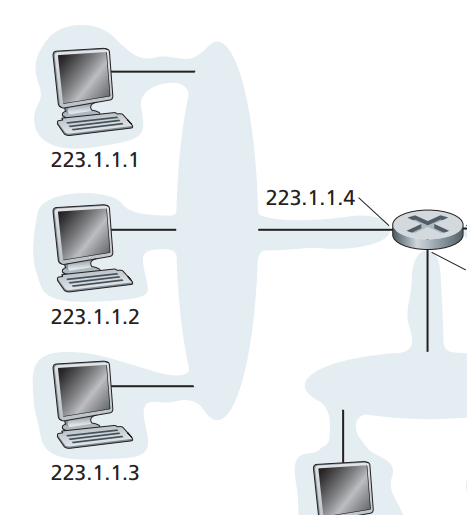
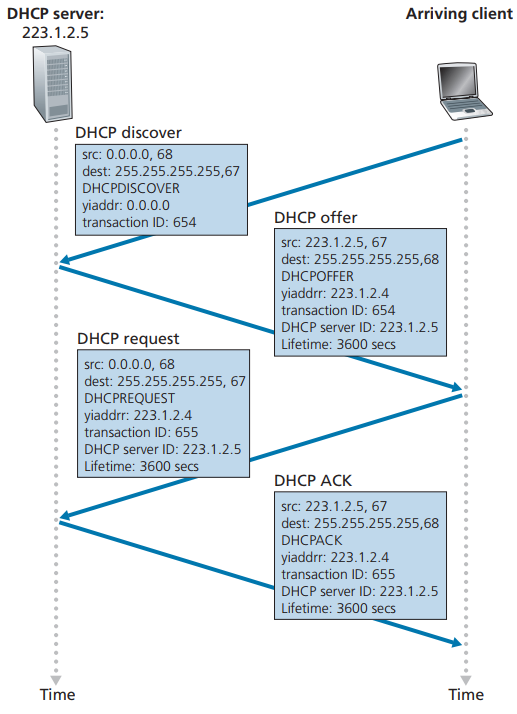
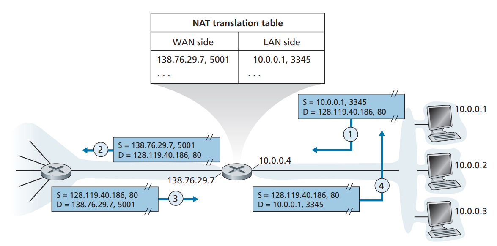
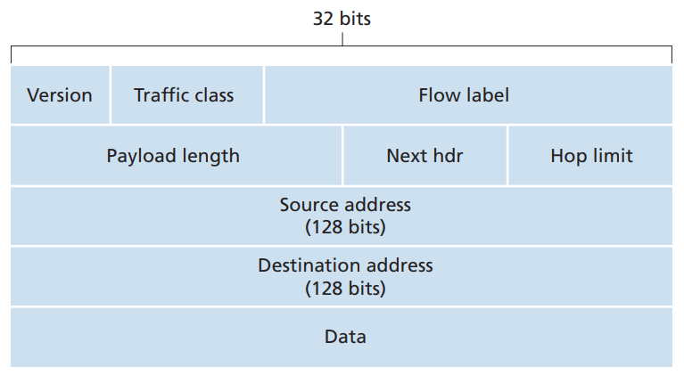
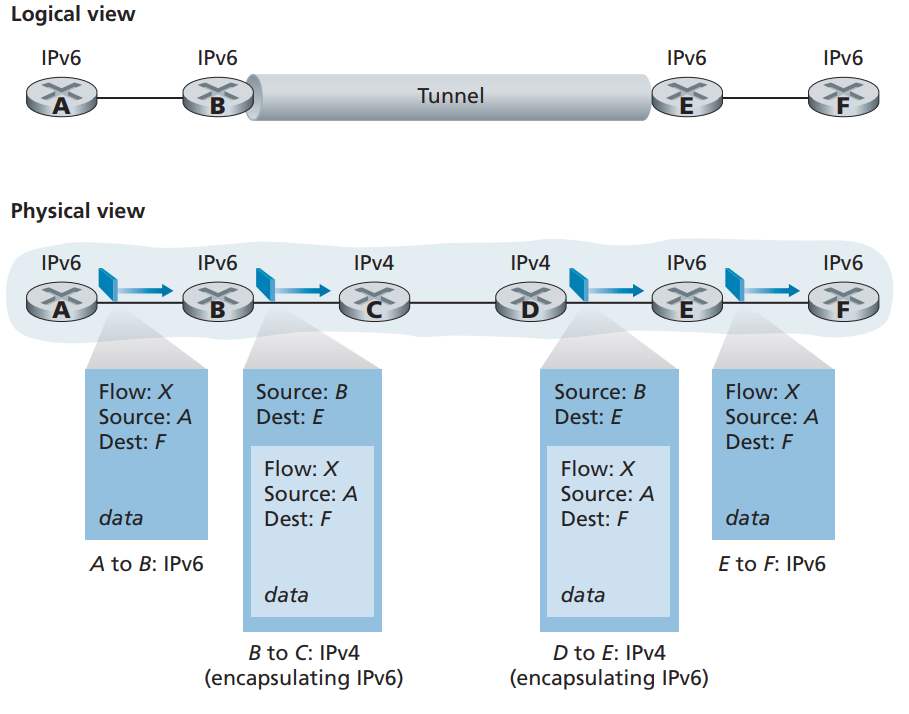

# 4.3 The Internet Protocol (IP): IPv4, Addressing, IPv6, and More

## 4.3.1 IPv4 Datagram Format

 

<figure><figcaption></figcaption></figure>

* **Version number.** These 4 bits specify the IP protocol version of the datagram. By looking at the version number, the router can determine how to interpret the remainder of the IP datagram. Different versions of IP use different datagram formats.
* **Header length**. Because an IPv4 datagram can contain a variable number of options (which are included in the IPv4 datagram header), these 4 bits are needed to determine where in the IP datagram the payload (for example, the transport layer segment being encapsulated in this datagram) actually begins. Most IP datagrams do not contain options, so the typical IP datagram has a 20-byte header.
* **Type of service.** The type of service (TOS) bits were included in the IPv4 header to allow different types of IP datagrams to be distinguished from each other. For example, it might be useful to distinguish real-time datagrams (such as those used by an IP telephony application) from non-real-time traffic (e.g., FTP).
* **Datagram length.** This is the total length of the IP datagram (header plus data), measured in bytes. Since this field is 16 bits long, the theoretical maximum size of the IP datagram is 65,535 bytes. However, datagrams are rarely larger than 1,500 bytes, which allows an IP datagram to fit in the payload field of a maximally sized Ethernet frame.
* **Identifier, flags, fragmentation offset.** These three fields have to do with so-called IP fragmentation, when a large IP datagram is broken into several smaller IP datagrams which are then forwarded independently to the destination, where they are reassembled before their payload data (see below) is passed up to the transport layer at the destination host. Interestingly, the new version of IP, IPv6, does not allow for fragmentation.
* **Time-to-live.** The time-to-live (TTL) field is included to ensure that datagrams do not circulate forever (due to, for example, a long-lived routing loop) in the network. This field is decremented by one each time the datagram is processed by a router. If the TTL field reaches 0, a router must drop that datagram.
* **Protocol.** This field is typically used only when an IP datagram reaches its final destination. The value of this field indicates the specific transport-layer protocol to which the data portion of this IP datagram should be passed. For example, a value of 6 indicates that the data portion is passed to TCP, while a value of 17 indicates that the data is passed to UDP.
* **Header checksum.** The header checksum aids a router in detecting bit errors in a received IP datagram. The header checksum is computed by treating each 2 bytes in the header as a number and summing these numbers using 1s complement arithmetic. Routers typically discard datagrams for which an error has been detected. Note that the checksum must be recomputed and stored again at each router, since the TTL field, and possibly the options field as well, will change.
* **Source and destination IP addresses.** When a source creates a datagram, it inserts its IP address into the source IP address field and inserts the address of the ultimate destination into the destination IP address field. Often the source host determines the destination address via a DNS lookup.
* **Options**. The options fields allow an IP header to be extended. Header options were meant to be used rarely—hence the decision to save overhead by not including the information in options fields in every datagram header. However, the mere existence of options does complicate matters—since datagram headers can be of variable length, one cannot determine a priori where the data field will start. Also, since some datagrams may require options processing and others may not, the amount of time needed to process an IP datagram at a router can vary greatly. These considerations become particularly important for IP processing in high performance routers and hosts. For these reasons and others, IP options **were not included** in the IPv6 header,
* **Data (payload)**. Finally, we come to the last and most important field—the raison d’etre for the datagram in the first place! In most circumstances, the data field of the IP datagram contains the transport-layer segment (TCP or UDP) to be delivered to the destination. However, the data field can carry other types of data, such as ICMP messages

Note that an IP datagram has a total of 20 bytes of header (assuming no options). If the datagram carries a TCP segment, then each datagram carries a total of 40 bytes of header (20 bytes of IP header plus 20 bytes of TCP header) along with the application-layer message.

## 4.3.2 IPv4 Addressing

A host typically has only a single link into the network; when IP in the host wants to send a datagram, it does so over this link. The boundary between the host and the physical link is called an **interface**. Now consider a router and its interfaces. Because a router’s job is to receive a datagram on one link and forward the datagram on some other link, a router necessarily has two or more links to which it is connected. The boundary between the router and any one of its links is also called an **interface**. A router thus has multiple interfaces, one for each of its links. Because every host and router is capable of sending and receiving IP datagrams, IP requires each host and router interface to have its own **IP address.** Thus, an IP address is technically associated with an interface, rather than with the host or router containing that interface.

Each IP address is 32 bits long (equivalently, 4 bytes), and there are thus a total of 232 (or approximately 4 billion) possible IP addresses. These addresses are typically written in so-called dotted-decimal notation, in which each byte of the address is written in its decimal form and is separated by a period (dot) from other bytes in the address.

For example, consider the IP address 193.32.216.9. The 193 is the decimal equivalent of the first 8 bits of the address; the 32 is the decimal equivalent of the second 8 bits of the address, and so on. Thus, the address 193.32.216.9 in binary notation is

&#x20;11000001 00100000 11011000 00001001&#x20;

Each interface on every host and router in the global Internet must have an IP address that is globally unique (except for interfaces behind NATs). A portion of an interface’s IP address will be determined by the subnet to which it is connected.

 

<figure><figcaption></figcaption></figure>

In IP terms, this network interconnecting three host interfaces and one router interface forms a subnet.

IP addressing assigns an address to this subnet: 223.1.1.0/24, where the /24 (“slash-24”) notation, sometimes known as a subnet mask, indicates that the leftmost 24 bits of the 32-bit quantity define the subnet address.

To determine the subnets, detach each interface from its host or router, creating islands of isolated networks, with interfaces terminating the end points of the isolated networks. Each of these isolated networks is called a subnet.

The Internet’s address assignment strategy is known as **Classless Interdomain Routing (CIDR—pronounced cider)**. CIDR generalizes the notion of subnet addressing. As with subnet addressing, the 32-bit IP address is divided into two parts and again has the dotted-decimal form a.b.c.d/x, where x indicates the number of bits in the first part of the address.

The x most significant bits of an address of the form a.b.c.d/x constitute the network portion of the IP address, and are often referred to as the prefix (or network prefix) of the address. An organization is typically assigned a block of contiguous addresses, that is, a range of addresses with a common prefix (see the Principles in Practice feature). In this case, the IP addresses of devices within the organization will share the common prefix.

When a router outside the organization forwards a datagram whose destination address is inside the organization, only the leading x bits of the address need be considered. This considerably reduces the size of the forwarding table in these routers, since a single entry of the form a.b.c.d/x will be sufficient to forward packets to any destination within the organization.

The remaining 32-x bits of an address can be thought of as distinguishing among the devices within the organization, all of which have the same network prefix. These are the bits that will be considered when forwarding packets at routers within the organization.

For example, suppose the first 21 bits of the CIDRized address a.b.c.d/21 specify the organization’s network prefix and are common to the IP addresses of all devices in that organization. The remaining 11 bits then identify the specific hosts in the organization. The organization’s internal structure might be such that these 11 rightmost bits are used for subnetting within the organization, as discussed above. For example, a.b.c.d/24 might refer to a specific subnet within the organization.

Before CIDR was adopted, the network portions of an IP address were constrained to be 8, 16, or 24 bits in length, an addressing scheme known as **classful addressing**,

We would be remiss if we did not mention yet another type of IP address, the IP broadcast address 255.255.255.255. When a host sends a datagram with destination address 255.255.255.255, the message is delivered to all hosts on the same subnet. Routers optionally forward the message into neighboring subnets as well (although they usually don’t).

#### Obtaining a Block of Addresses

In order to obtain a block of IP addresses for use within an organization’s subnet, a network administrator might first contact its ISP, which would provide addresses from a larger block of addresses that had already been allocated to the ISP.

For example, the ISP may itself have been allocated the address block 200.23.16.0/20. The ISP, in turn, could divide its address block into eight equal-sized contiguous address blocks and give one of these address blocks out to each of up to eight organizations that are supported by this ISP, as shown below.

ISP’s block: 200.23.16.0/20 **11001000 00010111 0001**0000 00000000

Organization 0 200.23.16.0/23 **11001000 00010111 0001**0000 00000000

Organization 1 200.23.18.0/23 **11001000 00010111 0001**0010 00000000

Organization 2 200.23.20.0/23 **11001000 00010111 0001**0100 00000000

Organization 7 200.23.30.0/23 **11001000 00010111 0001**1110 00000000

While obtaining a set of addresses from an ISP is one way to get a block of addresses, it is not the only way. Clearly, there must also be a way for the ISP itself to get a block of addresses. IP addresses are managed under the authority of the Internet Corporation for Assigned Names and Numbers. The role of the nonprofit ICANN organization is not only to allocate IP addresses, but also to manage the DNS root servers. It also has the very contentious job of assigning domain names and resolving domain name disputes.

#### Obtaining a Host Address: The Dynamic Host Configuration Protocol

Host addresses can also be configured manually, but typically this is done using the **Dynamic Host Configuration Protocol (DHCP)**. DHCP allows a host to obtain (be allocated) an IP address automatically. A network administrator can configure DHCP so that a given host receives the same IP address each time it connects to the network, or a host may be assigned a **temporary IP address** that will be different each time the host connects to the network. In addition to host IP address assignment, DHCP also allows a host to learn additional information, such as its subnet mask, the address of its first-hop router (often called the default gateway), and the address of its local DNS server.

Because of DHCP’s ability to automate the network-related aspects of connecting a host into a network, it is often referred to as a **plug-and-play** or **zeroconf** (zero-configuration) protocol. This capability makes it very attractive to the network administrator who would otherwise have to perform these tasks manually! DHCP is also enjoying widespread use in residential Internet access networks, enterprise networks, and in wireless LANs, where hosts join and leave the network frequently.

DHCP is a client-server protocol. A client is typically a newly arriving host wanting to obtain network configuration information, including an IP address for itself. In the simplest case, each subnet (in the addressing sense of Figure 4.20) will have a DHCP server. If no server is present on the subnet, a DHCP relay agent (typically a router) that knows the address of a DHCP server for that network is needed.

For a newly arriving host, the DHCP protocol is a four-step process. In this figure, yiaddr (as in “your Internet address”) indicates the address being allocated to the newly arriving client. The four steps are:

* **DHCP server discovery.** The first task of a newly arriving host is to find a DHCP server with which to interact. This is done using a **DHCP discover message**, which a client sends within a UDP packet to port 67. The UDP packet is encapsulated in an IP datagram. But to whom should this datagram be sent? The host doesn’t even know the IP address of the network to which it is attaching, much less the address of a DHCP server for this network. Given this, the DHCP client creates an IP datagram containing its DHCP discover message along with the broadcast destination IP address of 255.255.255.255 and a “this host” source IP address of 0.0.0.0. The DHCP client passes the IP datagram to the link layer, which then broadcasts this frame to all nodes attached to the subnet.
* **DHCP server offer(s).** A DHCP server receiving a **DHCP discover message** responds to the client with a DHCP offer message that is broadcast to all nodes on the subnet, again using the IP broadcast address of 255.255.255.255. Since several DHCP servers can be present on the subnet, the client may find itself in the enviable position of being able to choose from among several offers. Each server offer message contains the transaction ID of the received discover message, the proposed IP address for the client, the network mask, and an **IP address lease time**—the amount of time for which the IP address will be valid. It is common for the server to set the lease time to several hours or days.
* **DHCP request.** The newly arriving client will choose from among one or more server offers and respond to its selected offer with a **DHCP request message**, echoing back the configuration parameters.
* **DHCP ACK**. The server responds to the DHCP request message with a **DHCP ACK message**, confirming the requested parameters.

 

<figure><figcaption></figcaption></figure>

Once the client receives the DHCP ACK, the interaction is complete and the client can use the DHCP-allocated IP address for the lease duration.

From a mobility aspect, DHCP does have one very significant shortcoming. Since a new IP address is obtained from DHCP each time a node connects to a new subnet, a TCP connection to a remote application cannot be maintained as a mobile node moves between subnets.

#### 4.3.3 Network Address Translation (NAT)

 

<figure><figcaption></figcaption></figure>

The NAT-enabled router does not look like a router to the outside world. Instead the NAT router behaves to the outside world as a **single device with a single IP address.**

In essence, the NAT-enabled router is hiding the details of the home network from the outside world. (As an aside, you might wonder where the home network computers get their addresses and where the router gets its single IP address. Often, the answer is the same—DHCP! The router gets its address from the ISP’s DHCP server, and the router runs a DHCP server to provide addresses to computers within the NAT-DHCP-router-controlled home network’s address space.)

A **NAT translation table** at the NAT router, and to include **port numbers as well as IP addresses** in the table entries to know the internal host to which it should forward a given datagram.

## 4.3.4 IPv6

IPv6 was invented for a few reasons. One reason is that the number of available IPv4 addresses was running out. IPv6 allows for a much larger number of available addresses. Additionally, IPv6 also allows for more efficient routing and improved security features. Finally, IPv6 also includes support for new technologies, such as mobile devices and the Internet of Things.

#### IPv6 Datagram Format

 

<figure><figcaption></figcaption></figure>

The most important changes introduced in IPv6 are evident in the datagram format:

**Expanded addressing capabilities.** IPv6 increases the size of the IP address from 32 to 128 bits. This ensures that the world won’t run out of IP addresses. Now, every grain of sand on the planet can be IP-addressable. In addition to unicast and multicast addresses, IPv6 has introduced a new type of address, called an **anycast address**, that allows a datagram to be delivered to any one of a group of hosts.

**A streamlined 40-byte header**. As discussed below, a number of IPv4 fields have been dropped or made optional. The resulting 40-byte fixed-length header allows for faster processing of the IP datagram by a router. A new encoding of options allows for more flexible options processing.

**Flow labeling**. IPv6 has an elusive definition of a **flow**. RFC 2460 states that this allows “labeling of packets belonging to particular flows for which the sender requests special handling, such as a non-default quality of service or real-time service.” For example, audio and video transmission might likely be treated as a flow. On the other hand, the more traditional applications, such as file transfer and e-mail, might not be treated as flows. It is possible that the traffic carried by a high-priority user (for example, someone paying for better service for their traffic) might also be treated as a flow.

The following fields are defined in IPv6:

* **Version.** This 4-bit field identifies the IP version number. Not surprisingly, IPv6 carries a value of 6 in this field. Note that putting a 4 in this field does not create a valid IPv4 datagram.
* **Traffic class.** The 8-bit traffic class field, like the TOS field in IPv4, can be used to give priority to certain datagrams within a flow, or it can be used to give priority to datagrams from certain applications (for example, voice-over-IP) over datagrams from other applications (for example, SMTP e-mail)
* **Flow label.** As discussed above, this 20-bit field is used to identify a flow of datagrams
* **Payload length.** This 16-bit value is treated as an unsigned integer giving the number of bytes in the IPv6 datagram following the fixed-length, 40-byte datagram header.
* **Next header**. This field identifies the protocol to which the contents (data field) of this datagram will be delivered (for example, to TCP or UDP). The field uses the same values as the protocol field in the IPv4 header.
* **Hop limit**. The contents of this field are decremented by one by each router that forwards the datagram. If the hop limit count reaches zero, a router must discard that datagram
* **Source and destination addresses**. The various formats of the IPv6 128-bit address are described in RFC 4291.
* **Data.** This is the payload portion of the IPv6 datagram. When the datagram reaches its destination, the payload will be removed from the IP datagram and passed on to the protocol specified in the next header field.

Several fields appearing in the IPv4 datagram are no longer present in the IPv6 datagram

* **Fragmentation/reassembly**. IPv6 does not allow for fragmentation and reassembly at intermediate routers; these operations can be performed only by the source and destination. If an IPv6 datagram received by a router is too large to be forwarded over the outgoing link, the router simply drops the datagram and sends a “Packet Too Big” ICMP error message back to the sender. The sender can then resend the data, using a smaller IP datagram size. Fragmentation and reassembly is a time-consuming operation; removing this functionality from the routers and placing it squarely in the end systems considerably speeds up IP forwarding within the network.
* **Header checksum.** Because the transport-layer (for example, TCP and UDP) and link-layer (for example, Ethernet) protocols in the Internet layers perform check summing, the designers of IP probably felt that this functionality was sufficiently redundant in the network layer that it could be removed.
* **Options.** An options field is no longer a part of the standard IP header. However, it has not gone away. Instead, the options field is one of the possible next headers pointed to from within the IPv6 header. That is, just as TCP or UDP protocol headers can be the next header within an IP packet, so too can an options field.

#### Transitioning from IPv4 to IPv6

The approach to IPv4-to-IPv6 transition that has been most widely adopted in practice involves **tunneling**.

With tunneling, the IPv6 node on the sending side of the tunnel takes the entire IPv6 datagram and puts it in the data (payload) field of an IPv4 datagram. This IPv4 datagram is then addressed to the IPv6 node on the receiving side of the tunnel and sent to the first node in the tunnel. The intervening IPv4 routers in the tunnel route this IPv4 datagram among themselves, just as they would any other datagram, blissfully unaware that the IPv4 datagram itself contains a complete IPv6 datagram. The IPv6 node on the receiving side of the tunnel eventually receives the IPv4 datagram (it is the destination of the IPv4 datagram!), determines that the IPv4 datagram contains an IPv6 datagram (by observing that the protocol number field in the IPv4 datagram is 41, indicating that the IPv4 payload is a IPv6 datagram), extracts the IPv6 datagram, and then routes the IPv6 datagram exactly as it would if it had received the IPv6 datagram from a directly connected IPv6 neighbor.

 

<figure><figcaption></figcaption></figure>

One important lesson that we can learn from the IPv6 experience is that it is enormously difficult to change network-layer protocols.
