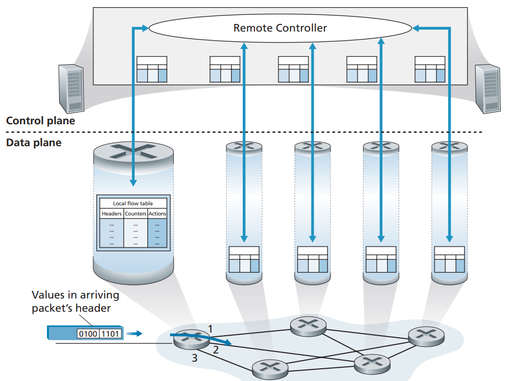
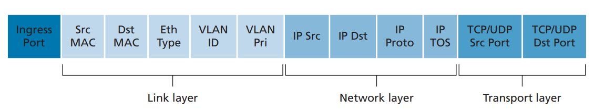

# 4.4 Generalized Forwarding and SDN

Recall that Section 4.2.1 characterized destination-based forwarding as the two steps of looking up a destination IP address (“**match**”), then sending the packet into the switching fabric to the specified output port (“**action**”). Let’s now consider a significantly more general “**match-plus-action**” paradigm, where the “**match**” can be made over multiple header fields associated with different protocols at different layers in the protocol stack. The “**action**” can include forwarding the packet to one or more output ports (as in destination-based forwarding), load balancing packets across multiple outgoing interfaces that lead to a service (as in load balancing), rewriting header values (as in NAT), purposefully blocking/dropping a packet (as in a firewall), sending a packet to a special server for further processing and action (as in DPI), and more.

In generalized forwarding, a match-plus-action table generalizes the notion of the destination-based forwarding table that we encountered in Section 4.2.1. Because forwarding decisions may be made using network-layer and/or link-layer source and destination addresses, the forwarding devices shown in the below figure are more accurately described as “packet switches” rather than layer 3 “routers” or layer 2 “switches.”

 

<figure><figcaption></figcaption></figure>

Our following discussion of generalized forwarding will be based on OpenFlow - a highly visible standard that has pioneered the notion of the match-plus-action forwarding abstraction and controllers, as well as the SDN revolution more generally. We’ll primarily consider OpenFlow 1.0, which introduced key SDN abstractions and functionality in a particularly clear and concise manner.

Each entry in the match-plus-action forwarding table, known as a flow table in OpenFlow, includes:

* **A set of header field values** to which an incoming packet will be matched. As in the case of destination-based forwarding, hardware-based matching is most rapidly performed in TCAM memory, with more than a million destination address entries being possible. A packet that matches no flow table entry can be dropped or sent to the remote controller for more processing.
* **A set of counters** that are updated as packets are matched to flow table entries. These counters might include the number of packets that have been matched by that table entry, and the time since the table entry was last updated.
* **A set of actions to be taken** when a packet matches a flow table entry. These actions might be to forward the packet to a given output port, to drop the packet, makes copies of the packet and sent them to multiple output ports, and/or to rewrite selected header fields.

## 4.4.1 Matching

 

<figure><figcaption></figcaption></figure>

## 4.4.2 Action

Among the most important possible actions are:

* **Forwarding**. An incoming packet may be forwarded to a particular physical output port, broadcast over all ports (except the port on which it arrived) or multicast over a selected set of ports. The packet may be encapsulated and sent to the remote controller for this device. That controller then may (or may not) take some action on that packet, including installing new flow table entries, and may return the packet to the device for forwarding under the updated set of flow table rules.
* **Dropping**. A flow table entry with no action indicates that a matched packet should be dropped.
* **Modify-field.** The values in 10 packet-header fields (all layer 2, 3, and 4 fields shown in Figure 4.29 except the IP Protocol field) may be re-written before the packet is forwarded to the chosen output port.
