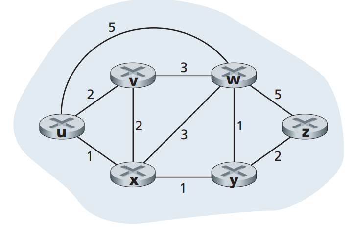
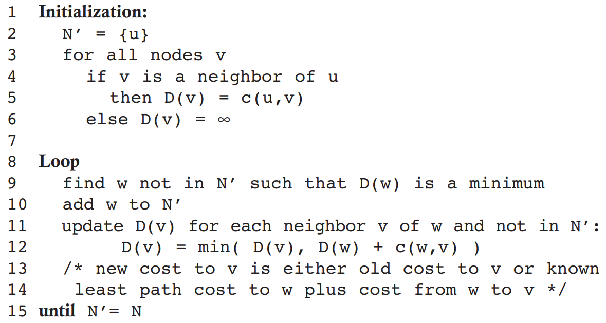
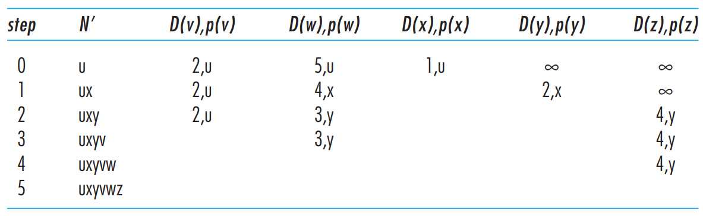
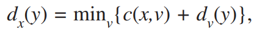
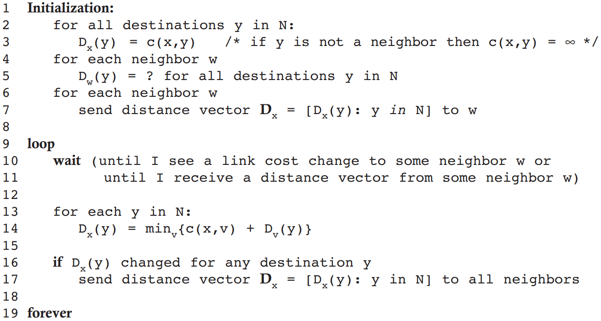
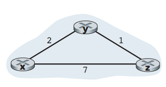
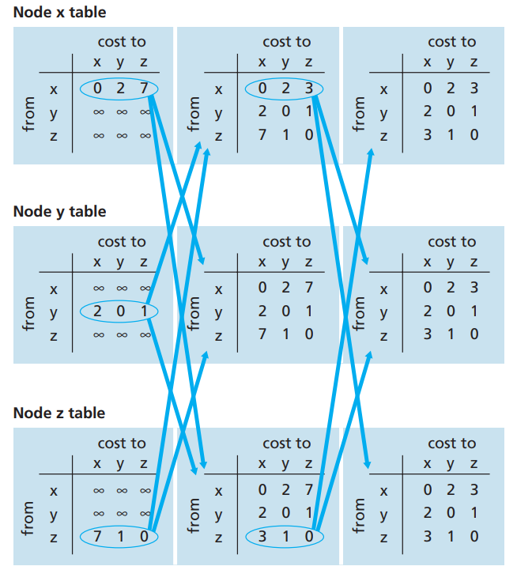
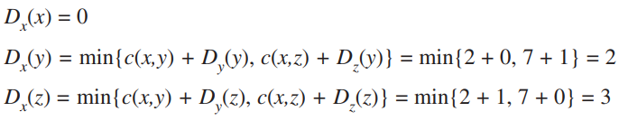

# 4.4 Routing Algorithms

We refer to the default router of the source host as the **source router** and the default router of the destination host as the **destination router**. The problem of routing a packet from source host to destination host clearly boils down to the problem of routing the packet from source router to destination router.

A graph is used to formulate routing problems. Recall that a graph G = (N,E) is a set N of nodes and a collection E of edges, where each edge is a pair of nodes from N. In the context of network-layer routing, the nodes in the graph represent routers—the points at which packet-forwarding decisions are made—and the edges connecting these nodes represent the physical links between these routers.

For any edge (x,y) in E, we denote c(x,y) as the cost of the edge between nodes x and y. If the pair (x,y) does not belong to E, we set c(x,y) = ∞.

 

<figure><figcaption>
Figure 4.27
</figcaption></figure>

* A **global routing algorithm** computes the least-cost path between a source and destination using complete, global knowledge about the network. That is, the algorithm takes the connectivity between all nodes and all link costs as inputs. In practice, algorithms with global state information are often referred to as **link-state (LS) algorithms**, since the algorithm must be aware of the cost of each link in the net-work.
* In a **decentralized routing algorithm**, the calculation of the least-cost path is carried out in an iterative, distributed manner. No node has complete information about the costs of all network links. The decentralized routing algorithm we’ll study is called a **distance-vector (DV) algorithm**, because each node maintains a vector of estimates of the costs (distances) to all other nodes in the network.

A second broad way to classify routing algorithms is according to whether they are static or dynamic. In **static routing algorithms**, routes change very slowly over time, often as a result of human intervention. **Dynamic routing algorithms** change the routing paths as the network traffic loads or topology change. A dynamic algorithm can be run either periodically or in direct response to topology or link cost changes.

A third way to classify routing algorithms is according to whether they are **load-sensitive** or **load-insensitive**. In a load-sensitive algorithm, link costs vary dynamically to reflect the current level of congestion in the underlying link. Today’s Internet routing algorithms (such as RIP, OSPF, and BGP) are **load-insensitive**, as a link’s cost does not explicitly reflect its current (or recent past) level of congestion.

## 4.4.1 The Link-State (LS) Routing Algorithm

Recall that in a link-state algorithm, the network topology and all link costs are known, that is, available as input to the LS algorithm. In practice this is accomplished by having each node broadcast link-state packets to all other nodes in the network, with each link-state packet containing the identities and costs of its attached links. In practice this is often accomplished by a **link-state broadcast algorithm.** The result of the nodes’ broadcast is that all nodes have an identical and complete view of the network. Each node can then run the LS algorithm and compute the same set of least-cost paths as every other node.

The link-state routing algorithm we present below is known as Dijkstra’s algorithm, named after its inventor. Dijkstra’s algorithm computes the least-cost path from one node (the source, which we will refer to as u) to all other nodes in the network. Dijkstra’s algorithm is iterative and has the property that after the kth iteration of the algorithm, the least-cost paths are known to k destination nodes, and among the least-cost paths to all destination nodes, these k paths will have the k smallest costs. Let us define the following notation:

* D(v): cost of the least-cost path from the source node to destination v as of this iteration of the algorithm.
* p(v): previous node (neighbor of v) along the current least-cost path from the source to v.
* N’ : subset of nodes; v is in N’ if the least-cost path from the source to v is definitively known.

The global routing algorithm consists of an initialization step followed by a loop. The number of times the loop is executed is equal to the number of nodes in the network. Upon termination, the algorithm will have calculated the shortest paths from the source node u to every other node in the network

 

<figure><figcaption></figcaption></figure>

 

<figure><figcaption>
Running the link-state algorithm on the network in figure 4.27
</figcaption></figure>

* In the initialization step, the currently known least-cost paths from u to its directly attached neighbors, v, x, and w, are initialized to 2, 1, and 5, respectively. Note in particular that the cost to w is set to 5 (even though we will soon see that a lesser-cost path does indeed exist) since this is the cost of the direct (one hop) link from u to w. The costs to y and z are set to infinity because they are not directly connected to u.
* In the first iteration, we look among those nodes not yet added to the set N and find that node with the least cost as of the end of the previous iteration. That node is x, with a cost of 1, and thus x is added to the set N. Line 12 of the LS algorithm is then performed to update D(v) for all nodes v, yielding the results shown in the second line (Step 1) in Table 4.3. The cost of the path to v is unchanged. The cost of the path to w (which was 5 at the end of the initialization) through node x is found to have a cost of 4. Hence this lower-cost path is selected and w’s predecessor along the shortest path from u is set to x. Similarly, the cost to y (through x) is computed to be 2, and the table is updated accordingly.
* In the second iteration, nodes v and y are found to have the least-cost paths (2), and we break the tie arbitrarily and add y to the set N so that N now contains u, x, and y. The cost to the remaining nodes not yet in N, that is, nodes v, w, and z, are updated via line 12 of the LS algorithm, yielding the results shown in the third row in the Table 4.3.
* And so on…

The preceding implementation of the LS algorithm has worst-case complexity of order n squared: O(n^2).

## 4.4.2 The Distance-Vector (DV) Routing Algorithm

Whereas the LS algorithm is an algorithm using global information, the **distance-vector (DV) algorithm** is iterative, asynchronous, and distributed. It is distributed in that each node receives some information from one or more of its directly attached neighbors, performs a calculation, and then distributes the results of its calculation back to its neighbors. It is iterative in that this process continues on until no more information is exchanged between neighbors. (Interestingly, the algorithm is also self-terminating—there is no signal that the computation should stop; it just stops.) The algorithm is asynchronous in that it does not require all of the nodes to operate in lockstep with each other.

Let $d\_x(y)$ be the cost of the least-cost path from node x to node y. Then the least costs are related by the celebrated Bellman-Ford equation, namely:

 

<figure><figcaption></figcaption></figure>

where the $min\_v$ in the equation is taken over all of x’s neighbors. Indeed, after traveling from x to v, if we then take the least-cost path from v to y, the path cost will be $c(x,y)+d\_v(y)$. Since we must begin by traveling to some neighbor v, the least cost from x to y is the minimum of $c(x,y)+d\_v(y)$ taken over all neighbors v.

 

<figure><figcaption></figcaption></figure>

DV-like algorithms are used in many routing protocols in practice, including the Internet’s RIP and BGP, ISO IDRP, Novell IPX, and the original ARPAnet

 

<figure><figcaption></figcaption></figure>

 

<figure><figcaption></figcaption></figure>

After initialization, each node sends its distance vector to each of its two neighbors. For example, node x sends its distance vector Dx = \[0, 2, 7] to both nodes y and z. After receiving the updates, each node recomputes its own distance vector. For example, node x computes

<figure><figcaption></figcaption></figure>

After the nodes recompute their distance vectors, they again send their updated distance vectors to their neighbors (if there has been a change).

The process of receiving updated distance vectors from neighbors, recomputing routing table entries, and informing neighbors of changed costs of the least-cost path to a destination continues until no update messages are sent. At this point, since no update messages are sent, no further routing table calculations will occur and the algorithm will enter a quiescent state;

#### A Comparison of LS and DV Routing Algorithms

* Message complexity. We have seen that LS requires each node to know the cost of each link in the network. This requires O(|N| |E|) messages to be sent. Also, whenever a link cost changes, the new link cost must be sent to all nodes. The DV algorithm requires message exchanges between directly connected neighbors at each iteration. We have seen that the time needed for the algorithm to converge can depend on many factors. When link costs change, the DV algorithm will propagate the results of the changed link cost only if the new link cost results in a changed least-cost path for one of the nodes attached to that link.
* Speed of convergence. We have seen that our implementation of LS is an O(|N|2) algorithm requiring O(|N| |E|)) messages. The DV algorithm can converge slowly and can have routing loops while the algorithm is converging. DV also suffers from the count-to-infinity problem.
* Robustness. What can happen if a router fails, misbehaves, or is sabotaged? Under LS, a router could broadcast an incorrect cost for one of its attached links (but no others). A node could also corrupt or drop any packets it received as part of an LS broadcast. But an LS node is computing only its own forwarding tables; other nodes are performing similar calculations for themselves. This means route calculations are somewhat separated under LS, providing a degree of robustness. Under DV, a node can advertise incorrect least-cost paths to any or all destinations. More generally, we note that, at each iteration, a node’s calculation in DV is passed on to its neighbor and then indirectly to its neighbor’s neighbor on the next iteration. In this sense, an incorrect node calculation can be diffused through the entire network under DV.

## 4.4.3 Hierarchical Routing

In our study of LS and DV algorithms, we’ve viewed the network simply as a collection of interconnected routers. In practice, this model and its view of a homogenous set of routers all executing the same routing algorithm is a bit simplistic for at least two important reasons:

* Scale. As the number of routers becomes large, the overhead involved in computing, storing, and communicating routing information (for example, LS updates or least-cost path changes) becomes prohibitive. Today’s public Internet consists of hundreds of millions of hosts. Storing routing information at each of these hosts would clearly require enormous amounts of memory. The overhead required to broadcast LS updates among all of the routers in the public Internet would leave no bandwidth left for sending data packets! A distance-vector algorithm that iterated among such a large number of routers would surely never converge.
* Administrative autonomy. Although researchers tend to ignore issues such as a company’s desire to run its routers as it pleases (for example, to run whatever routing algorithm it chooses) or to hide aspects of its network’s internal organization from the outside, these are important considerations. Ideally, an organization should be able to run and administer its network as it wishes, while still being able to connect its network to other outside networks.

Both of these problems can be solved by organizing routers into **autonomous systems (ASs)**, with each AS consisting of a group of routers that are typically under the same administrative control (e.g., operated by the same ISP or belonging to the same company network). Routers within the same AS all run the same routing algorithm (for example, an LS or DV algorithm) and have information about each other—exactly as was the case in our idealized model in the preceding section. The routing algorithm running within an autonomous system is called an **intra-autonomous system routing protocol**. It will be necessary, of course, to connect ASs to each other, and thus one or more of the routers in an AS will have the added task of being responsible for forwarding packets to destinations outside the AS; these routers are called **gateway routers**.

 

<figure><figcaption></figcaption></figure>

The **intra**-AS routing protocols running in AS1, AS2, and AS3 need not be the same. Also note that the routers 1b, 1c, 2a, and 3a are all gateway routers.

Two tasks—obtaining reachability information from neighboring ASs and propagating the reachability information to all routers internal to the AS—are handled by the **inter-AS routing protocol.**

The main difference between inter AS routing protocols and intra AS routing protocols is their scope. IGPs operate within a single AS, while EGPs operate between different AS. Inter AS routing protocols are used for exchanging routing information between AS and provide a way for the Internet to function as a network of networks.

As an example, consider a subnet x (identified by its CIDRized address), and suppose that AS1 learns from the inter-AS routing protocol that subnet x is reachable from AS3 but is not reachable from AS2. AS1 then propagates this information to all of its routers. When router 1d learns that subnet x is reachable from AS3, and hence from gateway 1c, it then determines, from the information provided by the intra-AS routing protocol, the router interface that is on the least-cost path from router 1d to gateway router 1c. Say this is interface I. The router 1d can then put the entry (x, I) into its forwarding table.

Following up on the previous example, now suppose that AS2 and AS3 connect to other ASs, which are not shown in the diagram. Also suppose that AS1 learns from the inter-AS routing protocol that subnet x is reachable both from AS2, via gateway 1b, and from AS3, via gateway 1c. AS1 would then propagate this information to all its routers, including router 1d. In order to configure its forwarding table, router 1d would have to determine to which gateway router, 1b or 1c, it should direct packets that are destined for subnet x. One approach, which is often employed in practice, is to use hot-potato routing. In hot-potato routing, the AS gets rid of the packet (the hot potato) as quickly as possible (more precisely, as inexpensively as possible). This is done by having a router send the packet to the gateway router that has the smallest router-to-gateway cost among all gateways with a path to the destination. In the context of the current example, hot-potato routing, running in 1d, would use information from the intra-AS routing protocol to determine the path costs to 1b and 1c, and then choose the path with the least cost. Once this path is chosen, router 1d adds an entry for subnet x in its forwarding table.

When an AS learns about a destination from a neighboring AS, the AS can advertise this routing information to some of its other neighboring ASs. For example, suppose AS1 learns from AS2 that subnet x is reachable via AS2. AS1 could then tell AS3 that x is reachable via AS1. In this manner, if AS3 needs to route a packet destined to x, AS3 would forward the packet to AS1, which would in turn forward the packet to AS2.

In summary, the problems of scale and administrative authority are solved by defining autonomous systems. Within an AS, all routers run the same intra-AS routing protocol. Among themselves, the ASs run the same inter-AS routing protocol. The problem of scale is solved because an intra-AS router need only know about routers within its AS. The problem of administrative authority is solved since an organization can run whatever intra-AS routing protocol it chooses; however, each pair of connected ASs needs to run the same inter-AS routing protocol to exchange reachability information.
