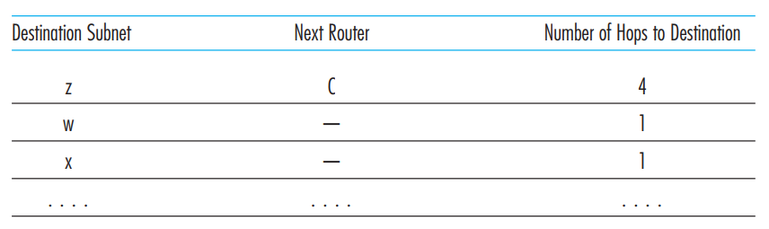
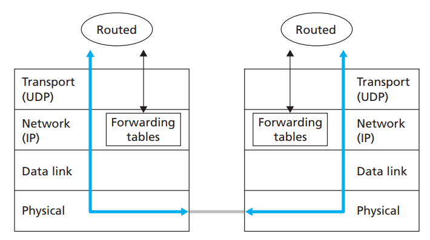
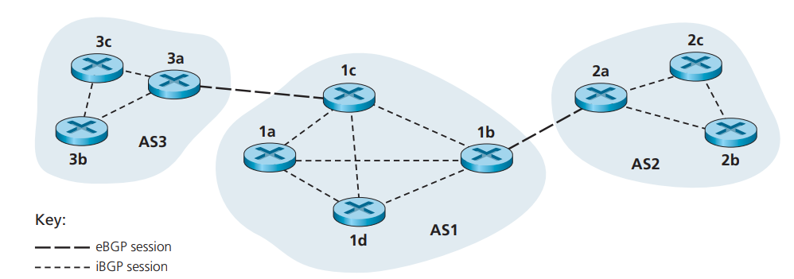
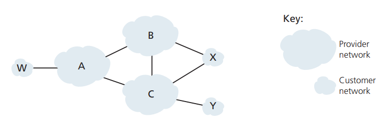

# 4.5 Routing in the Internet

## 4.5.1 Intra-AS Routing in the Internet: RIP

An intra-AS routing protocol is used to determine how routing is performed within an autonomous system (AS). Intra-AS routing protocols are also known as **interior gateway protocols**. Historically, two routing protocols have been used extensively for routing within an autonomous system in the Internet: the **Routing Information Protocol (RIP)** and **Open Shortest Path First (OSPF)**.

RIP is a distance-vector protocol that operates in a manner very close to the idealized DV protocol. The version of RIP specified in RFC 1058 uses hop count as a cost metric; that is, each link has a cost of 1. In the DV algorithm, for simplicity, costs were defined between pairs of routers. In RIP (and also in OSPF), costs are actually from source router to a destination subnet. RIP uses the term hop, which is the number of subnets traversed along the shortest path from source router to destination subnet, including the destination subnet.

The maximum cost of a path is limited to 15, thus limiting the use of RIP to autonomous systems that are fewer than 15 hops in diameter. Recall that in DV protocols, neighboring routers exchange distance vectors with each other. The distance vector for any one router is the current estimate of the shortest path distances from that router to the subnets in the AS. In RIP, routing updates are exchanged between neighbors approximately every 30 seconds using a **RIP response message**. The response message sent by a router or host contains a list of up to 25 destination subnets within the AS, as well as the sender’s distance to each of those subnets. Response messages are also known as **RIP advertisements**.

Each router maintains a RIP table known as a **routing table.** A router’s routing table includes both the router’s distance vector and the router’s forwarding table. Note that the routing table has three columns. The first column is for the destination subnet, the second column indicates the identity of the next router along the shortest path to the destination subnet, and the third column indicates the number of hops (that is, the number of subnets that have to be traversed, including the destination subnet) to get to the destination subnet along the shortest path.

 

<figure><figcaption></figcaption></figure>

Now suppose that 30 seconds later, router D receives from router A the advertisement shown below. Note that this advertisement is nothing other than the routing table information from router A! This information indicates, in particular, that subnet z is only four hops away from router A. Router D, upon receiving this advertisement, merges the advertisement with the old routing table . In particular, router D learns that there is now a path through router A to subnet z that is shorter than the path through router B. Thus, router D updates its routing table to account for the shorter shortest path.

 

<figure><figcaption></figcaption></figure>

Let’s next consider a few of the implementation aspects of RIP. Recall that RIP routers exchange advertisements approximately every 30 seconds. If a router does not hear from its neighbor at least once every 180 seconds, that neighbor is considered to be no longer reachable; that is, either the neighbor has died or the connecting link has gone down. When this happens, RIP modifies the local routing table and then propagates this information by sending advertisements to its neighboring routers (the ones that are still reachable). A router can also request information about its neighbor’s cost to a given destination using RIP’s request message. Routers send RIP request and response messages to each other over UDP using port number 520. The UDP segment is carried between routers in a standard IP datagram. The fact that RIP uses a transport-layer protocol (UDP) on top of a network-layer protocol (IP) to implement network-layer functionality (a routing algorithm) may seem rather convoluted.

Figure 4.39 sketches how RIP is typically implemented in a UNIX system, for example, a UNIX workstation serving as a router. A process called routed (pronounced “route dee”) executes RIP, that is, maintains routing information and exchanges messages with routed processes running in neighboring routers. Because RIP is implemented as an application-layer process (albeit a very special one that is able to manipulate the routing tables within the UNIX kernel), it can send and receive messages over a standard socket and use a standard transport protocol. As shown, RIP is implemented as an application-layer protocol (see Chapter 2) running over UDP.

 

<figure><figcaption>
Figure 4.39
</figcaption></figure>

## 4.5.2 Intra-AS Routing in the Internet: OSPF

Like RIP, OSPF routing is widely used for intra-AS routing in the Internet. OSPF and its closely related cousin, IS-IS, are typically deployed in upper-tier ISPs whereas RIP is deployed in lower-tier ISPs and enterprise networks. The Open in OSPF indicates that the routing protocol specification is publicly available.

OSPF was conceived as the successor to RIP and as such has a number of advanced features. At its heart, however, OSPF is a link-state protocol that uses flooding of link-state information and a Dijkstra least-cost path algorithm. With OSPF, a router constructs a complete topological map (that is, a graph) of the entire autonomous system. The router then locally runs Dijkstra’s shortest-path algorithm to determine a shortest-path tree to all subnets, with itself as the root node. Individual link costs are configured by the network administrator. The administrator might choose to set all link costs to 1, thus achieving minimum-hop routing, or might choose to set the link weights to be inversely proportional to link capacity in order to discourage traffic from using low-bandwidth links. OSPF does not mandate a policy for how link weights are set (that is the job of the network administrator), but instead provides the mechanisms (protocol) for determining least-cost path routing for the given set of link weights.

With OSPF, a router broadcasts routing information to all other routers in the autonomous system, not just to its neighboring routers. A router broadcasts link-state information whenever there is a change in a link’s state (for example, a change in cost or a change in up/down status). It also broadcasts a link’s state periodically (at least once every 30 minutes), even if the link’s state has not changed. RFC 2328 notes that “this periodic updating of link state advertisements adds robustness to the link state algorithm.” OSPF advertisements are contained in OSPF messages that are carried directly by IP, with an upper-layer protocol of 89 for OSPF. Thus, the OSPF protocol must itself implement functionality such as reliable message transfer and link-state broadcast. The OSPF protocol also checks that links are operational (via a HELLO message that is sent to an attached neighbor) and allows an OSPF router to obtain a neighboring router’s database of network-wide link state.

Some of the advances embodied in OSPF include the following:

* **Security.** Exchanges between OSPF routers (for example, link-state updates) can be authenticated. With authentication, only trusted routers can participate in the OSPF protocol within an AS, thus preventing malicious intruders (or networking students taking their newfound knowledge out for a joyride) from injecting incorrect information into router tables. By default, OSPF packets between routers are not authenticated and could be forged. Two types of authentication can be configured—simple and MD5.
* **Multiple same-cost paths.** When multiple paths to a destination have the same cost, OSPF allows multiple paths to be used.
* **Integrated support for unicast and multicast routing.** Multicast OSPF (MOSPF) provides simple extensions to OSPF to provide for multicast routing
* **Support for hierarchy within a single routing domain.** Perhaps the most significant advance in OSPF is the ability to structure an autonomous system hierarchically.

An OSPF autonomous system can be configured hierarchically into areas. Each area runs its own OSPF link-state routing algorithm, with each router in an area broadcasting its link state to all other routers in that area. Within each area, one or more **area border routers** are responsible for routing packets outside the area. Lastly, exactly one OSPF area in the AS is configured to be the **backbone** area. The primary role of the backbone area is to route traffic between the other areas in the AS. The backbone always contains all area border routers in the AS and may contain non-border routers as well. Inter-area routing within the AS requires that the packet be first routed to an area border router (intra-area routing), then routed through the backbone to the area border router that is in the destination area, and then routed to the final destination.

## 4.5.3 Inter-AS Routing: BGP

We just learned how ISPs use RIP and OSPF to determine optimal paths for source-destination pairs that are internal to the same AS. Let’s now examine how paths are determined for source-destination pairs that span multiple ASs. The **Border Gateway Protocol** version 4 is the de facto standard inter-AS routing protocol in today’s Internet. It is commonly referred to as BGP4 or simply as BGP. As an inter-AS routing protocol, BGP provides each AS a means to

1. Obtain subnet reachability information from neighboring ASs.
2. Propagate the reachability information to all routers internal to the AS.
3. Determine “good” routes to subnets based on the reachability information and on AS policy

Most importantly, BGP allows each subnet to advertise its existence to the rest of the Internet. A subnet screams “I exist and I am here,” and BGP makes sure that all the ASs in the Internet know about the subnet and how to get there. If it weren’t for BGP, each subnet would be isolated—alone and unknown by the rest of the Internet.

#### BGP Basics

 

<figure><figcaption>
Figure 4.40
</figcaption></figure>

In BGP, pairs of routers exchange routing information over semipermanent TCP connections using port 179. The semi-permanent TCP connections for the network in Figure 4.32 are shown in Figure 4.40. There is typically one such BGP TCP connection for each link that directly connects two routers in two different ASs; thus, in Figure 4.40, there is a TCP connection between gateway routers 3a and 1c and another TCP connection between gateway routers 1b and 2a. There are also semipermanent BGP TCP connections between routers within an AS. In particular, Figure 4.40 displays a common configuration of one TCP connection for each pair of routers internal to an AS, creating a mesh of TCP connections within each AS. For each TCP connection, the two routers at the end of the connection are called BGP peers, and the TCP connection along with all the BGP messages sent over the connection is called a BGP session. Furthermore, a BGP session that spans two ASs is called an external BGP (eBGP) session, and a BGP session between routers in the same AS is called an internal BGP (iBGP) session. In Figure 4.40, the eBGP sessions are shown with the long dashes; the iBGP sessions are shown with the short dashes.

BGP allows each AS to learn which destinations are reachable via its neighboring ASs. In BGP, destinations are not hosts but instead are CIDRized prefixes, with each prefix representing a subnet or a collection of subnets. Thus, for example, suppose there are four subnets attached to AS2: 138.16.64/24, 138.16.65/24, 138.16.66/24, and 138.16.67/24. Then AS2 could aggregate the prefixes for these four subnets and use BGP to advertise the single prefix to 138.16.64/22 to AS1. As another example, suppose that only the first three of those four subnets are in AS2 and the fourth subnet, 138.16.67/24, is in AS3. Then, as described in the Principles and Practice in Section 4.4.2, because routers use longest-prefix matching for forwarding datagrams, AS3 could advertise to AS1 the more specific prefix 138.16.67/24 and AS2 could still advertise to AS1 the aggregated prefix 138.16.64/22.

Let’s now examine how BGP would distribute prefix reachability information over the BGP sessions shown in Figure 4.40. As you might expect, using the eBGP session between the gateway routers 3a and 1c, AS3 sends AS1 the list of prefixes that are reachable from AS3; and AS1 sends AS3 the list of prefixes that are reachable from AS1. Similarly, AS1 and AS2 exchange prefix reachability information through their gateway routers 1b and 2a. Also as you may expect, when a gateway router (in any AS) receives eBGP-learned prefixes, the gateway router uses its iBGP sessions to distribute the prefixes to the other routers in the AS. Thus, all the routers in AS1 learn about AS3 prefixes, including the gateway router 1b. The gateway router 1b (in AS1) can therefore re-advertise AS3’s prefixes to AS2. When a router (gateway or not) learns about a new prefix, it creates an entry for the prefix in its forwarding table.

#### Path Attributes and BGP Routes

In BGP, an autonomous system is identified by its globally unique **autonomous system number (ASN)**. AS numbers, like IP addresses, are assigned by ICANN regional registries. When a router advertises a prefix across a BGP session, it includes with the prefix a number of **BGP attributes**. In BGP jargon, a prefix along with its attributes is called a route. Thus, BGP peers advertise **routes** to each other. Two of the more important attributes are AS-PATH and NEXT-HOP:

* **AS-PATH**. This attribute contains the ASs through which the advertisement for the prefix has passed. When a prefix is passed into an AS, the AS adds its ASN to the ASPATH attribute. For example, consider Figure 4.40 and suppose that prefix 138.16.64/24 is first advertised from AS2 to AS1; if AS1 then advertises the prefix to AS3, AS-PATH would be AS2 AS1. Routers use the AS-PATH attribute to detect and prevent looping advertisements; specifically, if a router sees that its AS is contained in the path list, it will reject the advertisement.
* Providing the critical link between the inter-AS and intra-AS routing protocols, the **NEXT-HOP** attribute has a subtle but important use. The NEXT-HOP is the router interface that begins the AS-PATH. To gain insight into this attribute, let’s again refer to Figure 4.40. Consider what happens when the gateway router 3a in AS3 advertises a route to gateway router 1c in AS1 using eBGP. The route includes the advertised prefix, which we’ll call x, and an AS-PATH to the prefix. This advertisement also includes the NEXT-HOP, which is the IP address of the router 3a interface that leads to 1c. (Recall that a router has multiple IP addresses, one for each of its interfaces.) Now consider what happens when router 1d learns about this route from iBGP. After learning about this route to x, router 1d may want to forward packets to x along the route, that is, router 1d may want to include the entry (x, l) in its forwarding table, where l is its interface that begins the least-cost path from 1d towards the gateway router 1c. To determine l, 1d provides the IP address in the NEXT-HOP attribute to its intra-AS routing module. Note that the intra-AS routing algorithm has determined the least-cost path to all subnets attached to the routers in AS1, including to the subnet for the link between 1c and 3a. From this least-cost path from 1d to the 1c-3a subnet, 1d determines its router interface l that begins this path and then adds the entry (x, l) to its forwarding table. Whew! In summary, the NEXT-HOP attribute is used by routers to properly configure their forwarding tables.

When a gateway router receives a route advertisement, it uses its import policy to decide whether to accept or filter the route and whether to set certain attributes such as the router preference metrics. The import policy may filter a route because the AS may not want to send traffic over one of the ASs in the route’s AS-PATH. The gateway router may also filter a route because it already knows of a preferable route to the same prefix.

#### BGP Route Selection

* As described earlier in this section, BGP uses eBGP and iBGP to distribute routes to all the routers within ASs. From this distribution, a router may learn about more than one route to any one prefix, in which case the router must select one of the possible routes. The input into this route selection process is the set of all routes that have been learned and accepted by the router. If there are two or more routes to the same prefix, then BGP sequentially invokes the following elimination rules until one route remains:
* Routes are assigned a local preference value as one of their attributes. The local preference of a route could have been set by the router or could have been learned by another router in the same AS. This is a policy decision that is left up to the AS’s network administrator. The routes with the highest local preference values are selected.
* From the remaining routes (all with the same local preference value), the route with the shortest AS-PATH is selected. If this rule were the only rule for route selection, then BGP would be using a DV algorithm for path determination, where the distance metric uses the number of AS hops rather than the number of router hops.
* From the remaining routes (all with the same local preference value and the same AS-PATH length), the route with the closest NEXT-HOP router is selected. Here, closest means the router for which the cost of the least-cost path, determined by the intra-AS algorithm, is the smallest.
* If more than one route still remains, the router uses BGP identifiers to select the route

#### Routing Policy

<figure><figcaption>
Figure 4.42
</figcaption></figure>

Let’s assume that autonomous systems W, X, and Y are stub networks and that A, B, and C are backbone provider networks. We’ll also assume that A, B, and C, all peer with each other, and provide full BGP information to their customer networks. All traffic entering a **stub network** must be destined for that network, and all traffic leaving a stub network must have originated in that network. W and Y are clearly stub networks. X is a **multihomed stub network**, since it is connected to the rest of the network via two different providers. However, like W and Y, X itself must be the source/destination of all traffic leaving/entering X. How will X be prevented from forwarding traffic between B and C? This can easily be accomplished by controlling the manner in which BGP routes are advertised. In particular, X will function as a stub network if it advertises (to its neighbors B and C) that it has no paths to any other destinations except itself. That is, even though X may know of a path, say XCY, that reaches network Y, it will not advertise this path to B. Since B is unaware that X has a path to Y, B would never forward traffic destined to Y (or C) via X. This simple example illustrates how a selective route advertisement policy can be used to implement customer/provider routing relationships.

Let’s next focus on a provider network, say AS B. Suppose that B has learned (from A) that A has a path AW to W. B can thus install the route BAW into its routing information base. Clearly, B also wants to advertise the path BAW to its customer, X, so that X knows that it can route to W via B. But should B advertise the path BAW to C? If it does so, then C could route traffic to W via CBAW. If A, B, and C are all backbone providers, than B might rightly feel that it should not have to shoulder the burden (and cost!) of carrying transit traffic between A and C. B might rightly feel that it is A’s and C’s job (and cost!) to make sure that C can route to/from A’s customers via a direct connection between A and C. There are currently no official standards that govern how backbone ISPs route among themselves. However, a rule of thumb followed by commercial ISPs is that any traffic flowing across an ISP’s backbone network must have either a source or a destination (or both) in a network that is a customer of that ISP; otherwise the traffic would be getting a free ride on the ISP’s network.
