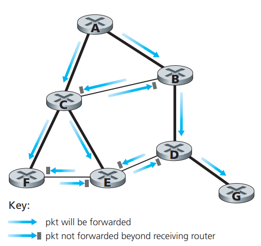
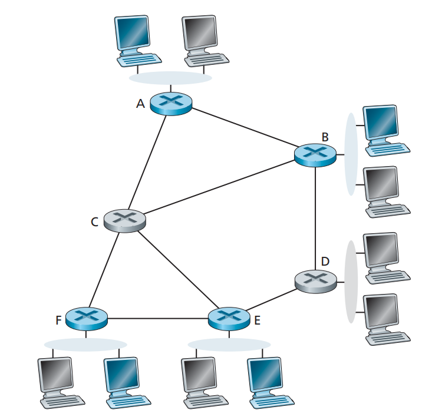

# 4.6 Broadcast and Multicast Routing

Thus far in this chapter, our focus has been on routing protocols that support unicast (i.e., point-to-point) communication, in which a single source node sends a packet to a single destination node. In this section, we turn our attention to broadcast and multicast routing protocols. In **broadcast routing**, the network layer -provides a service of delivering a packet sent from a source node to all other nodes in the network; **multicast routing** enables a single source node to send a copy of a packet to a subset of the other network nodes.

## 4.6.1 Broadcast Routing Algorithm

Perhaps the most straightforward way to accomplish broadcast communication is for the sending node to send a separate copy of the packet to each destination. Given N destination nodes, the source node simply makes N copies of the packet, addresses each copy to a different destination, and then transmits the N copies to the N destinations using unicast routing. This N-way-unicast approach to broadcasting is simple—no new network-layer routing protocol, packet-duplication, or forwarding functionality is needed. There are, however, several drawbacks to this approach. The first drawback is its inefficiency. If the source node is connected to the rest of the network via a single link, then N separate copies of the (same) packet will traverse this single link. It would clearly be more efficient to send only a single copy of a packet over this first hop and then have the node at the other end of the first hop make and forward any additional needed copies. That is, it would be more efficient for the network nodes themselves (rather than just the source node) to create duplicate copies of a packet.

The additional drawbacks of N-way-unicast are perhaps more subtle, but no less important. An implicit assumption of N-way-unicast is that broadcast recipients, and their addresses, are known to the sender. But how is this information obtained? Most likely, additional protocol mechanisms (such as a broadcast membership or destination-registration protocol) would be required. This would add more overhead and, importantly, additional complexity to a protocol that had initially seemed quite simple. A final drawback of N-way-unicast relates to the purposes for which broadcast is to be used. We learned that link-state routing protocols use broadcast to disseminate the link-state information that is used to compute unicast routes. Clearly, in situations where broadcast is used to create and update unicast routes, it would be unwise (at best!) to rely on the unicast routing infrastructure to achieve broadcast.

Given the several drawbacks of N-way-unicast broadcast, approaches in which the network nodes themselves play an active role in packet duplication, packet forwarding, and computation of the broadcast routes are clearly of interest. We again model the network as a graph, G = (N,E), where N is a set of nodes and a collection E of edges, where each edge is a pair of nodes from N.

#### Uncontrolled flooding

The most obvious technique for achieving broadcast is a **flooding** approach in which the source node sends a copy of the packet to all of its neighbors. When a node receives a broadcast packet, it duplicates the packet and forwards it to all of its neighbors (except the neighbor from which it received the packet). Clearly, if the graph is connected, this scheme will eventually deliver a copy of the broadcast packet to all nodes in the graph. Although this scheme is simple and elegant, it has a fatal flaw: If the graph has cycles, then one or more copies of each broadcast packet will cycle indefinitely. But there can be an even more calamitous fatal flaw: When a node is connected to more than two other nodes, it will create and forward multiple copies of the broadcast packet, each of which will create multiple copies of itself (at other nodes with more than two neighbors), and so on. This **broadcast storm**, resulting from the endless multiplication of broadcast packets, would eventually result in so many broadcast packets being created that the network would be rendered useless.

#### Controlled flooding

The key to avoiding a broadcast storm is for a node to judiciously choose when to flood a packet and (e.g., if it has already received and flooded an earlier copy of a packet) when not to flood a packet. In practice, this can be done in one of several ways.

In **sequence-number-controlled flooding**, a source node puts its address (or other unique identifier) as well as a **broadcast sequence number** into a broadcast packet, then sends the packet to all of its neighbors. Each node maintains a list of the source address and sequence number of each broadcast packet it has already received, duplicated, and forwarded. When a node receives a broadcast packet, it first checks whether the packet is in this list. If so, the packet is dropped; if not, the packet is duplicated and forwarded to all the node’s neighbors (except the node from which the packet has just been received).

A second approach to controlled flooding is known as **reverse path forwarding (RPF),** also sometimes referred to as **reverse path broadcast (RPB).** The idea behind RPF is simple, yet elegant. When a router receives a broadcast packet with a given source address, it transmits the packet on all of its outgoing links (except the one on which it was received) only if the packet arrived on the link that is on its own shortest unicast path back to the source. Otherwise, the router simply discards the incoming packet without forwarding it on any of its outgoing links. Such a packet can be dropped because the router knows it either will receive or has already received a copy of this packet on the link that is on its own shortest path back to the sender. Note that RPF does not use unicast routing to actually deliver a packet to a destination, nor does it require that a router know the complete shortest path from itself to the source. RPF need only know the next neighbor on its unicast shortest path to the sender; it uses this neighbor’s identity only to determine whether or not to flood a received broadcast packet.

<figure><figcaption></figcaption></figure>

Suppose that the links drawn with thick lines represent the least-cost paths from the receivers to the source (A). Node A initially broadcasts a source-A packet to nodes C and B. Node B will forward the source-A packet it has received from A (since A is on its least-cost path to A) to both C and D. B will ignore (drop, without forwarding) any source-A packets it receives from any other nodes (for example, from routers C or D). Let us now consider node C, which will receive a source-A packet directly from A as well as from B. Since B is not on C’s own shortest path back to A, C will ignore any source-A packets it receives from B. On the other hand, when C receives a source-A packet directly from A, it will forward the packet to nodes B, E, and F.

#### Spanning-Tree Broadcast

While sequence-number-controlled flooding and RPF avoid broadcast storms, they do not completely avoid the transmission of redundant broadcast packets. Ideally, every node should receive only one copy of the broadcast packet. Examining the tree consisting of the nodes connected by thick lines in the above figure, you can see that if broadcast packets were forwarded only along links within this tree, each and every network node would receive exactly one copy of the broadcast packet—exactly the solution we were looking for! This tree is an example of a spanning tree—a tree that contains each and every node in a graph. If each link has an associated cost and the cost of a tree is the sum of the link costs, then a spanning tree whose cost is the minimum of all of the graph’s spanning trees is called (not surprisingly) a minimum spanning tree.

Thus, another approach to providing broadcast is for the network nodes to first construct a spanning tree. When a source node wants to send a broadcast packet, it sends the packet out on all of the incident links that belong to the spanning tree. A node receiving a broadcast packet then forwards the packet to all its neighbors in the spanning tree (except the neighbor from which it received the packet). Not only does spanning tree eliminate redundant broadcast packets, but once in place, the spanning tree can be used by any node to begin a broadcast. Note that a node need not be aware of the entire tree; it simply needs to know which of its neighbors in G are spanning-tree neighbors.

The main complexity associated with the spanning-tree approach is the creation and maintenance of the spanning tree. Numerous distributed spanning-tree algorithms have been developed. We consider only one simple algorithm here. In the center-based approach to building a spanning tree, a center node (also known as a rendezvous point or a core) is defined. Nodes then unicast tree-join messages addressed to the center node. A tree-join message is forwarded using unicast routing toward the center until it either arrives at a node that already belongs to the spanning tree or arrives at the center. In either case, the path that the tree-join message has followed defines the branch of the spanning tree between the edge node that initiated the tree-join message and the center. One can think of this new path as being grafted onto the existing spanning tree.

#### Broadcast Algorithms in Practice

Broadcast protocols are used in practice at both the application and network layers. Gnutella uses application-level broadcast in order to broadcast queries for content among Gnutella peers. Here, a link between two distributed application-level peer processes in the Gnutella network is actually a TCP connection. Gnutella uses a form of sequence-number-controlled flooding in which a 16-bit identifier and a 16-bit payload descriptor (which identifies the Gnutella message type) are used to detect whether a received broadcast query has been previously received, duplicated, and forwarded. Gnutella also uses a time-to-live (TTL) field to limit the number of hops over which a flooded query will be forwarded. When a Gnutella process receives and duplicates a query, it decrements the TTL field before forwarding the query. Thus, a flooded Gnutella query will only reach peers that are within a given number (the initial value of TTL) of application-level hops from the query initiator. Gnutella’s flooding mechanism is thus sometimes referred to as limited-scope flooding.

(Gnutella is a peer-to-peer (P2P) file sharing protocol that allows users to share files over the internet without the need for a centralized server. It was developed in 2000 and became one of the most popular P2P file-sharing systems of its time.)

A form of sequence-number-controlled flooding is also used to broadcast link-state advertisements (LSAs) in the OSPF routing algorithm, and in the Intermediate-System-to-Intermediate-System (IS-IS) routing algorithm. OSPF uses a 32-bit sequence number, as well as a 16-bit age field to identify LSAs. Recall that an OSPF node broadcasts LSAs for its attached links periodically, when a link cost to a neighbor changes, or when a link goes up/down. LSA sequence numbers are used to detect duplicate LSAs, but also serve a second important function in OSPF. The sequence numbers used by the source node allow an older LSA to be distinguished from a newer LSA. The age field serves a purpose similar to that of a TTL value. The initial age field value is set to zero and is incremented at each hop as it is flooded, and is also incremented as it sits in a router’s memory waiting to be flooded. Although we have only briefly described the LSA flooding algorithm here, we note that designing LSA broadcast protocols can be very tricky business indeed.

## 4.6.2 Multicast

We’ve seen in the previous section that with broadcast service, packets are delivered to each and every node in the network. In this section we turn our attention to multicast service, in which a multicast packet is delivered to only a subset of network nodes. A number of emerging network applications require the delivery of packets from one or more senders to a group of receivers.

In multicast communication, we are immediately faced with two problems—how to identify the receivers of a multicast packet and how to address a packet sent to these receivers. In the case of unicast communication, the IP address of the receiver (destination) is carried in each IP unicast datagram and identifies the single recipient; in the case of broadcast, all nodes need to receive the broadcast packet, so no destination addresses are needed. But in the case of multicast, we now have multiple receivers. Does it make sense for each multicast packet to carry the IP addresses of all of the multiple recipients? While this approach might be workable with a small number of recipients, it would not scale well to the case of hundreds or thousands of receivers; the amount of addressing information in the datagram would swamp the amount of data actually carried in the packet’s payload field. Explicit identification of the receivers by the sender also requires that the sender know the identities and addresses of all of the receivers.

For these reasons, in the Internet architecture, a multicast packet is addressed using **address indirection**. That is, a single identifier is used for the group of receivers, and a copy of the packet that is addressed to the group using this single identifier is delivered to all of the multicast receivers associated with that group. In the Internet, the single identifier that represents a group of receivers is a class D multicast IP address. The group of receivers associated with a class D address is referred to as a **multicast group.** The difficulty that we must still address is the fact that each host has a unique IP unicast address that is completely independent of the address of the multicast group in which it is participating.

While the multicast group abstraction is simple, it raises a host (pun intended) of questions. How does a group get started and how does it terminate? How is the group address chosen? How are new hosts added to the group (either as senders or receivers)? Can anyone join a group (and send to, or receive from, that group) or is group membership restricted and, if so, by whom? Do group members know the identities of the other group members as part of the network-layer protocol? How do the network nodes interoperate with each other to deliver a multicast datagram to all group members? For the Internet, the answers to all of these questions involve the Internet Group Management Protocol.

#### Internet Group Management Protocol

The IGMP protocol version 3 operates between a host and its directly attached router (first hop router).

IGMP provides the means for a host to inform its attached router that an application running on the host wants to join a specific multicast group. Given that the scope of IGMP interaction is limited to a host and its attached router, another protocol is clearly required to coordinate the multicast routers (including the attached routers) throughout the Internet, so that multicast datagrams are routed to their final destinations. This latter functionality is accomplished by network-layer multicast routing algorithms, such as those we will consider shortly. Network-layer multicast in the Internet thus consists of two complementary components: IGMP and multicast routing protocols

IGMP has only three message types. Like ICMP, IGMP messages are carried (encapsulated) within an IP datagram, with an IP protocol number of 2. The `membership_query` message is sent by a router to all hosts on an attached interface (for example, to all hosts on a local area network) to determine the set of all multicast groups that have been joined by the hosts on that interface. Hosts respond to a `membership_query` message with an IGMP `membership_report` message. `membership_report` messages can also be generated by a host when an application first joins a multicast group without waiting for a `membership_query` message from the router. The final type of IGMP message is the `leave_group` message. Interestingly, this message is optional. But if it is optional, how does a router detect when a host leaves the multicast group? The answer to this question is that the router infers that a host is no longer in the multicast group if it no longer responds to a `membership_query` message with the given group address. This is an example of what is sometimes called **soft state** in an Internet protocol.

#### Multicast Routing Algorithms

<figure><figcaption>
Figure 4.49
</figcaption></figure>

The multicast routing problem is illustrated in Figure 4.49. Hosts joined to the multicast group are shaded in color; their immediately attached router is also shaded in color. As shown in Figure 4.49, only a subset of routers (those with attached hosts that are joined to the multicast group) actually needs to receive the multicast traffic. In Figure 4.49, only routers A, B, E, and F need to receive the multicast traffic. Since none of the hosts attached to router D are joined to the multicast group and since router C has no attached hosts, neither C nor D needs to receive the multicast group traffic. The goal of multicast routing, then, is to find a tree of links that connects all of the routers that have attached hosts belonging to the multicast group. Multicast packets will then be routed along this tree from the sender to all of the hosts belonging to the multicast tree. Of course, the tree may contain routers that do not have attached hosts belonging to the multicast group (for example, in Figure 4.49, it is impossible to connect routers A, B, E, and F in a tree without involving either router C or D).

In practice, two approaches have been adopted for determining the multicast routing tree, both of which we have already studied in the context of broadcast-routing, and so we will only mention them in passing here. The two approaches differ according to whether a single group-shared tree is used to distribute the traffic for all senders in the group, or whether a source-specific routing tree is constructed for each individual sender.

* **Multicast routing using a group-shared tree.** As in the case of spanning-tree broadcast, multicast routing over a group-shared tree is based on building a tree that includes all edge routers with attached hosts belonging to the multicast group. In practice, a center-based approach is used to construct the multicast routing tree, with edge routers with attached hosts belonging to the multicast group sending (via unicast) join messages addressed to the center node. As in the broadcast case, a join message is forwarded using unicast routing toward the center until it either arrives at a router that already belongs to the multicast tree or arrives at the center. All routers along the path that the join message follows will then forward received multicast packets to the edge router that initiated the multicast join. A critical question for center-based tree multicast routing is the process used to select the center.
* **Multicast routing using a source-based tree.** While group-shared tree multicast routing constructs a single, shared routing tree to route packets from all senders, the second approach constructs a multicast routing tree for each source in the multicast group. In practice, an RPF algorithm (with source node x) is used to construct a multicast forwarding tree for multicast datagrams originating at source x. The RPF broadcast algorithm we studied earlier requires a bit of tweaking for use in multicast. Under broadcast RPF, it would forward packets to router G, even though router G has no attached hosts that are joined to the multicast group. While this is not so bad for this case where D has only a single downstream router, G, imagine what would happen if there were thousands of routers downstream from D! Each of these thousands of routers would receive unwanted multicast packets. The solution to the problem of receiving unwanted multicast packets under RPF is known as pruning. A multicast router that receives multicast packets and has no attached hosts joined to that group will send a prune message to its upstream router. If a router receives prune messages from each of its downstream routers, then it can forward a prune message upstream.

#### Multicast Routing in the Internet

The first multicast routing protocol used in the Internet was the Distance-Vector Multicast Routing Protocol (DVMRP). DVMRP implements source-based trees with reverse path forwarding and pruning. DVMRP uses an RPF algorithm with pruning, as discussed above. Perhaps the most widely used Internet multicast routing protocol is the Protocol-Independent Multicast (PIM) routing protocol, which explicitly recognizes two multicast distribution scenarios. In dense mode, multicast group members are densely located; that is, many or most of the routers in the area need to be involved in routing multicast datagrams. PIM dense mode is a flood-and-prune reverse path forwarding technique similar in spirit to DVMRP.

In sparse mode, the number of routers with attached group members is small with respect to the total number of routers; group members are widely dispersed. PIM sparse mode uses rendezvous points to set up the multicast distribution tree. In source-specific multicast (SSM), only a single sender is allowed to send traffic into the multicast tree, considerably simplifying tree construction and maintenance.

When PIM and DVMP are used within a domain, the network operator can configure IP multicast routers within the domain, in much the same way that intradomain unicast routing protocols such as RIP, IS-IS, and OSPF can be configured. But what happens when multicast routes are needed between different domains? Is there a multicast equivalent of the inter-domain BGP protocol? The answer is yes. The Multicast Source Discovery Protocol (MSDP) can be used to connect together rendezvous points in different PIM sparse mode domains.
