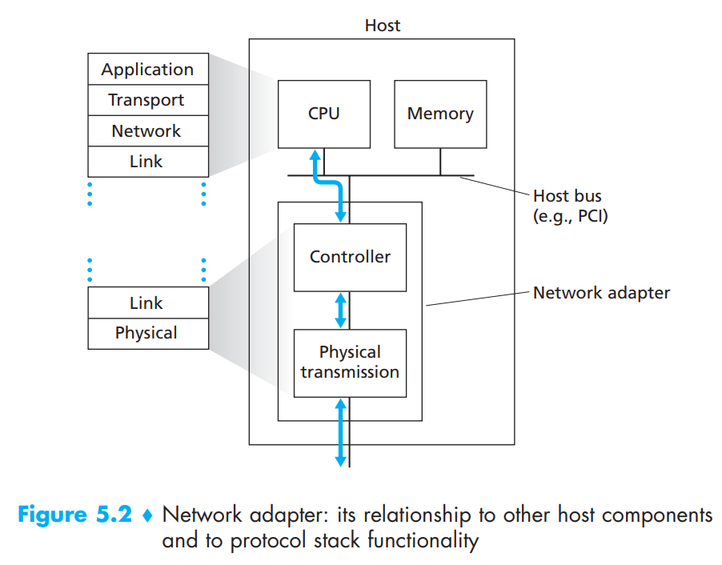

# 5.1 Introduction to the Link Layer

Let’s begin with some important terminology. We’ll find it convenient in this chapter to refer to any device that runs a link-layer (i.e., layer 2) protocol as a node. Nodes include hosts, routers, switches, and WiFi access points. We will also refer to the communication channels that connect adjacent nodes along the communication path as links. In order for a datagram to be transferred from source host to destination host, it must be moved over each of the individual links in the end-to-end path. Over a given link, a transmitting node encapsulates the datagram in a link-layer frame and transmits the frame into the link

In order to gain further insight into the link layer and how it relates to the network layer, let’s consider a transportation analogy. Consider a travel agent who is planning a trip for a tourist traveling from Princeton, New Jersey, to Lausanne, Switzerland. The travel agent decides that it is most convenient for the tourist to take a limousine from Princeton to JFK airport, then a plane from JFK airport to Geneva’s airport, and finally a train from Geneva’s airport to Lausanne’s train station. Once the travel agent makes the three reservations, it is the responsibility of the Princeton limousine company to get the tourist from Princeton to JFK; it is the responsibility of the airline company to get the tourist from JFK to Geneva; and it is the responsibility of the Swiss train service to get the tourist from Geneva to Lausanne. Each of the three segments of the trip is “direct” between two “adjacent” locations. Note that the three transportation segments are managed by different companies and use entirely different transportation modes (limousine, plane, and train). Although the transportation modes are different, they each provide the basic service of moving passengers from one location to an adjacent location. In this transportation analogy, the tourist is a datagram, each transportation segment is a link, the transportation mode is a link-layer protocol, and the travel agent is a routing protocol.

## 5.1.1 The Services Provided by the Link Layer

Although the basic service of any link layer is to move a datagram from one node to an adjacent node over a single communication link, the details of the provided service can vary from one link-layer protocol to the next. Possible services that can be offered by a link-layer protocol include:

* **Framing**. Almost all link-layer protocols encapsulate each network-layer datagram within a link-layer frame before transmission over the link. A frame consists of a data field, in which the network-layer datagram is inserted, and a number of header fields. The structure of the frame is specified by the link-layer protocol.
* **Link access**. A medium access control (MAC) protocol specifies the rules by which a frame is transmitted onto the link. For point-to-point links that have a single sender at one end of the link and a single receiver at the other end of the link, the MAC protocol is simple (or nonexistent)—the sender can send a frame whenever the link is idle. The more interesting case is when multiple nodes share a single broadcast link—the so-called multiple access problem. Here, the MAC protocol serves to coordinate the frame transmissions of the many nodes.
* **Reliable delivery**. When a link-layer protocol provides reliable delivery service, it guarantees to move each network-layer datagram across the link without error. Recall that certain transport-layer protocols (such as TCP) also provide a reliable delivery service. Similar to a transport-layer reliable delivery service, a link-layer reliable delivery service can be achieved with acknowledgments and retransmissions. A link-layer reliable delivery service is often used for links that are prone to high error rates, such as a wireless link, with the goal of correcting an error locally—on the link where the error occurs—rather than forcing an end-to-end retransmission of the data by a transport- or application-layer protocol. However, link-layer reliable delivery can be considered an unnecessary overhead for low bit-error links, including fiber, coax, and many twisted-pair copper links. For this reason, many wired link-layer protocols do not provide a reliable delivery service.
* **Error detection and correction.** The link-layer hardware in a receiving node can incorrectly decide that a bit in a frame is zero when it was transmitted as a one, and vice versa. Such bit errors are introduced by signal attenuation and electromagnetic noise. Because there is no need to forward a datagram that has an error, many link-layer protocols provide a mechanism to detect such bit errors. This is done by having the transmitting node include error-detection bits in the frame, and having the receiving node perform an error check. Error detection in the link layer is usually more sophisticated and is implemented in hardware. Error correction is similar to error detection, except that a receiver not only detects when bit errors have occurred in the frame but also determines exactly where in the frame the errors have occurred (and then corrects these errors).

## 5.1.2 Where Is the Link Layer Implemented?

 

<figure><figcaption></figcaption></figure>

Figure 5.2 shows a typical host architecture. For the most part, the link layer is implemented in a **network adapter**, also sometimes known as a **network interface card (NIC)**. At the heart of the network adapter is the link-layer controller, usually a single, special-purpose chip that implements many of the link-layer services (framing, link access, error detection, and so on). Thus, much of a link-layer controller’s functionality is implemented in hardware.

Until the late 1990s, most network adapters were physically separate cards (such as a PCMCIA card or a plug-in card fitting into a PC’s PCI card slot) but increasingly, network adapters are being integrated onto the host’s motherboard—a so-called LAN-on-motherboard configuration.

On the sending side, the controller takes a datagram that has been created and stored in host memory by the higher layers of the protocol stack, encapsulates the datagram in a link-layer frame (filling in the frame’s various fields), and then transmits the frame into the communication link, following the link-access protocol. On the receiving side, a controller receives the entire frame, and extracts the network-layer datagram. If the link layer performs error detection, then it is the sending controller that sets the error-detection bits in the frame header and it is the receiving controller that performs error detection.

Figure 5.2 also shows that while most of the link layer is implemented in hardware, part of the link layer is implemented in software that runs on the host’s CPU. The software components of the link layer implement higher-level link layer functionality such as assembling link-layer addressing information and activating the controller hardware. On the receiving side, link-layer software responds to controller interrupts (e.g., due to the receipt of one or more frames), handling error conditions and passing a datagram up to the network layer. Thus, the link layer is a combination of hardware and software—the place in the protocol stack where software meets hardware.
