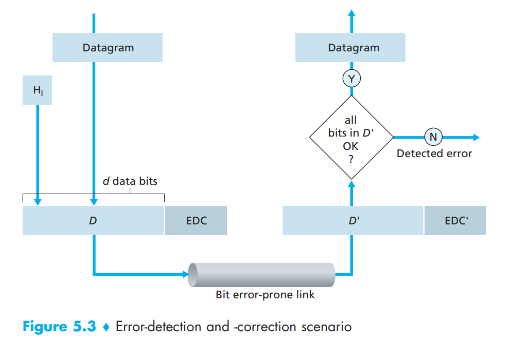
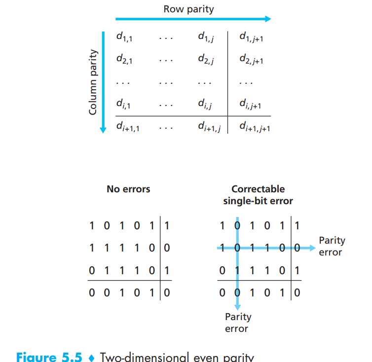
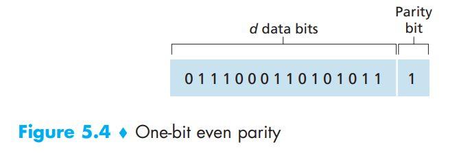
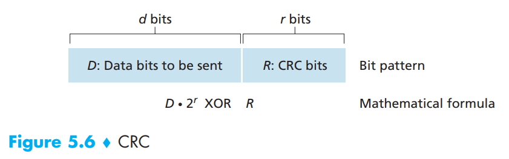
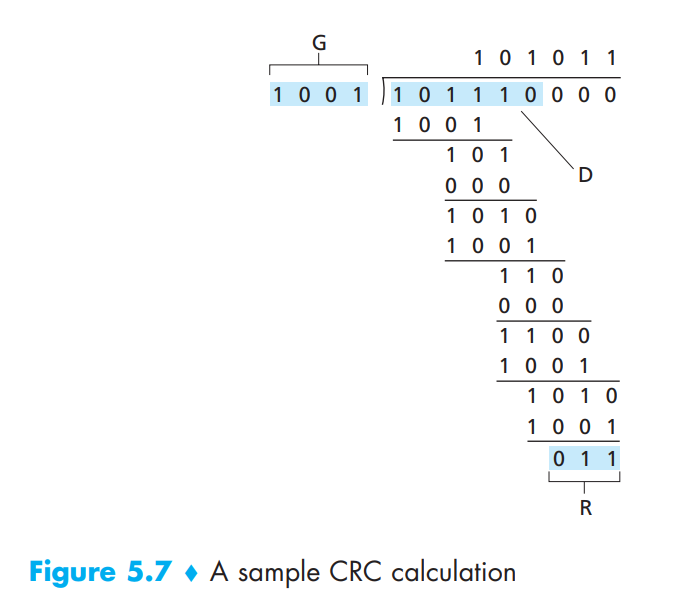

# 5.2 Error-Detection and -Correction Techniques

In the previous section, we noted that bit-level error detection and correction—detecting and correcting the corruption of bits in a link-layer frame sent from one node to another physically connected neighboring node—are two services often provided by the link layer. We saw in Chapter 3 that error-detection and -correction services are also often offered at the transport layer as well. In this section, we’ll examine a few of the simplest techniques that can be used to detect and, in some cases, correct such bit errors.

<figure><figcaption></figcaption></figure>

Figure 5.3 illustrates the setting for our study. At the sending node, data, D, to be protected against bit errors is augmented with error-detection and -correction bits (EDC). Typically, the data to be protected includes not only the datagram passed down from the network layer for transmission across the link, but also link-level addressing information, sequence numbers, and other fields in the link frame header. Both D and EDC are sent to the receiving node in a link-level frame. At the receiving node, a sequence of bits, D and EDC is received. Note that D and EDC may differ from the original D and EDC as a result of in-transit bit flips.

The receiver’s challenge is to determine whether or not D is the same as the original D, given that it has only received D and EDC. The exact wording of the receiver’s decision in Figure 5.3 (we ask whether an error is detected, not whether an error has occurred!) is important. Error-detection and -correction techniques allow the receiver to sometimes, but not always, detect that bit errors have occurred. Even with the use of error-detection bits there still may be undetected bit errors; that is, the receiver may be unaware that the received information contains bit errors. As a consequence, the receiver might deliver a corrupted datagram to the network layer, or be unaware that the contents of a field in the frame’s header has been corrupted. We thus want to choose an error-detection scheme that keeps the probability of such occurrences small.

Let’s now examine three techniques for detecting errors in the transmitted data—parity checks (to illustrate the basic ideas behind error detection and correction), check summing methods (which are more typically used in the transport layer), and cyclic redundancy checks (which are more typically used in the link layer in an adapter).

## 5.2.1 Parity Checks

Perhaps the simplest form of error detection is the use of a single **parity bit**.

In an even parity scheme, the sender simply includes one additional bit and chooses its value such that the total number of 1s in the d + 1 bits (the original information plus a parity bit) is even. For odd parity schemes, the parity bit value is chosen such that there is an odd number of 1s.

Receiver operation is also simple with a single parity bit. The receiver need only count the number of 1s in the received d + 1 bits. If an odd number of 1-valued bits are found with an even parity scheme, the receiver knows that at least one bit error has occurred. More precisely, it knows that some odd number of bit errors have occurred.

But what happens if an even number of bit errors occur? You should convince yourself that this would result in an undetected error.

In this case, a single parity bit might suffice. However, measurements have shown that, rather than occurring independently, errors are often clustered together in “bursts.” Under burst error conditions, the probability of undetected errors in a frame protected by single-bit parity can approach 50 percent. Clearly, a more robust error-detection scheme is needed (and, fortunately, is used in practice!). But before examining error-detection schemes that are used in practice, let’s consider a simple generalization of one-bit parity that will provide us with insight into error-correction techniques.

<figure><figcaption></figcaption></figure>

Figure 5.5 shows a two-dimensional generalization of the single-bit parity scheme. Here, the d bits in D are divided into i rows and j columns. A parity value is computed for each row and for each column. The resulting i + j + 1 parity bits comprise the link-layer frame’s error-detection bits.

Suppose now that a single bit error occurs in the original d bits of information. With this two-dimensional parity scheme, the parity of both the column and the row containing the flipped bit will be in error. The receiver can thus not only detect the fact that a single bit error has occurred, but can use the column and row indices of the column and row with parity errors to actually identify the bit that was corrupted and correct that error! Two-dimensional parity can also detect (but not correct!) any combination of two errors in a packet.

The ability of the receiver to both detect and correct errors is known as forward error correction (FEC). These techniques are commonly used in audio storage and playback devices such as audio CDs. In a network setting, FEC techniques can be used by themselves, or in conjunction with link-layer ARQ techniques similar to those we examined in Chapter 3. FEC techniques are valuable because they can decrease the number of sender retransmissions required. Perhaps more important, they allow for immediate correction of errors at the receiver. This avoids having to wait for the round-trip propagation delay needed for the sender to receive a NAK packet and for the retransmitted packet to propagate back to the receiver—a potentially important advantage for real-time network applications or links (such as deep-space links) with long propagation delays.

## 5.2.2 Checksumming Methods

<figure><figcaption></figcaption></figure>

In checksumming techniques, the d bits of data in Figure 5.4 are treated as a sequence of k-bit integers. One simple checksumming method is to simply sum these k-bit integers and use the resulting sum as the error-detection bits. The Internet checksum is based on this approach—bytes of data are treated as 16-bit integers and summed. The 1s complement of this sum then forms the Internet checksum that is carried in the segment header. As discussed in Section 3.3, the receiver checks the checksum by taking the 1s complement of the sum of the received data (including the checksum) and checking whether the result is all 1 bits. If any of the bits are 0, an error is indicated.

Checksumming methods require relatively little packet overhead. For example, the checksums in TCP and UDP use only 16 bits. However, they provide relatively weak protection against errors as compared with cyclic redundancy check, which is discussed below and which is often used in the link layer.

Why is checksumming used at the transport layer and cyclic redundancy check used at the link layer? Recall that the transport layer is typically implemented in software in a host as part of the host’s operating system. Because transport-layer error detection is implemented in software, it is important to have a simple and fast error-detection scheme such as checksumming. On the other hand, error detection at the link layer is implemented in dedicated hardware in adapters, which can rapidly perform the more complex CRC operations.

## 5.2.3 Cyclic Redundancy Check (CRC)

An error-detection technique used widely in today’s computer networks is based on cyclic redundancy check (CRC) codes. CRC codes are also known as polynomial codes, since it is possible to view the bit string to be sent as a polynomial whose coefficients are the 0 and 1 values in the bit string, with operations on the bit string interpreted as polynomial arithmetic.

CRC codes operate as follows. Consider the d-bit piece of data, D, that the sending node wants to send to the receiving node. The sender and receiver must first agree on an r + 1 bit pattern, known as a generator, which we will denote as G.

We will require that the most significant (leftmost) bit of G be a 1. The key idea behind CRC codes is shown in Figure 5.6. For a given piece of data, D, the sender will choose r additional bits, R, and append them to D such that the resulting d + r bit pattern (interpreted as a binary number) is exactly divisible by G (i.e., has no remainder) using modulo-2 arithmetic. The process of error checking with CRCs is thus simple: The receiver divides the d + r received bits by G. If the remainder is nonzero, the receiver knows that an error has occurred; otherwise the data is accepted as being correct.

All CRC calculations are done in modulo-2 arithmetic without carries in addition or borrows in subtraction. This means that addition and subtraction are identical, and both are equivalent to the bitwise exclusive-or (XOR) of the operands.

 

<figure><figcaption></figcaption></figure>

We can calculate R as

$$
R = remainder \frac{D.2^r}{G}
$$

Figure 5.7 illustrates this calculation for the case of D = 101110, d = 6, G = 1001, and r = 3. The 9 bits transmitted in this case are 101110 011.

<figure><figcaption></figcaption></figure>
