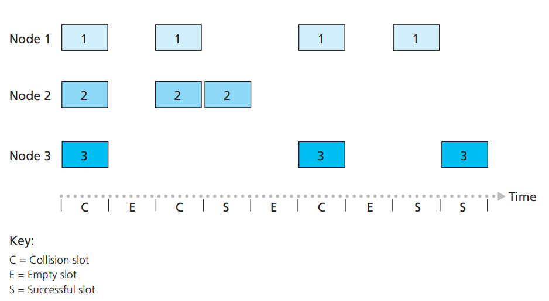
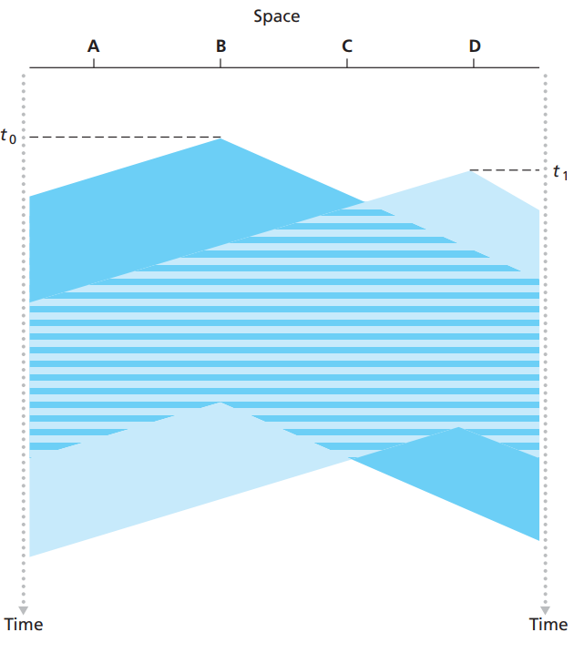
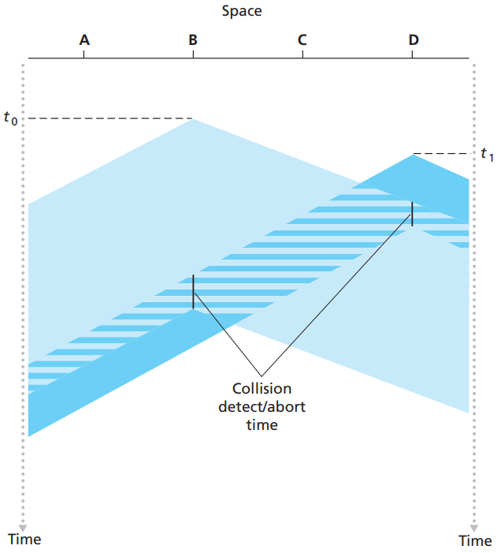
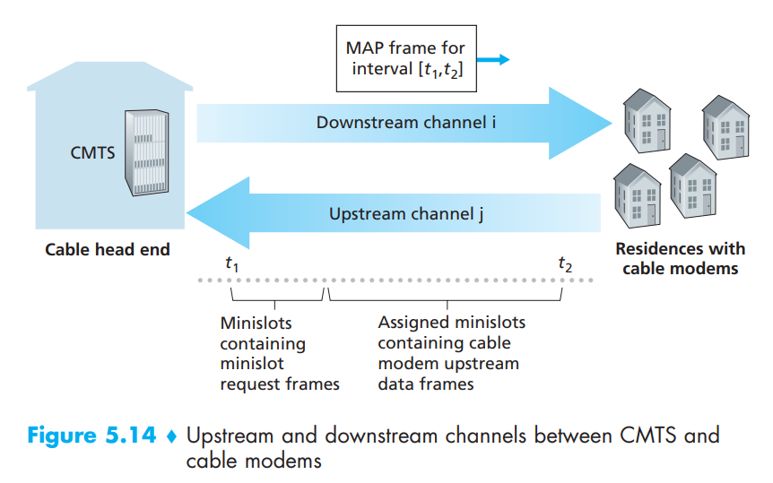

# 5.3 Multiple Access Links and Protocols

In the introduction to this chapter, we noted that there are two types of network links: point-to-point links and broadcast links. A point-to-point link consists of a single sender at one end of the link and a single receiver at the other end of the link. Many link-layer protocols have been designed for point-to-point links; the point-to-point protocol (PPP) and high-level data link control (HDLC) are two such protocols that we’ll cover later in this chapter. The second type of link, a broadcast link, can have multiple sending and receiving nodes all connected to the same, single, shared broadcast channel. The term broadcast is used here because when any one node transmits a frame, the channel broadcasts the frame and each of the other nodes receives a copy. Ethernet and wireless LANs are examples of broadcast link-layer technologies. In this section we’ll take a step back from specific link-layer protocols and first examine a problem of central importance to the link layer: how to coordinate the access of multiple sending and receiving nodes to a shared broadcast channel—the multiple access problem. Broadcast channels are often used in LANs, networks that are geographically concentrated in a single building (or on a corporate or university campus). Thus, we’ll also look at how multiple access channels are used in LANs at the end of this section.

Perhaps a more apt human analogy for a broadcast channel is a cocktail party, where many people gather in a large room (the air providing the broadcast medium) to talk and listen. A second good analogy is something many readers will be familiar with—a classroom—where teacher(s) and student(s) similarly share the same, single, broadcast medium. A central problem in both scenarios is that of determining who gets to talk (that is, transmit into the channel), and when. As humans, we’ve evolved an elaborate set of protocols for sharing the broadcast channel:

* “Give everyone a chance to speak.”
* “Don’t speak until you are spoken to.”
* “Don’t monopolize the conversation.”
* “Raise your hand if you have a question.”
* “Don’t interrupt when someone is speaking.”
* “Don’t fall asleep when someone is talking.”

Computer networks similarly have protocols—so-called **multiple access protocols**—by which nodes regulate their transmission into the shared broadcast channel. Multiple access protocols are needed in a wide variety of network settings, including both wired and wireless access networks, and satellite networks. Although technically each node accesses the broadcast channel through its adapter, in this section we will refer to the node as the sending and receiving device. In practice, hundreds or even thousands of nodes can directly communicate over a broadcast channel.

Because all nodes are capable of transmitting frames, more than two nodes can transmit frames at the same time. When this happens, all of the nodes receive multiple frames at the same time; that is, the transmitted frames collide at all of the receivers. Typically, when there is a collision, none of the receiving nodes can make any sense of any of the frames that were transmitted; in a sense, the signals of the colliding frames become inextricably tangled together. Thus, all the frames involved in the collision are lost, and the broadcast channel is wasted during the collision interval. Clearly, if many nodes want to transmit frames frequently, many transmissions will result in collisions, and much of the bandwidth of the broadcast channel will be wasted.

In order to ensure that the broadcast channel performs useful work when multiple nodes are active, it is necessary to somehow coordinate the transmissions of the active nodes. This coordination job is the responsibility of the multiple access protocol.

Over the years, dozens of multiple access protocols have been implemented in a variety of link-layer technologies. Nevertheless, we can classify just about any multiple access protocol as belonging to one of three categories: channel partitioning protocols, random access protocols, and taking-turns protocols. We’ll cover these categories of multiple access protocols in the following three subsections.

Let’s conclude this overview by noting that, ideally, a multiple access protocol for a broadcast channel of rate R bits per second should have the following desirable characteristics:

1. When only one node has data to send, that node has a throughput of R bps.
2. When M nodes have data to send, each of these nodes has a throughput of R/M bps. This need not necessarily imply that each of the M nodes always has an instantaneous rate of R/M, but rather that each node should have an average transmission rate of R/M over some suitably defined interval of time.
3. The protocol is decentralized; that is, there is no master node that represents a single point of failure for the network.
4. The protocol is simple, so that it is inexpensive to implement.

## 5.3.1 Channel Partitioning Protocols

Recall from our early discussion back in Section 1.3 that time-division multiplexing (TDM) and frequency-division multiplexing (FDM) are two techniques that can be used to partition a broadcast channel’s bandwidth among all nodes sharing that channel. As an example, suppose the channel supports N nodes and that the transmission rate of the channel is R bps. TDM divides time into time frames and further divides each time frame into N time slots.

Each time slot is then assigned to one of the N nodes. Whenever a node has a packet to send, it transmits the packet’s bits during its assigned time slot in the revolving TDM frame. Typically, slot sizes are chosen so that a single packet can be transmitted during a slot time.

TDM is appealing because it eliminates collisions and is perfectly fair: Each node gets a dedicated transmission rate of R/N bps during each frame time. However, it has two major drawbacks. First, a node is limited to an average rate of R/N bps even when it is the only node with packets to send. A second drawback is that a node must always wait for its turn in the transmission sequence—again, even when it is the only node with a frame to send.

While TDM shares the broadcast channel in time, FDM divides the R bps channel into different frequencies (each with a bandwidth of R/N) and assigns each frequency to one of the N nodes. FDM thus creates N smaller channels of R/N bps out of the single, larger R bps channel. FDM shares both the advantages and drawbacks of TDM. It avoids collisions and divides the bandwidth fairly among the N nodes. However, FDM also shares a principal disadvantage with TDM—a node is limited to a bandwidth of R/N, even when it is the only node with packets to send.

A third channel partitioning protocol is code division multiple access (CDMA). While TDM and FDM assign time slots and frequencies, respectively, to the nodes, CDMA assigns a different code to each node. Each node then uses its unique code to encode the data bits it sends. If the codes are chosen carefully, CDMA networks have the wonderful property that different nodes can transmit simultaneously and yet have their respective receivers correctly receive a sender’s encoded data bits (assuming the receiver knows the sender’s code) in spite of interfering transmissions by other nodes. CDMA has been used in military systems for some time (due to its anti-jamming properties) and now has widespread civilian use, particularly in cellular telephony.

## 5.3.2 Random Access Protocols

The second broad class of multiple access protocols are random access protocols. In a random access protocol, a transmitting node always transmits at the full rate of the channel, namely, R bps. When there is a collision, each node involved in the collision repeatedly retransmits its frame (that is, packet) until its frame gets through without a collision. But when a node experiences a collision, it doesn’t necessarily retransmit the frame right away. Instead it waits a random delay before retransmitting the frame. Each node involved in a collision chooses independent random delays. Because the random delays are independently chosen, it is possible that one of the nodes will pick a delay that is sufficiently less than the delays of the other colliding nodes and will therefore be able to sneak its frame into the channel without a collision.

#### Slotted ALOHA

Let’s begin our study of random access protocols with one of the simplest random access protocols, the slotted ALOHA protocol. In our description of slotted ALOHA, we assume the following:

* All frames consist of exactly L bits.
* Time is divided into slots of size L/R seconds (that is, a slot equals the time to transmit one frame).
* Nodes start to transmit frames only at the beginnings of slots.
* The nodes are synchronized so that each node knows when the slots begin.
* If two or more frames collide in a slot, then all the nodes detect the collision event before the slot ends.

Let p be a probability, that is, a number between 0 and 1. The operation of slotted ALOHA in each node is simple:

* When the node has a fresh frame to send, it waits until the beginning of the next slot and transmits the entire frame in the slot.
* If there isn’t a collision, the node has successfully transmitted its frame and thus need not consider retransmitting the frame. (The node can prepare a new frame for transmission, if it has one.)
* If there is a collision, the node detects the collision before the end of the slot. The node retransmits its frame in each subsequent slot with probability p until the frame is transmitted without a collision

By retransmitting with probability p, we mean that the node effectively tosses a biased coin; the event heads corresponds to “retransmit,” which occurs with probability p. The event tails corresponds to “skip the slot and toss the coin again in the next slot”; this occurs with probability (1 – p). All nodes involved in the collision toss their coins independently.

Slotted ALOHA would appear to have many advantages. Unlike channel partitioning, slotted ALOHA allows a node to transmit continuously at the full rate, R, when that node is the only active node. (A node is said to be active if it has frames to send.) Slotted ALOHA is also highly decentralized, because each node detects collisions and independently decides when to retransmit. Slotted ALOHA is also an extremely simple protocol.

Slotted ALOHA works well when there is only one active node, but how efficient is it when there are multiple active nodes? There are two possible efficiency concerns here. First, when there are multiple active nodes, a certain fraction of the slots will have collisions and will therefore be “wasted.” The second concern is that another fraction of the slots will be empty because all active nodes refrain from transmitting as a result of the probabilistic transmission policy. The only “unwasted” slots will be those in which exactly one node transmits. A slot in which exactly one node transmits is said to be a successful slot. The efficiency of a slotted multiple access protocol is defined to be the long-run fraction of successful slots in the case when there are a large number of active nodes, each always having a large number of frames to send.

<figure><figcaption></figcaption></figure>

We now proceed to outline the derivation of the maximum efficiency of slotted ALOHA. To keep this derivation simple, let’s modify the protocol a little and assume that each node attempts to transmit a frame in each slot with probability p.

Suppose there are N nodes. Then the probability that a given slot is a successful slot is the probability that one of the nodes transmits and that the remaining N – 1 nodes do not transmit. The probability that a given node transmits is p; the probability that the remaining nodes do not transmit is (1 – p)^(N-1). Therefore the probability a given node has a success is p(1 – p)^(N-1). Because there are N nodes, the probability that any one of the N nodes has a success is Np(1 – p)^(N-1). Thus, when there are N active nodes, the efficiency of slotted ALOHA is Np(1 – p)^(N-1).

To obtain the maximum efficiency for N active nodes, we have to find the p\* that maximizes this expression. And to obtain the maximum efficiency for a large number of active nodes, we take the limit of Np\*(1 – p\*)^(N-1) as N approaches infinity. After performing these calculations, we’ll find that the maximum efficiency of the protocol is given by 1/e = 0.37. That is, when a large number of nodes have many frames to transmit, then (at best) only 37 percent of the slots do useful work. Thus the effective transmission rate of the channel is not R bps but only 0.37 R bps! A similar analysis also shows that 37 percent of the slots go empty and 26 percent of slots have collisions.

#### ALOHA

The slotted ALOHA protocol required that all nodes synchronize their transmissions to start at the beginning of a slot. The first ALOHA protocol was actually an unslotted, fully decentralized protocol. In pure ALOHA, when a frame first arrives (that is, a network-layer datagram is passed down from the network layer at the sending node), the node immediately transmits the frame in its entirety into the broadcast channel. If a transmitted frame experiences a collision with one or more other transmissions, the node will then immediately (after completely transmitting its collided frame) retransmit the frame with probability p. Otherwise, the node waits for a frame transmission time. After this wait, it then transmits the frame with probability p, or waits (remaining idle) for another frame time with probability 1 – p.

The probability that a given node has a successful transmission is p(1 – p)^2(N-1). By taking limits as in the slotted ALOHA case, we find that the maximum efficiency of the pure ALOHA protocol is only 1/(2e)—exactly half that of slotted ALOHA.

#### Carrier Sense Multiple Access (CSMA)

In both slotted and pure ALOHA, a node’s decision to transmit is made independently of the activity of the other nodes attached to the broadcast channel. In particular, a node neither pays attention to whether another node happens to be transmitting when it begins to transmit, nor stops transmitting if another node begins to interfere with its transmission.

In our cocktail party analogy, there are two important rules for polite human conversation:

* **Listen before speaking**. If someone else is speaking, wait until they are finished. In the networking world, this is called **carrier sensing**—a node listens to the channel before transmitting. If a frame from another node is currently being transmitted into the channel, a node then waits until it detects no transmissions for a short amount of time and then begins transmission.
* **If someone else begins talking at the same time, stop talking**. In the networking world, this is called **collision detection**—a transmitting node listens to the channel while it is transmitting. If it detects that another node is transmitting an interfering frame, it stops transmitting and waits a random amount of time before repeating the sense-and-transmit-when-idle cycle.

These two rules are embodied in the family of **carrier sense multiple access (CSMA)** and **CSMA with collision detection (CSMA/CD)** protocols.

<figure><figcaption></figcaption></figure>

At time t0, node B senses the channel is idle, as no other nodes are currently transmitting. Node B thus begins transmitting, with its bits propagating in both directions along the broadcast medium. The downward propagation of B’s bits in Figure 5.12 with increasing time indicates that a nonzero amount of time is needed for B’s bits actually to propagate (albeit at near the speed of light) along the broadcast medium. At time t1 (t1 > t0), node D has a frame to send. Although node B is currently transmitting at time t1, the bits being transmitted by B have yet to reach D, and thus D senses the channel idle at t1. In accordance with the CSMA protocol, D thus begins transmitting its frame. A short time later, B’s transmission begins to interfere with D’s transmission at D. From the above figure, it is evident that the end-to-end channel propagation delay of a broadcast channel—the time it takes for a signal to propagate from one of the nodes to another—will play a crucial role in determining its performance. The longer this propagation delay, the larger the chance that a carrier-sensing node is not yet able to sense a transmission that has already begun at another node in the network.

#### Carrier Sense Multiple Access with Collision Detection (CSMA/CD)

In the above figure, nodes do not perform collision detection; both B and D continue to transmit their frames in their entirety even though a collision has occurred. When a node performs collision detection, it ceases transmission as soon as it detects a collision. The below figure shows the same scenario as in the above figure, except that the two nodes each abort their transmission a short time after detecting a collision. Clearly, adding collision detection to a multiple access protocol will help protocol performance by not transmitting a useless, damaged (by interference with a frame from another node) frame in its entirety.

 

<figure><figcaption></figcaption></figure>

Before analyzing the CSMA/CD protocol, let us now summarize its operation from the perspective of an adapter (in a node) attached to a broadcast channel:

1. The adapter obtains a datagram from the network layer, prepares a link-layer frame, and puts the frame adapter buffer.
2. If the adapter senses that the channel is idle (that is, there is no signal energy entering the adapter from the channel), it starts to transmit the frame. If, on the other hand, the adapter senses that the channel is busy, it waits until it senses no signal energy and then starts to transmit the frame.
3. While transmitting, the adapter monitors for the presence of signal energy coming from other adapters using the broadcast channel.
4. If the adapter transmits the entire frame without detecting signal energy from other adapters, the adapter is finished with the frame. If, on the other hand, the adapter detects signal energy from other adapters while transmitting, it aborts the transmission (that is, it stops transmitting its frame).
5. After aborting, the adapter waits a random amount of time and then returns to step 2.

The need to wait a random (rather than fixed) amount of time is hopefully clear—if two nodes transmitted frames at the same time and then both waited the same fixed amount of time, they’d continue colliding forever. But what is a good interval of time from which to choose the random backoff time? If the interval is large and the number of colliding nodes is small, nodes are likely to wait a large amount of time (with the channel remaining idle) before repeating the sense-and-transmit-when-idle step. On the other hand, if the interval is small and the number of colliding nodes is large, it’s likely that the chosen random values will be nearly the same, and transmitting nodes will again collide. What we’d like is an interval that is short when the number of colliding nodes is small, and long when the number of colliding nodes is large.

The **binary exponential backoff** algorithm, used in Ethernet as well as in DOCSIS cable network multiple access protocols, elegantly solves this problem. Specifically, when transmitting a frame that has already experienced n collisions, a node chooses the value of K at random from {0, 1, 2, . . . . 2n 1}. Thus, the more collisions experienced by a frame, the larger the interval from which K is chosen. For Ethernet, the actual amount of time a node waits is K 512 bit times (i.e., K times the amount of time needed to send 512 bits into the Ethernet) and the maximum value that n can take is capped at 10.

We also note here that each time a node prepares a new frame for transmission, it runs the CSMA/CD algorithm, not taking into account any collisions that may have occurred in the recent past. So it is possible that a node with a new frame will immediately be able to sneak in a successful transmission while several other nodes are in the exponential backoff state.

#### CSMA/CD Efficiency

When only one node has a frame to send, the node can transmit at the full channel rate (e.g., for Ethernet typical rates are 10 Mbps, 100 Mbps, or 1 Gbps). However, if many nodes have frames to transmit, the effective transmission rate of the channel can be much less. We define the efficiency of CSMA/CD to be the long-run fraction of time during which frames are being transmitted on the channel without collisions when there is a large number of active nodes, with each node having a large number of frames to send. In order to present a closed-form approximation of the efficiency of Ethernet, let dprop denote the maximum time it takes signal energy to propagate between any two adapters. Let dtrans be the time to transmit a maximum-size frame (approximately 1.2 msecs for a 10 Mbps Ethernet).

$$
Efficiency = \frac{1}{1+5d_{prop}/d_{trans}}
$$

We see from this formula that as dprop approaches 0, the efficiency approaches 1. This matches our intuition that if the propagation delay is zero, colliding nodes will abort immediately without wasting the channel. Also, as dtrans becomes very large, efficiency approaches 1. This is also intuitive because when a frame grabs the channel, it will hold on to the channel for a very long time; thus, the channel will be doing productive work most of the time.

## 5.3.3 Taking-Turns Protocols

Recall that two desirable properties of a multiple access protocol are (1) when only one node is active, the active node has a throughput of R bps, and (2) when M nodes are active, then each active node has a throughput of nearly R/M bps. The ALOHA and CSMA protocols have this first property but not the second. This has motivated researchers to create another class of protocols—the **taking-turns protocols**. As with random access protocols, there are dozens of taking-turns protocols, and each one of these protocols has many variations. We’ll discuss two of the more important protocols here. The first one is the **polling protocol**.

*   The polling protocol requires one of the nodes to be designated as a master node. The master node **polls** each of the nodes in a round-robin fashion. In particular, the master node first sends a message to node 1, saying that it (node 1) can transmit up to some maximum number of frames. After node 1 transmits some frames, the master node tells node 2 it (node 2) can transmit up to the maximum number of frames. (The master node can determine when a node has finished sending its frames by observing the lack of a signal on the channel.) The procedure continues in this manner, with the master node polling each of the nodes in a cyclic manner.

    The polling protocol eliminates the collisions and empty slots that plague random access protocols. This allows polling to achieve a much higher efficiency. But it also has a few drawbacks. The first drawback is that the protocol introduces a polling delay—the amount of time required to notify a node that it can transmit. If, for example, only one node is active, then the node will transmit at a rate less than R bps, as the master node must poll each of the inactive nodes in turn each time the active node has sent its maximum number of frames. The second drawback, which is potentially more serious, is that if the master node fails, the entire channel becomes inoperative.
*   The second taking-turns protocol is the **token-passing protocol**. In this protocol there is no master node. A small, special-purpose frame known as a **token** is exchanged among the nodes in some fixed order. For example, node 1 might always send the token to node 2, node 2 might always send the token to node 3, and node N might always send the token to node 1. When a node receives a token, it holds onto the token only if it has some frames to transmit; otherwise, it immediately forwards the token to the next node. If a node does have frames to transmit when it receives the token, it sends up to a maximum number of frames and then forwards the token to the next node. Token passing is decentralized and highly efficient.

    But it has its problems as well. For example, the failure of one node can crash the entire channel. Or if a node accidentally neglects to release the token, then some recovery procedure must be invoked to get the token back in circulation.

## 5.3.4 DOCSIS: The Link-Layer Protocol for Cable Internet Access

In the previous three subsections, we’ve learned about three broad classes of multiple access protocols: channel partitioning protocols, random access protocols, and taking turns protocols. A cable access network will make for an excellent case study here, as we’ll find aspects of each of these three classes of multiple access protocols with the cable access network!

The Data-Over-Cable Service Interface Specifications (DOCSIS) specifies the cable data network architecture and its protocols. DOCSIS uses FDM to divide the downstream (CMTS to modem) and upstream (modem to CMTS) network segments into multiple frequency channels. Each downstream channel is 6 MHz wide, with a maximum throughput of approximately 40 Mbps per channel (although this data rate is seldom seen at a cable modem in practice); each upstream channel has a maximum channel width of 6.4 MHz, and a maximum upstream throughput of approximately 30 Mbps. Each upstream and downstream channel is a broadcast channel. Frames transmitted on the downstream channel by the CMTS are received by all cable modems receiving that channel; since there is just a single CMTS transmitting into the downstream channel, however, there is no multiple access problem. The upstream direction, however, is more interesting and technically challenging, since multiple cable modems share the same upstream channel (frequency) to the CMTS, and thus collisions can potentially occur.

 

<figure><figcaption></figcaption></figure>

As illustrated in Figure 5.14, each upstream channel is divided into intervals of time (TDM-like), each containing a sequence of mini-slots during which cable modems can transmit to the CMTS. The CMTS explicitly grants permission to individual cable modems to transmit during specific mini-slots. The CMTS accomplishes this by sending a control message known as a MAP message on a downstream channel to specify which cable modem (with data to send) can transmit during which mini-slot for the interval of time specified in the control message. Since mini-slots are explicitly allocated to cable modems, the CMTS can ensure there are no colliding transmissions during a mini-slot.

But how does the CMTS know which cable modems have data to send in the first place? This is accomplished by having cable modems send mini-slot-request frames to the CMTS during a special set of interval mini-slots that are dedicated for this purpose, as shown in Figure 5.14. These mini-slot-request frames are transmitted in a random access manner and so may collide with each other. A cable modem can neither sense whether the upstream channel is busy nor detect collisions. Instead, the cable modem infers that its mini-slot-request frame experienced a collision if it does not receive a response to the requested allocation in the next downstream control message. When a collision is inferred, a cable modem uses binary exponential backoff to defer the retransmission of its mini-slot request frame to a future time slot. When there is little traffic on the upstream channel, a cable modem may actually transmit data frames during slots nominally assigned for mini-slot-request frames.

A cable access network thus serves as a terrific example of multiple access protocols in action—FDM, TDM, random access, and centrally allocated time slots all within one network!
