# 5.4 Switched Local Area Networks

<figure>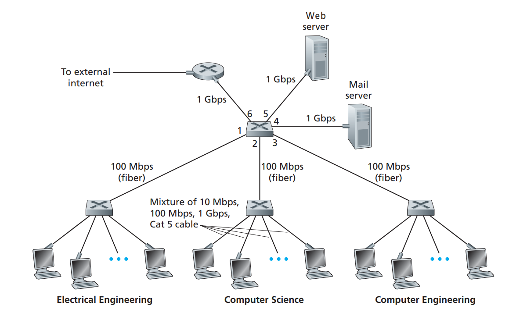<figcaption></figcaption></figure>

Figure 5.15 shows a switched local network connecting three departments, two servers and a router with four switches. Because these switches operate at the link layer, they switch link-layer frames (rather than network-layer datagrams), don’t recognize network-layer addresses, and don’t use routing algorithms like RIP or OSPF to determine paths through the network of layer-2 switches. Instead of using IP addresses, we will soon see that they use link-layer addresses to forward link layer frames through the network of switches. We’ll begin our study of switched LANs by first covering link-layer addressing (Section 5.4.1). We then examine the celebrated Ethernet protocol (Section 5.5.2). After examining link-layer addressing and Ethernet, we’ll look at how link-layer switches operate (Section 5.4.3), and then see (Section 5.4.4) how these switches are often used to build large-scale LANs.

## 5.4.1 Link-Layer Addressing and ARP

Hosts and routers have link-layer addresses.

#### MAC Addresses

In truth, it is not hosts and routers that have link-layer addresses but rather their adapters (that is, network interfaces) that have link-layer addresses. A host or router with multiple network interfaces will thus have multiple link-layer addresses associated with it, just as it would also have multiple IP addresses associated with it. It's important to note, however, that link-layer switches do not have link-layer addresses associated with their interfaces that connect to hosts and routers.

Link-layer address is variously called a **LAN address**, a **physical address**, or a **MAC address**.

For most LANs (including Ethernet and 802.11 wireless LANs), the MAC address is 6 bytes long, giving 248 possible MAC addresses. As shown in Figure 5.16, these 6-byte addresses are typically expressed in hexadecimal notation, with each byte of the address expressed as a pair of hexadecimal numbers.

<figure>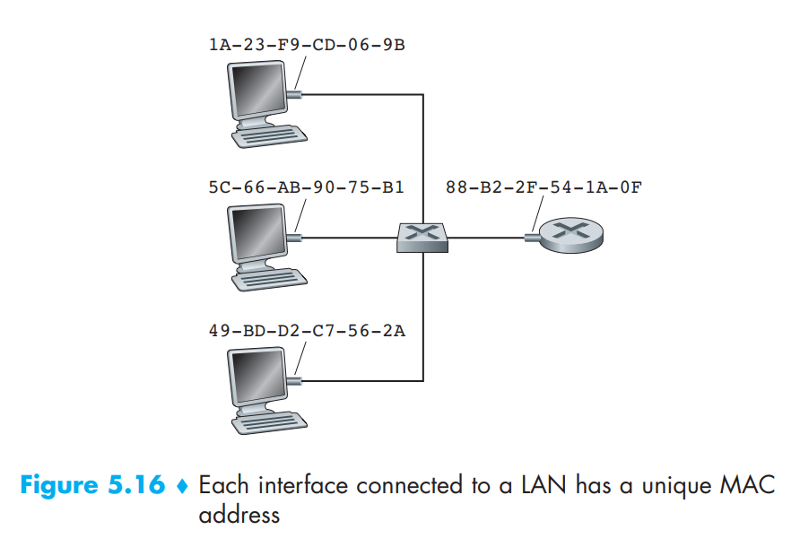<figcaption></figcaption></figure>

Although MAC addresses were designed to be permanent, it is now possible to change an adapter’s MAC address via software.

One interesting property of MAC addresses is that no two adapters have the same address. This might seem surprising given that adapters are manufactured in many countries by many companies. How does a company manufacturing adapters in Taiwan make sure that it is using different addresses from a company manufacturing adapters in Belgium? The answer is that the IEEE manages the MAC address space. In particular, when a company wants to manufacture adapters, it purchases a chunk of the address space consisting of 2^24 addresses for a nominal fee. IEEE allocates the chunk of 2^24 addresses by fixing the first 24 bits of a MAC address and letting the company create unique combinations of the last 24 bits for each adapter.

An adapter’s MAC address has a flat structure (as opposed to a hierarchical structure) and doesn’t change no matter where the adapter goes. A laptop with an Ethernet interface always has the same MAC address, no matter where the computer goes.

Recall that, in contrast, IP addresses have a hierarchical structure (that is, a network part and a host part), and a host’s IP addresses needs to be changed when the host moves, i.e, changes the network to which it is attached. An adapter’s MAC address is analogous to a person’s social security number, which also has a flat addressing structure and which doesn’t change no matter where the person goes. An IP address is analogous to a person’s postal address, which is hierarchical and which must be changed whenever a person moves. Just as a person may find it useful to have both a postal address and a social security number, it is useful for a host and router interfaces to have both a network-layer address and a MAC address.

When an adapter wants to send a frame to some destination adapter, the sending adapter inserts the destination adapter’s MAC address into the frame and then sends the frame into the LAN. As we will soon see, a switch occassionally broadcasts an incoming frame onto all of its interfaces. Thus, an adapter may receive a frame that isn’t addressed to it. Thus, when an adapter receives a frame, it will check to see whether the destination MAC address in the frame matches its own MAC address. If there is a match, the adapter extracts the enclosed datagram and passes the datagram up the protocol stack. If there isn’t a match, the adapter discards the frame, without passing the network-layer datagram up. Thus, the destination only will be interrupted when the frame is received.

However, sometimes a sending adapter does want all the other adapters on the LAN to receive and process the frame it is about to send. In this case, the sending adapter inserts a special MAC broadcast address into the destination address field of the frame. For LANs that use 6-byte addresses (such as Ethernet and 802.11), the broadcast address is a string of 48 consecutive 1s (that is, FF-FF-FF-FF-FFFF in hexadecimal notation).

#### Address Resolution Protocol (ARP)

Because there are both network-layer addresses (for example, Internet IP addresses) and link-layer addresses (that is, MAC addresses), there is a need to translate between them. For the Internet, this is the job of the **Address Resolution Protocol (ARP).**

 

<figure>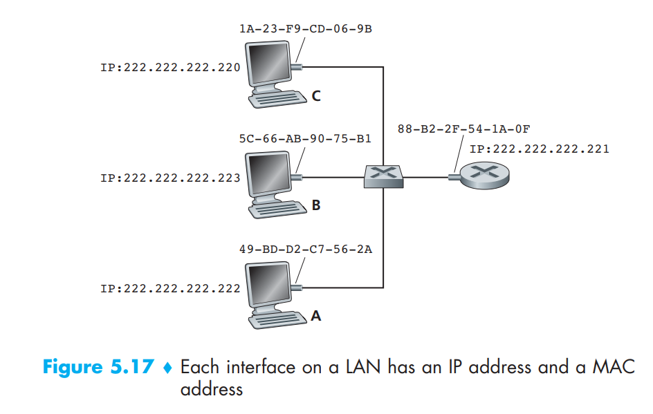<figcaption></figcaption></figure>

To understand the need for a protocol such as ARP, consider the network shown in Figure 5.17. In this simple example, each host and router has a single IP address and single MAC address. As usual, IP addresses are shown in dotted-decimal notation and MAC addresses are shown in hexadecimal notation.

Now suppose that the host with IP address 222.222.222.220 wants to send an IP datagram to host 222.222.222.222. In this example, both the source and destination are in the same subnet. To send a datagram, the source must give its adapter not only the IP datagram but also the MAC address for destination 222.222.222.222. The sending adapter will then construct a link layer frame containing the destination’s MAC address and send the frame into the LAN.

The important question addressed in this section is, How does the sending host determine the MAC address for the destination host with IP address 222.222.222.222? As you might have guessed, it uses ARP. An ARP module in the sending host takes any IP address on the same LAN as input, and returns the corresponding MAC address. In the example at hand, sending host 222.222.222.220 provides its ARP module the IP address 222.222.222.222, and the ARP module returns the corresponding MAC address 49-BD-D2-C7-56-2A.

So we see that ARP resolves an IP address to a MAC address. In many ways it is analogous to DNS, which resolves host names to IP addresses. However, one important difference between the two resolvers is that DNS resolves host names for hosts anywhere in the Internet, whereas ARP resolves IP addresses only for hosts and router interfaces on **the same subnet**.

<figure>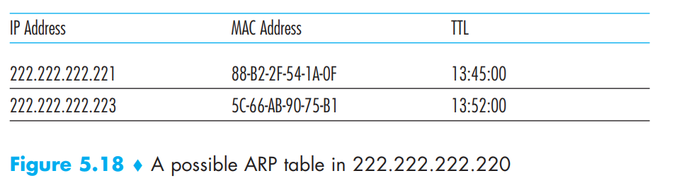<figcaption></figcaption></figure>

Now that we have explained what ARP does, let’s look at how it works. Each host and router has an ARP table in its memory, which contains mappings of IP addresses to MAC addresses. Figure 5.18 shows what an ARP table in host 222.222.222.220 might look like. The ARP table also contains a time-to-live (TTL) value, which indicates when each mapping will be deleted from the table. Note that a table does not necessarily contain an entry for every host and router on the subnet; some may have never been entered into the table, and others may have expired.

But what if the ARP table doesn’t currently have an entry for the destination? In particular, suppose 222.222.222.220 wants to send a datagram to 222.222.222.222. In this case, the sender uses the ARP protocol to resolve the address. First, the sender constructs a special packet called an ARP packet. An ARP packet has several fields, including the sending and receiving IP and MAC addresses. Both ARP query and response packets have the same format. The purpose of the ARP query packet is to query all the other hosts and routers on the subnet to determine the MAC address corresponding to the IP address that is being resolved.

Returning to our example, 222.222.222.220 passes an ARP query packet to the adapter along with an indication that the adapter should send the packet to the MAC broadcast address, namely, FF-FF-FF-FF-FF-FF. The adapter encapsulates the ARP packet in a link-layer frame, uses the broadcast address for the frame’s destination address, and transmits the frame into the subnet. The frame containing the ARP query is received by all the other adapters on the subnet, and (because of the broadcast address) each adapter passes the ARP packet within the frame up to its ARP module. Each of these ARP modules checks to see if its IP address matches the destination IP address in the ARP packet. The one with a match sends back to the querying host a response ARP packet with the desired mapping. The querying host 222.222.222.220 can then update its ARP table and send its IP datagram, encapsulated in a link-layer frame whose destination MAC is that of the host or router responding to the earlier ARP query.

There are a couple of interesting things to note about the ARP protocol. First, the query ARP message is sent within a broadcast frame, whereas the response ARP message is sent within a standard frame.

Second, ARP is plug-and-play; that is, an ARP table gets built automatically—it doesn’t have to be configured by a system administrator. And if a host becomes disconnected from the subnet, its entry is eventually deleted from the other ARP tables in the subnet.

Students often wonder if ARP is a link-layer protocol or a network-layer protocol. As we’ve seen, an ARP packet is encapsulated within a link-layer frame and thus lies architecturally above the link layer. However, an ARP packet has fields containing link-layer addresses and thus is arguably a link-layer protocol, but it also contains network-layer addresses and thus is also arguably a network-layer protocol. In the end, ARP is probably best considered a protocol that straddles the boundary between the link and network layers.

#### Sending a Datagram off the Subnet

<figure>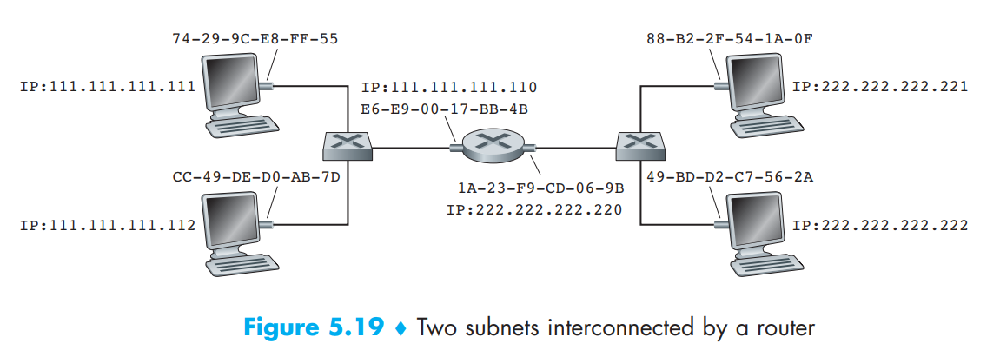<figcaption></figcaption></figure>

There are several interesting things to note about Figure 5.19. Each host has exactly one IP address and one adapter. But, as discussed in Chapter 4, a router has an IP address for each of its interfaces. For each router interface there is also an ARP module (in the router) and an adapter. Because the router in Figure 5.19 has two interfaces, it has two IP addresses, two ARP modules, and two adapters. Of course, each adapter in the network has its own MAC address.

Also note that Subnet 1 has the network address 111.111.111/24 and that Subnet 2 has the network address 222.222.222/24. Thus all of the interfaces connected to Subnet 1 have addresses of the form [111.111.111.xxx](http://111.111.111.xxx) and all of the interfaces connected to Subnet 2 have addresses of the form [222.222.222.xxx](http://222.222.222.xxx).

Suppose that host 111.111.111.111 wants to send an IP datagram to a host 222.222.222.222. The sending host passes the datagram to its adapter, as usual. But the sending host must also indicate to its adapter an appropriate destination MAC address. What MAC address should the adapter use? One might be tempted to guess that the appropriate MAC address is that of the adapter for host 222.222.222.222, namely, 49-BD-D2-C7-56-2A. This guess, however, would be wrong! If the sending adapter were to use that MAC address, then none of the adapters on Subnet 1 would bother to pass the IP datagram up to its network layer, since the frame’s destination address would not match the MAC address of any adapter on Subnet 1. The datagram would just die and go to datagram heaven.

If we look carefully at Figure 5.19, we see that in order for a datagram to go from 111.111.111.111 to a host on Subnet 2, the datagram must first be sent to the router interface 111.111.111.110, which is the IP address of the first-hop router on the path to the final destination. Thus, the appropriate MAC address for the frame is the address of the adapter for router interface 111.111.111.110, namely, E6-E9-00-17-BB-4B. How does the sending host acquire the MAC address for 111.111.111.110? By using ARP, of course! Once the sending adapter has this MAC address, it creates a frame (containing the datagram addressed to 222.222.222.222) and sends the frame into Subnet 1. The router adapter on Subnet 1 sees that the link-layer frame is addressed to it, and therefore passes the frame to the network layer of the router. Hooray—the IP datagram has successfully been moved from source host to the router! But we are not finished. We still have to move the datagram from the router to the destination. The router now has to determine the correct interface on which the datagram is to be forwarded. As discussed in Chapter 4, this is done by consulting a forwarding table in the router. The forwarding table tells the router that the datagram is to be forwarded via router interface 222.222.222.220. This interface then passes the datagram to its adapter, which encapsulates the datagram in a new frame and sends the frame into Subnet 2. This time, the destination MAC address of the frame is indeed the MAC address of the ultimate destination. And how does the router obtain this destination MAC address? From ARP, of course!

## 5.4.2 Ethernet

Ethernet has pretty much taken over the wired LAN market. Today, Ethernet is by far the most prevalent wired LAN technology, and it is likely to remain so for the foreseeable future. One might say that Ethernet has been to local area networking what the Internet has been to global networking.

There are many reasons for Ethernet’s success.

* Ethernet was the first high-speed LAN technology that was widely deployed.
* Token ring, FDDI, and ATM LAN technologies were more complex and expensive than Ethernet, which discouraged network administrators from switching to them.
* Ethernet continued to improve its data rates and introduced switched Ethernet, making it a popular and affordable option for LANs.

The original Ethernet LAN used a coaxial bus to interconnect the nodes. Bus topologies for Ethernet actually persisted throughout the 1980s and into the mid-1990s. Ethernet with a bus topology is a broadcast LAN—all transmitted frames travel to and are processed by all adapters connected to the bus.

By the late 1990s, most companies and universities had replaced their LANs with Ethernet installations using a hub-based star topology. In such an installation the hosts (and routers) are directly connected to a hub with twisted-pair copper wire. A hub is a physical-layer device that acts on individual bits rather than frames. When a bit, representing a zero or a one, arrives from one interface, the hub simply re-creates the bit, boosts its energy strength, and transmits the bit onto all the other interfaces. Thus, Ethernet with a hub-based star topology is also a broadcast LAN—whenever a hub receives a bit from one of its interfaces, it sends a copy out on all of its other interfaces. In particular, if a hub receives frames from two different interfaces at the same time, a collision occurs and the nodes that created the frames must retransmit.

In the early 2000s Ethernet experienced yet another major evolutionary change. Ethernet installations continued to use a star topology, but the hub at the center was replaced with a switch. A switch is not only “collision-less” but is also a bona-fide store-and-forward packet switch;

#### Ethernet Frame Structure

<figure>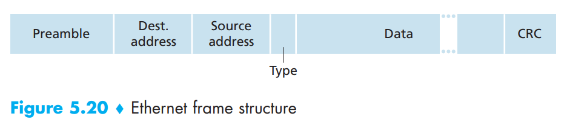<figcaption></figcaption></figure>

To give this discussion about Ethernet frames a tangible context, let’s consider sending an IP datagram from one host to another host, with both hosts on the same Ethernet LAN (for example, the Ethernet LAN in Figure 5.17.). (Although the payload of our Ethernet frame is an IP datagram, we note that an Ethernet frame can carry other network-layer packets as well.) Let the sending adapter, adapter A, have the MAC address AA-AA-AA-AA-AA-AA and the receiving adapter, adapter B, have the MAC address BB-BB-BB-BB-BB-BB. The sending adapter encapsulates the IP datagram within an Ethernet frame and passes the frame to the physical layer. The receiving adapter receives the frame from the physical layer, extracts the IP datagram, and passes the IP datagram to the network layer. In this context, let’s now examine the six fields of the Ethernet frame, as shown in Figure 5.20.

* **Preamble (8 bytes)**. The Ethernet frame begins with an 8-byte preamble field. Each of the first 7 bytes of the preamble has a value of 10101010; the last byte is 10101011. The first 7 bytes of the preamble serve to “wake up” the receiving adapters and to synchronize their clocks to that of the sender’s clock. Why should the clocks be out of synchronization? Keep in mind that adapter A aims to transmit the frame at 10 Mbps, 100 Mbps, or 1 Gbps, depending on the type of Ethernet LAN. However, because nothing is absolutely perfect, adapter A will not transmit the frame at exactly the target rate; there will always be some drift from the target rate, a drift which is not known a priori by the other adapters on the LAN. A receiving adapter can lock onto adapter A’s clock simply by locking onto the bits in the first 7 bytes of the preamble. The last 2 bits of the eighth byte of the preamble (the first two consecutive 1s) alert adapter B that the “important stuff” is about to come
* **Destination address (6 bytes).** This field contains the MAC address of the destination adapter, BB-BB-BB-BB-BB-BB. When adapter B receives an Ethernet frame whose destination address is either BB-BB-BB-BB-BB-BB or the MAC broadcast address, it passes the contents of the frame’s data field to the network layer; if it receives a frame with any other MAC address, it discards the frame.
* **Source address (6 bytes).** This field contains the MAC address of the adapter that transmits the frame onto the LAN, in this example, AA-AA-AA-AA-AA-AA.
* **Type field (2 bytes).** The type field permits Ethernet to multiplex network-layer protocols. To understand this, we need to keep in mind that hosts can use other network-layer protocols besides IP. In fact, a given host may support multiple network-layer protocols using different protocols for different applications. For this reason, when the Ethernet frame arrives at adapter B, adapter B needs to know to which network-layer protocol it should pass (that is, demultiplex) the contents of the data field. Note that the type field is analogous to the protocol field in the network layer datagram and the port-number fields in the transport-layer segment; all of these fields serve to glue a protocol at one layer to a protocol at the layer above.
* **Data field (46 to 1,500 bytes).** This field carries the IP datagram. The maximum transmission unit (MTU) of Ethernet is 1,500 bytes. This means that if the IP datagram exceeds 1,500 bytes, then the host has to fragment the datagram. The minimum size of the data field is 46 bytes. This means that if the IP datagram is less than 46 bytes, the data field has to be “stuffed” to fill it out to 46 bytes. The network layer uses the length field in the IP datagram header to remove the stuffing.
* **Cyclic redundancy check (CRC) (4 bytes).** As discussed in Section 5.2.3, the purpose of the CRC field is to allow the receiving adapter, adapter B, to detect bit errors in the frame

All of the Ethernet technologies provide connectionless service to the network layer. That is, when adapter A wants to send a datagram to adapter B, adapter A encapsulates the datagram in an Ethernet frame and sends the frame into the LAN, without first handshaking with adapter B.

Ethernet technologies provide an unreliable service to the network layer. Specifically, when adapter B receives a frame from adapter A, it runs the frame through a CRC check, but neither sends an acknowledgment when a frame passes the CRC check nor sends a negative acknowledgment when a frame fails the CRC check. When a frame fails the CRC check, adapter B simply discards the frame. Thus, adapter A has no idea whether its transmitted frame reached adapter B and passed the CRC check. This lack of reliable transport (at the link layer) helps to make Ethernet simple and cheap. But it also means that the stream of datagrams passed to the network layer can have gaps.

If there are gaps due to discarded Ethernet frames, does the application at Host B see gaps as well? This depends on whether the application is using UDP or TCP. If the application is using UDP, then the application in Host B will indeed see gaps in the data. On the other hand, if the application is using TCP, then TCP in Host B will not acknowledge the data contained in discarded frames, causing TCP in Host A to retransmit. Note that when TCP retransmits data, the data will eventually return to the Ethernet adapter at which it was discarded. Thus, in this sense, Ethernet does retransmit data, although Ethernet is unaware of whether it is transmitting a brand-new datagram with brand-new data, or a datagram that contains data that has already been transmitted at least once.

#### Ethernet Technologies

In our discussion above, we’ve referred to Ethernet as if it were a single protocol standard. But in fact, Ethernet comes in many different flavors, with somewhat bewildering acronyms such as 10BASE-T, 10BASE-2, 100BASE-T, 1000BASE-LX.

While these acronyms may appear bewildering, there is actually considerable order here. The first part of the acronym refers to the speed of the standard: 10, 100, 1000, or 10G, for 10 Megabit (per second), 100 Megabit, Gigabit, and 10 Gigabit Ethernet, respectively. “BASE” refers to baseband Ethernet, meaning that the physical media only carries Ethernet traffic; almost all of the 802.3 standards are for baseband Ethernet. The final part of the acronym refers to the physical media itself; Ethernet is both a link-layer and a physical-layer specification and is carried over a variety of physical media including coaxial cable, copper wire, and fiber. Generally, a “T” refers to twisted-pair copper wires.

Historically, an Ethernet was initially conceived of as a segment of coaxial cable. The early 10BASE-2 and 10BASE-5 standards specify 10 Mbps Ethernet over two types of coaxial cable, each limited in length to 500 meters. Longer runs could be obtained by using a repeater—a physical-layer device that receives a signal on the input side, and regenerates the signal on the output side.

## 5.4.3 Link-Layer Switches

The role of the switch is to receive incoming link-layer frames and forward them onto outgoing links. We’ll see that the switch itself is **transparent** to the hosts and routers in the subnet.

#### Forwarding and Filtering

Filtering is the switch function that determines whether a frame should be forwarded to some interface or should just be dropped. Forwarding is the switch function that determines the interfaces to which a frame should be directed, and then moves the frame to those interfaces. Switch filtering and forwarding are done with a switch table. The switch table contains entries for some, but not necessarily all, of the hosts and routers on a LAN.

<figure>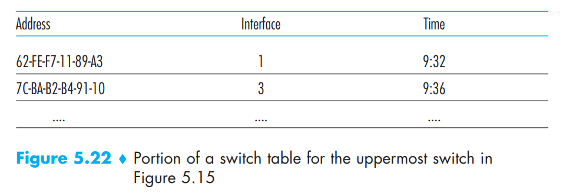<figcaption></figcaption></figure>

An entry in the switch table contains (1) a MAC address, (2) the switch interface that leads toward that MAC address, and (3) the time at which the entry was placed in the table. An example switch table for the uppermost switch in Figure 5.15 is shown in Figure 5.22.

Although this description of frame forwarding may sound similar to our discussion of datagram forwarding, we’ll see shortly that there are important differences. One important difference is that switches forward packets based on MAC addresses rather than on IP addresses. We will also see that a switch table is constructed in a very different manner from a router’s forwarding table.

To understand how switch filtering and forwarding work, suppose a frame with destination address DD-DD-DD-DD-DD-DD arrives at the switch on interface x. The switch indexes its table with the MAC address DD-DD-DD-DD-DD-DD. There are three possible cases:

* There is no entry in the table for DD-DD-DD-DD-DD-DD. In this case, the switch forwards copies of the frame to the output buffers preceding all interfaces except for interface x. In other words, if there is no entry for the destination address, the switch broadcasts the frame.
* There is an entry in the table, associating DD-DD-DD-DD-DD-DD with interface x. In this case, the frame is coming from a LAN segment that contains adapter DD-DD-DD-DD-DD-DD. There being no need to forward the frame to any of the other interfaces, the switch performs the filtering function by discarding the frame.
* There is an entry in the table, associating DD-DD-DD-DD-DD-DD with interface y ≠ x. In this case, the frame needs to be forwarded to the LAN segment attached to interface y. The switch performs its forwarding function by putting the frame in an output buffer that precedes interface y.

But how does this switch table get configured in the first place? Are there link-layer equivalents to network layer routing protocols? Or must an overworked manager manually configure the switch table?

#### Self-Learning

A switch has the wonderful property that its table is built automatically, dynamically, and autonomously—without any intervention from a network administrator or from a configuration protocol. In other words, switches are self-learning. This capability is accomplished as follows:

1. The switch table is initially empty.
2. For each incoming frame received on an interface, the switch stores in its table (1) the MAC address in the frame’s source address field, (2) the interface from which the frame arrived, and (3) the current time. In this manner the switch records in its table the LAN segment on which the sender resides. If every host in the LAN eventually sends a frame, then every host will eventually get recorded in the table.
3. The switch deletes an address in the table if no frames are received with that address as the source address after some period of time (the aging time). In this manner, if a PC is replaced by another PC (with a different adapter), the MAC address of the original PC will eventually be purged from the switch table.

Switches are **plug-and-play devices** because they require no intervention from a network administrator or user. A network administrator wanting to install a switch need do nothing more than connect the LAN segments to the switch interfaces. Switches are also full-duplex, meaning any switch interface can send and receive at the same time.

#### Properties of Link-Layer Switching

* **Elimination of collisions.** In a LAN built from switches (and without hubs), there is no wasted bandwidth due to collisions! The switches buffer frames and never transmit more than one frame on a segment at any one time. As with a router, the maximum aggregate throughput of a switch is the sum of all the switch interface rates. Thus, switches provide a significant performance improvement over LANs with broadcast links.
* **Heterogeneous links.** Because a switch isolates one link from another, the different links in the LAN can operate at different speeds and can run over different media. Thus, a switch is ideal for mixing legacy equipment with new equipment.
* **Management**. In addition to providing enhanced security (see sidebar on Focus on Security), a switch also eases network management. For example, if an adapter malfunctions and continually sends Ethernet frames (called a jabbering adapter), a switch can detect the problem and internally disconnect the malfunctioning adapter. Similarly, a cable cut disconnects only that host that was using the cut cable to connect to the switch. Switches also gather statistics on bandwidth usage, collision rates, and traffic types, and make this information available to the network manager.

#### Switches Versus Routers

As we learned in Chapter 4, routers are store-and-forward packet switches that forward packets using network-layer addresses. Although a switch is also a store-and-forward packet switch, it is fundamentally different from a router in that it forwards packets using MAC addresses. Whereas a router is a layer-3 (network) packet switch, a switch is a layer-2 (link) packet switch.

Given that both switches and routers are candidates for interconnection devices, what are the pros and cons of the two approaches?

First consider the pros and cons of switches. As mentioned above, switches are plug-and-play, a property that is cherished by all the overworked network administrators of the world. Switches can also have relatively high filtering and forwarding rates—as shown in Figure 5.24, switches have to process frames only up through layer 2, whereas routers have to process datagrams up through layer 3. On the other hand, to prevent the cycling of broadcast frames, the active topology of a switched network is restricted to a spanning tree. Also, a large switched network would require large ARP tables in the hosts and routers and would generate substantial ARP traffic and processing. Furthermore, switches are susceptible to broadcast storms—if one host goes haywire and transmits an endless stream of Ethernet broadcast frames, the switches will forward all of these frames, causing the entire network to collapse.

<figure><figcaption></figcaption></figure>

Now consider the pros and cons of routers. Because network addressing is often hierarchical (and not flat, as is MAC addressing), packets do not normally cycle through routers even when the network has redundant paths. Thus, packets are not restricted to a spanning tree and can use the best path between source and destination. Because routers do not have the spanning tree restriction, they have allowed the Internet to be built with a rich topology that includes, for example, multiple active links between Europe and North America. Another feature of routers is that they provide firewall protection against layer-2 broadcast storms. Perhaps the most significant drawback of routers, though, is that they are not plug-and-play—they and the hosts that connect to them need their IP addresses to be configured. Also, routers often have a larger per-packet processing time than switches, because they have to process up through the layer-3 fields.

 

<figure>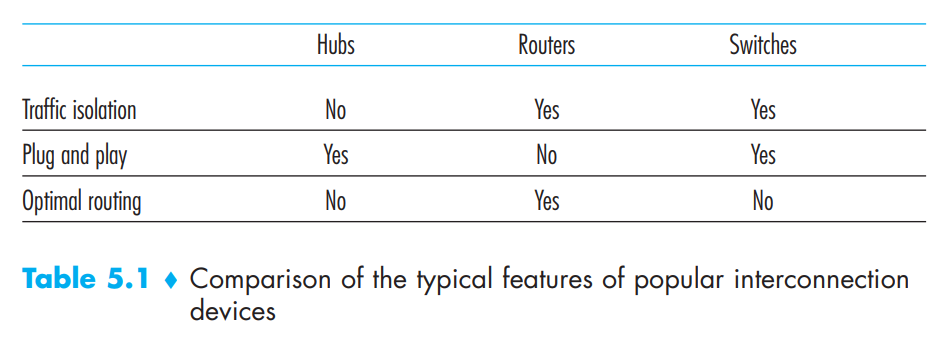<figcaption></figcaption></figure>

Given that both switches and routers have their pros and cons (as summarized in Table 5.1), when should an institutional network (for example, a university campus network or a corporate campus network) use switches, and when should it use routers? Typically, small networks consisting of a few hundred hosts have a few LAN segments. Switches suffice for these small networks, as they localize traffic and increase aggregate throughput without requiring any configuration of IP addresses. But larger networks consisting of thousands of hosts typically include routers within the network (in addition to switches). The routers provide a more robust isolation of traffic, control broadcast storms, and use more “intelligent” routes among the hosts in the network.

## 5.4.4 Virtual Local Area Networks (VLANs)

In our earlier discussion of Figure 5.15, we noted that modern institutional LANs are often configured hierarchically, with each workgroup (department) having its own switched LAN connected to the switched LANs of other groups via a switch hierarchy. While such a configuration works well in an ideal world, the real world is often far from ideal. Three drawbacks can be identified in the configuration in Figure 5.15:

* **Lack of traffic isolation**. Although the hierarchy localizes group traffic to within a single switch, broadcast traffic (e.g., frames carrying ARP and DHCP messages or frames whose destination has not yet been learned by a self learning switch) must still traverse the entire institutional network. Limiting the scope of such broadcast traffic would improve LAN performance. Perhaps more importantly, it also may be desirable to limit LAN broadcast traffic for security/privacy reasons. This type of isolation could be provided by replacing the center switch in Figure 5.15 with a router.
* **Inefficient use of switches**. If instead of three groups, the institution had 10 groups, then 10 first-level switches would be required. If each group were small, say less than 10 people, then a single 96-port switch would likely be large enough to accommodate everyone, but this single switch would not provide traffic isolation.
* **Managing users**. If an employee moves between groups, the physical cabling must be changed to connect the employee to a different switch in Figure 5.15. Employees belonging to two groups make the problem even harder.

Fortunately, each of these difficulties can be handled by a switch that supports virtual local area networks (VLANs). As the name suggests, a switch that supports VLANs allows multiple virtual local area networks to be defined over a single physical local area network infrastructure. Hosts within a VLAN communicate with each other as if they (and no other hosts) were connected to the switch. In a port-based VLAN, the switch’s ports (interfaces) are divided into groups by the network manager. Each group constitutes a VLAN, with the ports in each VLAN forming a broadcast domain (i.e., broadcast traffic from one port can only reach other ports in the group).

<figure><figcaption></figcaption></figure>

Figure 5.25 shows a single switch with 16 ports. Ports 2 to 8 belong to the EE VLAN, while ports 9 to 15 belong to the CS VLAN (ports 1 and 16 are unassigned). This VLAN solves all of the difficulties noted above—EE and CS VLAN frames are isolated from each other, the two switches in Figure 5.15 have been replaced by a single switch, and if the user at switch port 8 joins the CS Department, the network operator simply reconfigures the VLAN software so that port 8 is now associated with the CS VLAN.

But by completely isolating the two VLANs, we have introduced a new difficulty! How can traffic from the EE Department be sent to the CS Department? One way to handle this would be to connect a VLAN switch port (e.g., port 1 in Figure 5.25) to an external router and configure that port to belong both the EE and CS VLANs. In this case, even though the EE and CS departments share the same physical switch, the logical configuration would look as if the EE and CS departments had separate switches connected via a router. An IP datagram going from the EE to the CS department would first cross the EE VLAN to reach the router and then be forwarded by the router back over the CS VLAN to the CS host.

<figure>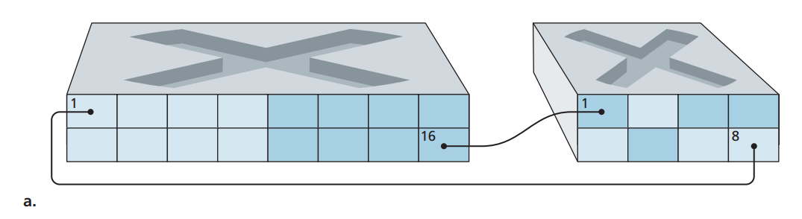<figcaption></figcaption></figure>

Returning again to Figure 5.15, let’s now suppose that rather than having a separate Computer Engineering department, some EE and CS faculty are housed in a separate building, where (of course!) they need network access, and (of course!) they’d like to be part of their department’s VLAN. Figure 5.26 shows a second 8-port switch, where the switch ports have been defined as belonging to the EE or the CS VLAN, as needed. But how should these two switches be interconnected? One easy solution would be to define a port belonging to the CS VLAN on each switch (similarly for the EE VLAN) and to connect these ports to each other, as shown in Figure 5.26(a). This solution doesn’t scale, however, since N VLANS would require N ports on each switch simply to interconnect the two switches.

<figure>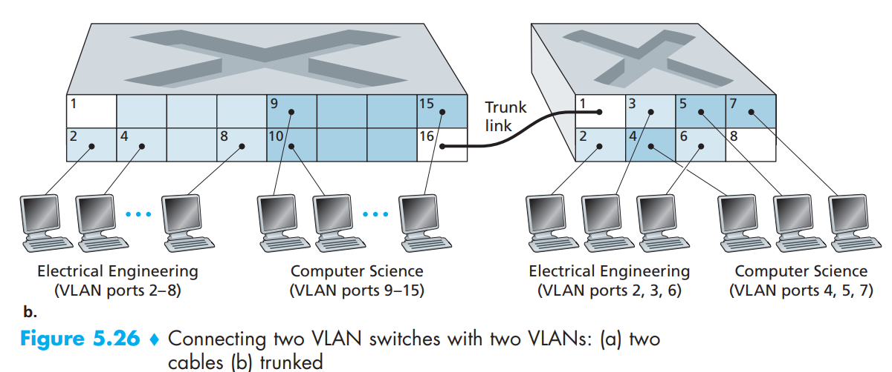<figcaption></figcaption></figure>

A more scalable approach to interconnecting VLAN switches is known as VLAN trunking. In the VLAN trunking approach shown in Figure 5.26(b), a special port on each switch (port 16 on the left switch and port 1 on the right switch) is configured as a trunk port to interconnect the two VLAN switches. The trunk port belongs to all VLANs, and frames sent to any VLAN are forwarded over the trunk link to the other switch. But this raises yet another question: How does a switch know that a frame arriving on a trunk port belongs to a particular VLAN? The IEEE has defined an extended Ethernet frame format, 802.1Q, for frames crossing a VLAN trunk.

 

<figure>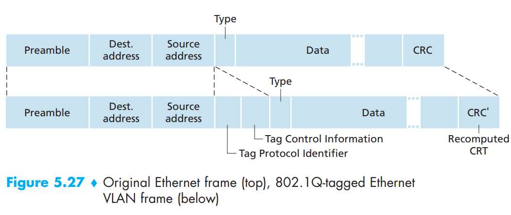<figcaption></figcaption></figure>

As shown in Figure 5.27, the 802.1Q frame consists of the standard Ethernet frame with a four-byte VLAN tag added into the header that carries the identity of the VLAN to which the frame belongs. The VLAN tag is added into a frame by the switch at the sending side of a VLAN trunk, parsed, and removed by the switch at the receiving side of the trunk. The VLAN tag itself consists of a 2-byte Tag Protocol Identifier (TPID) field (with a fixed hexadecimal value of 81-00), a 2-byte Tag Control Information field that contains a 12-bit VLAN identifier field, and a 3-bit priority field that is similar in intent to the IP datagram TOS field.
