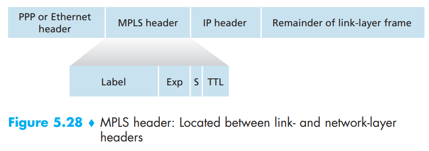
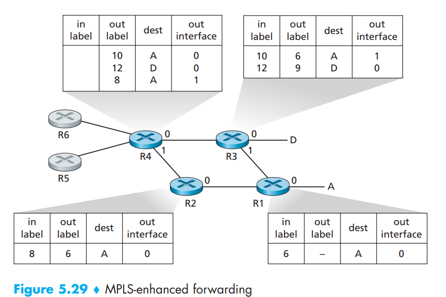

# 5.5 Link Virtualization: A Network as a Link Layer

In this section, we’ll consider Multiprotocol Label Switching (MPLS) networks. Unlike the circuit-switched telephone network, MPLS is a packet-switched, virtual-circuit network in its own right. It has its own packet formats and forwarding behaviors. Thus, from a pedagogical viewpoint, a discussion of MPLS fits well into a study of either the network layer or the link layer. From an Internet viewpoint, however, we can consider MPLS, like the telephone network and switched Ethernets, as a link-layer technology that serves to interconnect IP devices. Thus, we’ll consider MPLS in our discussion of the link layer.

## 5.5.1 Multiprotocol Label Switching (MPLS)

Multiprotocol Label Switching (MPLS) evolved from a number of industry efforts in the mid-to-late 1990s to improve the forwarding speed of IP routers by adopting a key concept from the world of virtual-circuit networks: a fixed-length label. The goal was not to abandon the destination-based IP datagram-forwarding infrastructure for one based on fixed-length labels and virtual circuits, but to augment it by selectively labeling datagrams and allowing routers to forward datagrams based on fixed-length labels (rather than destination IP addresses) when possible. Importantly, these techniques work hand-in-hand with IP, using IP addressing and routing.

<figure><figcaption></figcaption></figure>

Let’s begin our study of MPLS by considering the format of a link-layer frame that is handled by an MPLS-capable router. Figure 5.28 shows that a link-layer frame transmitted between MPLS-capable devices has a small MPLS header added between the layer-2 (e.g., Ethernet) header and layer-3 (i.e., IP) header.

Among the fields in the MPLS header are the label, 3 bits reserved for experimental use, a single S bit, which is used to indicate the end of a series of “stacked” MPLS headers, and a time-to-live field.

It’s immediately evident from Figure 5.28 that an MPLS-enhanced frame can only be sent between routers that are both MPLS capable.

An MPLS-capable router is often referred to as a **label-switched router**, since it forwards an MPLS frame by looking up the MPLS label in its forwarding table and then immediately passing the datagram to the appropriate output interface. Thus, the MPLS-capable router need not extract the destination IP address and perform a lookup of the longest prefix match in the forwarding table. But how does a router know if its neighbor is indeed MPLS capable, and how does a router know what label to associate with the given IP destination?

<figure><figcaption></figcaption></figure>

In the example in Figure 5.29, routers R1 through R4 are MPLS capable. R5 and R6 are standard IP routers. R1 has advertised to R2 and R3 that it (R1) can route to destination A, and that a received frame with MPLS label 6 will be forwarded to destination A. Router R3 has advertised to router R4 that it can route to destinations A and D, and that incoming frames with MPLS labels 10 and 12, respectively, will be switched toward those destinations. Router R2 has also advertised to router R4 that it (R2) can reach destination A, and that a received frame with MPLS label 8 will be switched toward A. Note that router R4 is now in the interesting position of having two MPLS paths to reach A: via interface 0 with outbound MPLS label 10, and via interface 1 with an MPLS label of 8. The broad picture painted in Figure 5.29 is that IP devices R5, R6, A, and D are connected together via an MPLS infrastructure (MPLS capable routers R1, R2, R3, and R4) in much the same way that a switched LAN or an ATM network can connect together IP devices. And like a switched LAN or ATM network, the MPLS-capable routers R1 through R4 do so without ever touching the IP header of a packet.

In our discussion above, we’ve not specified the specific protocol used to distribute labels among the MPLS-capable routers, as the details of this signaling are well beyond the scope of this book. We’ve also not discussed how MPLS actually computes the paths for packets among MPLS capable routers, nor how it gathers link-state information (e.g., amount of link bandwidth unreserved by MPLS) to use in these path computations. Existing link-state routing algorithms (e.g., OSPF) have been extended to flood this information to MPLS-capable routers. Interestingly, the actual path computation algorithms are not standardized, and are currently vendor-specific.

Thus far, the emphasis of our discussion of MPLS has been on the fact that MPLS performs switching based on labels, without needing to consider the IP address of a packet. The true advantages of MPLS and the reason for current interest in MPLS, however, lie not in the potential increases in switching speeds, but rather in the new traffic management capabilities that MPLS enables. As noted above, R4 has two MPLS paths to A. If forwarding were performed up at the IP layer on the basis of IP address, the IP routing protocols we studied in Chapter 4 would specify only a single, least-cost path to A. Thus, MPLS provides the ability to forward packets along routes that would not be possible using standard IP routing protocols. This is one simple form of traffic engineering using MPLS, in which a network operator can override normal IP routing and force some of the traffic headed toward a given destination along one path, and other traffic destined toward the same destination along another path

It is also possible to use MPLS for many other purposes as well. It can be used to perform fast restoration of MPLS forwarding paths, e.g., to reroute traffic over a precomputed failover path in response to link failure.

Finally, we note that MPLS can, and has, been used to implement so-called **virtual private networks (VPNs).** In implementing a VPN for a customer, an ISP uses its MPLS-enabled network to connect together the customer’s various networks. MPLS can be used to isolate both the resources and addressing used by the customer’s VPN from that of other users crossing the ISP’s network.
