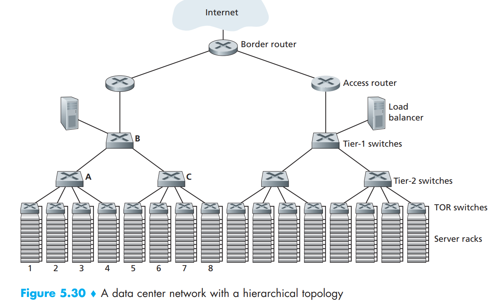
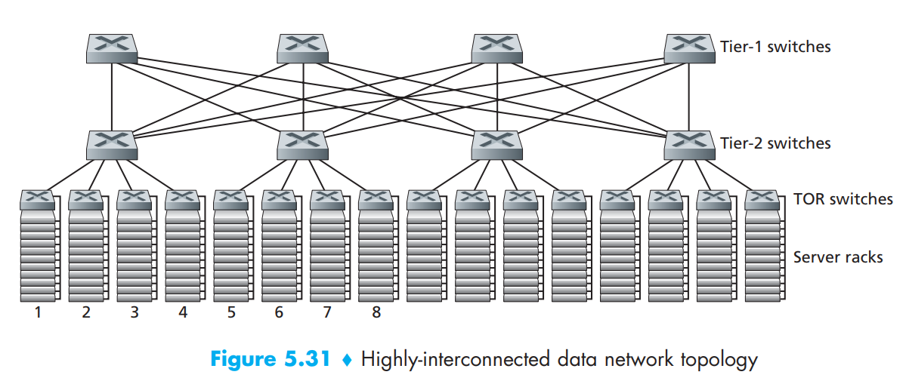

# 5.6 Data Center Networking

In recent years, Internet companies such as Google, Microsoft, Facebook, and Amazon (as well as their counterparts in Asia and Europe) have built massive data centers, each housing tens to hundreds of thousands of hosts, and concurrently supporting many distinct cloud applications (e.g., search, email, social networking, and e-commerce). Each data center has its own **data center network** that interconnects its hosts with each other and interconnects the data center with the Internet. In this section, we provide a brief introduction to data center networking for cloud applications.

The worker bees in a data center are the hosts: They serve content (e.g., Web pages and videos), store emails and documents, and collectively perform massively distributed computations (e.g., distributed index computations for search engines). The hosts in data centers, called **blades** and resembling pizza boxes, are generally commodity hosts that include CPU, memory, and disk storage. The hosts are stacked in racks, with each rack typically having 20 to 40 blades. At the top of each rack there is a switch, aptly named the **Top of Rack (TOR) switch**, that interconnects the hosts in the rack with each other and with other switches in the data center. Specifically, each host in the rack has a network interface card that connects to its TOR switch, and each TOR switch has additional ports that can be connected to other switches. Although today hosts typically have 1 Gbps Ethernet connections to their TOR switches, 10 Gbps connections may become the norm. Each host is also assigned its own data-center-internal IP address.

The data center network supports two types of traffic: traffic flowing between external clients and internal hosts and traffic flowing between internal hosts.

To handle flows between external clients and internal hosts, the data center network includes one or more **border routers**, connecting the data center network to the public Internet. The data center network therefore interconnects the racks with each other and connects the racks to the border routers. Figure 5.30 shows an example of a data center network. **Data center network design**, the art of designing the interconnection network and protocols that connect the racks with each other and with the border routers, has become an important branch of computer networking research in recent years

#### Load Balancing

A cloud data center, such as a Google or Microsoft data center, provides many applications concurrently, such as search, email, and video applications. To support requests from external clients, each application is associated with a publicly visible IP address to which clients send their requests and from which they receive responses. Inside the data center, the external requests are first directed to a **load balancer** whose job it is to distribute requests to the hosts, balancing the load across the hosts as a function of their current load. A large data center will often have several load balancers, each one devoted to a set of specific cloud applications. Such a load balancer is sometimes referred to as a “layer-4 switch” since it makes decisions based on the destination port number (layer 4) as well as destination IP address in the packet. Upon receiving a request for a particular application, the load balancer forwards it to one of the hosts that handles the application. When the host finishes processing the request, it sends its response back to the load balancer, which in turn relays the response back to the external client. The load balancer not only balances the work load across hosts, but also provides a NAT-like function, translating the public external IP address to the internal IP address of the appropriate host, and then translating back for packets traveling in the reverse direction back to the clients. This prevents clients from contacting hosts directly, which has the security benefit of hiding the internal network structure and preventing clients from directly interacting with the hosts.

#### Hierarchical Architecture

For a small data center housing only a few thousand hosts, a simple network consisting of a border router, a load balancer, and a few tens of racks all interconnected by a single Ethernet switch could possibly suffice. But to scale to tens to hundreds of thousands of hosts, a data center often employs a **hierarchy of routers and switches**, such as the topology shown in Figure 5.30. At the top of the hierarchy, the border router connects to access routers (only two are shown in Figure 5.30, but there can be many more). Below each access router there are three tiers of switches. Each access router connects to a top-tier switch, and each top-tier switch connects to multiple second-tier switches and a load balancer. Each second-tier switch in turn connects to multiple racks via the racks’ TOR switches (third-tier switches). All links typically use Ethernet for their link-layer and physical-layer protocols, with a mix of copper and fiber cabling. With such a hierarchical design, it is possible to scale a data center to hundreds of thousands of hosts.

Because it is critical for a cloud application provider to continually provide applications with high availability, data centers also include redundant network equipment and redundant links in their designs. For example, each TOR switch can connect to two tier-2 switches, and each access router, tier-1 switch, and tier-2 switch can be duplicated and integrated into the design. In the hierarchical design in Figure 5.30, observe that the hosts below each access router form a single subnet. In order to localize ARP broadcast traffic, each of these subnets is further partitioned into smaller VLAN subnets, each comprising a few hundred hosts.

Although the conventional hierarchical architecture just described solves the problem of scale, it suffers from **limited host-to-host capacity.** To understand this limitation, consider again Figure 5.30, and suppose each host connects to its TOR switch with a 1 Gbps link, whereas the links between switches are 10 Gbps Ethernet links. Two hosts in the same rack can always communicate at a full 1 Gbps, limited only by the rate of the hosts’ network interface cards. However, if there are many simultaneous flows in the data center network, the maximum rate between two hosts in different racks can be much less. One possible solution to this limitation is to deploy higher-rate switches and routers. But this would significantly increase the cost of the data center, because switches and routers with high port speeds are very expensive.

Supporting high-bandwidth host-to-host communication is important because a key requirement in data centers is flexibility in placement of computation and services. For example, a large-scale Internet search engine may run on thousands of hosts spread across multiple racks with significant bandwidth requirements between all pairs of hosts. Similarly, a cloud computing service such as EC2 may wish to place the multiple virtual machines comprising a customer’s service on the physical hosts with the most capacity irrespective of their location in the data center. If these physical hosts are spread across multiple racks, network bottlenecks as described above may result in poor performance.

#### Trends in Data Center Networking

In order to reduce the cost of data centers, and at the same time improve their delay and throughput performance, Internet cloud giants such as Google, Facebook, Amazon, and Microsoft are continually deploying new data center network designs. Although these designs are proprietary, many important trends can nevertheless be identified.

<figure><figcaption></figcaption></figure>

One such trend is to deploy new interconnection architectures and network protocols that overcome the drawbacks of the traditional hierarchical designs. One such approach is to replace the hierarchy of switches and routers with a fully connected topology, such as the topology shown in Figure 5.31. In this design, each tier-1 switch connects to all of the tier-2 switches so that (1) host-to-host traffic never has to rise above the switch tiers, and (2) with n tier-1 switches, between any two tier-2 switches there are n disjoint paths. Such a design can significantly improve the host-to-host capacity.

Shipping container-based modular data centers (MDCs) are another major trend in data center design. In an MDC, a factory builds a "mini data center" within a standard 12-meter shipping container, which is then shipped to the data center location. Each container can contain up to a few thousand hosts, stacked in tens of racks. Multiple containers are interconnected with each other and with the internet. MDCs are designed for graceful performance degradation as components fail over time. When performance drops below a certain threshold, the entire container is replaced with a fresh one.

Building a data center out of containers creates new networking challenges. With an MDC, there are two types of networks: the container-internal networks within each of the containers and the core network connecting each container. Within each container, at the scale of up to a few thousand hosts, it is possible to build a fully connected network (as described above) using inexpensive commodity Gigabit Ethernet switches. However, the design of the core network, interconnecting hundreds to thousands of containers while providing high host-to-host bandwidth across containers for typical workloads, remains a challenging problem.

When using highly interconnected topologies, one of the major issues is designing routing algorithms among the switches. One possibility is to use a form of random routing. Another possibility is to deploy multiple network interface cards in each host, connect each host to multiple low-cost commodity switches, and allow the hosts themselves to intelligently route traffic among the switches. Variations and extensions of these approaches are currently being deployed in contemporary data centers. Many more innovations in data center design are likely to come.
