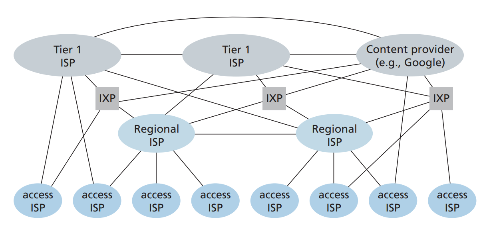

# 1.3 The Network Core

#### 1.3.1 Packet Switching

Most packet switches use store-and-forward transmission at the inputs to the links. Store-and-forward transmission means that the packet switch must receive the entire packet before it can begin to transmit the first bit of the packet onto the outbound link.

#### 1.3.2 Circuit Switching

Most packet switches use store-and-forward transmission at the inputs to the links. Store-and-forward transmission means that the packet switch must receive the entire packet before it can begin to transmit the first bit of the packet onto the outbound link.

In circuit-switched networks, the resources needed along a path (buffers, link transmission rate) to provide for communication between the end systems are reserved for the duration of the communication session between the end systems.

Although packet switching and circuit switching are both prevalent in today’s telecommunication networks, the trend has certainly been in the direction of packet switching.

#### 1.3.3 A network of network

In summary, today’s Internet—a network of networks—is complex, consisting of a dozen or so tier-1 ISPs and hundreds of thousands of lower-tier ISPs. The ISPs are diverse in their coverage, with some spanning multiple continents and oceans, and others limited to narrow geographic regions. The lower-tier ISPs connect to the higher-tier ISPs, and the higher-tier ISPs interconnect with one another. Users and content providers are customers of lower-tier ISPs, and lower-tier ISPs are customers of higher-tier ISPs. In recent years, major content providers have also created their own networks and connect directly into lower-tier ISPs where possible.

<figure><figcaption></figcaption></figure>
