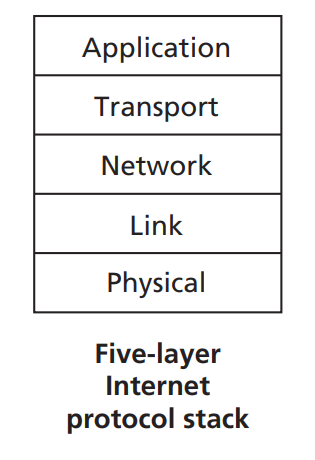

# 1.5 Protocol Layers and their Service Models

#### 1.5.1 Layered architecture

To provide structure to the design of network protocols, network designers organize protocols—and the network hardware and software that implement the protocols—in layers. **Each protocol belongs to one of the layers**.

A protocol layer can be implemented in software, in hardware, or in a combination of the two. Application-layer protocols—such as HTTP and SMTP—are almost always implemented in software in the end systems; so are transport-layer protocols.

<figure><figcaption></figcaption></figure>

When taken together, the protocols of the various layers are called the protocol stack. The Internet protocol stack consists of five layers: the physical, link, network, transport, and application layers,

**Application layer**

The application layer is where network applications and their application-layer protocols reside.

The Internet’s application layer includes many protocols, such as the **HTTP protocol** (which provides for Web document request and transfer), **SMTP** (which provides for the transfer of e-mail messages), and **FTP** (which provides for the transfer of files between two end systems).

The translation of human-friendly names for Internet end systems like [www.ietf.org](http://www.ietf.org) to a 32-bit network address, are also done with the help of a specific application-layer protocol, namely, the domain name system (**DNS**).

An application-layer protocol is distributed over multiple end systems, with the application in one end system using the protocol to exchange packets of information with the application in another end system. We’ll refer to this packet of information at the application layer as a message.

**Transport layer**

The Internet’s transport layer transports application-layer messages between application endpoints. In the Internet, there are two transport protocols, **TCP** and **UDP**, either of which can transport application-layer messages. TCP provides a connection-oriented service to its applications. This service includes guaranteed delivery of application-layer messages to the destination and flow control (that is, sender/receiver speed matching). TCP also breaks long messages into shorter segments and provides a congestion-control mechanism, so that a source throttles its transmission rate when the network is congested. The UDP protocol provides a connectionless service to its applications. This is a no-frills service that provides no reliability, no flow control, and no congestion control. In this book, we’ll refer to a transport-layer packet as a segment.

**Network layer**

The Internet’s network layer is responsible for moving network-layer packets known as datagrams from one host to another. The Internet transport-layer protocol (TCP or UDP) in a source host passes a transport-layer segment and a destination address to the network layer, just as you would give the postal service a letter with a destination address. The network layer then provides the service of delivering the segment to the transport layer in the destination host.

The Internet’s network layer includes the celebrated **IP** protocol, which defines the fields in the datagram as well as how the end systems and routers act on these fields. There is only one IP protocol, and all Internet components that have a network layer must run the IP protocol. The Internet’s network layer also contains routing protocols that determine the routes that datagrams take between sources and destinations. The Internet has many routing protocols.

**Link Layer**

The Internet’s network layer routes a datagram through a series of routers between the source and destination. To move a packet from one node (host or router) to the next node in the route, the network layer relies on the services of the link layer. In particular, at each node, the network layer passes the datagram down to the link layer, which delivers the datagram to the next node along the route. At this next node, the link layer passes the datagram up to the network layer.

The services provided by the link layer depend on the specific link-layer protocol that is employed over the link. For example, some link-layer protocols provide reliable delivery, from transmitting node, over one link, to receiving node. Note that this reliable delivery service is different from the reliable delivery service of TCP, which provides reliable delivery from one end system to another. Examples of link-layer protocols include **Ethernet**, **WiFi**, and the cable access network’s **DOCSIS** protocol.

As datagrams typically need to traverse several links to travel from source to destination,

a datagram may be handled by different link-layer protocols at different links along its route. For example, a datagram may be handled by Ethernet on one link and by PPP on the next link. The network layer will receive a different service from each of the different link-layer protocols. In this book, we’ll refer to the link-layer packets as frames.

**Physical Layer**

While the job of the link layer is to move entire frames from one network element to an adjacent network element, the job of the physical layer is to move the individual bits within the frame from one node to the next. The protocols in this layer are again link dependent and further depend on the actual transmission medium of the link (for example, twisted-pair copper wire, single-mode fiber optics).

#### 1.5.2 Encapsulation

Similar to end systems, routers and link-layer switches organize their networking hardware and software into layers. But routers and link-layer switches do not implement all of the layers in the protocol stack; they typically implement only the bottom layers.

At the sending host, an **application-layer message** is passed to the **transport layer**. In the simplest case, the **transport layer** takes the **message** and appends additional information (so-called transport-layer header information) that will be used by the receiver-side transport layer. The **application-layer message** and the **transport-layer header** information together constitute the **transport-layer segment**. The **transport-layer segment** thus encapsulates the **application-layer message**. The added information might include information allowing the receiver-side transport layer to deliver the message up to the appropriate application, and error-detection bits that allow the receiver to determine whether bits in the message have been changed in route. The **transport layer** then passes the **segment** to the **network layer**, which adds **network-layer header information** such as source and destination end system addresses, creating a **network-layer datagram**. The **datagram** is then passed to the **link layer**, which (of course!) will add its own **link-layer header information** and create a **link-layer frame**. Thus, we see that at each layer, a packet has two types of fields: **header fields** and a **payload field**. The payload is typically a packet from the layer above.
